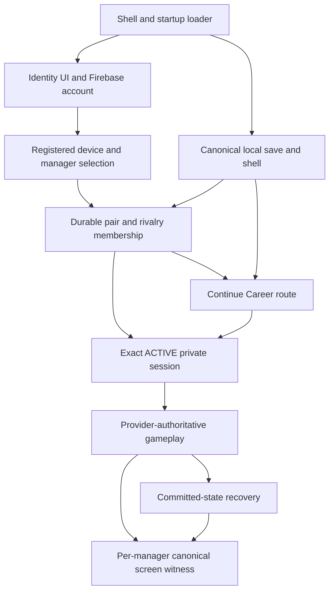

# Studio Z — Causal model and discriminating experiments

**Source anchor:** `bc77a0b934c3d43279f27f73a72db21c2db2b4f2`. Full provenance in [EVIDENCE_REGISTER.md](EVIDENCE_REGISTER.md). Stable hypothesis records, including evidence, alternatives, falsifiers, disposition and uncertainty, are authoritative in `RESEARCH_LEDGER.json#/hypotheses`.

## The implemented chain branches

The original linear account-to-gameplay chain is a useful list, not the actual execution order. Startup loads storage/showdown before the optional loader; identity lazily resolves runtime/account/pairing; account initialization can inspect an existing Firebase user before any popup. Save-library preparation and a pending local shell participate **before** durable pairing. Manager selection is local and later reconciled with the UID-bound provider membership. Pairing `connectionState=active` is different from private-session `sessionState=active`. The latter must be exact, finite and unexpired before shared authority. Continue Career rejoins several paths rather than simply advancing the chain.

A local draft, local canonical save, provider commit and per-device screen witness are distinct. A late device may need to render earlier screens even when remote state has advanced. A reload can retain the pair and save while losing session capability and in-memory cursors.

## Boundary inventory

Recovery entries describe permitted design directions, not authorization to run them on real accounts. Source/tests listed here were inspected or located; they were not executed in this assignment.

| Boundary / owner | Authority, persistence and preconditions | Failure propagation / UI | Safe distinguishing action and recovery boundary | Coverage / missing evidence |
|---|---|---|---|---|
| Startup: `index.html`, `showdown.js`, `optionalModules.js` | Deferred ordering; page flag; runtime script loader must exist | Flag set before failed load can leave badge and capture guard absent; optional reporter may also be absent | X-01 on unchanged files; no production script edits | S-11/T-01; existing two-manager browser journey; independent replay needed |
| Asset/runtime: service worker + Firebase runtime | Shell caches r62/r61, network-only exceptions; public config and SDK resolve before account services | Missing/mixed module or runtime-unavailable result | X-03; compare safe byte fingerprints, do not clear/activate/rollback caches | S-08/15, P-01; original cache/Rules/config not read |
| Firebase auth: Connected Account | Browser-session persistence; Google popup only, no scopes; may restore existing user | Distinct popup fail/cancel, pending or auth-state errors | X-02 invocation/result trace with synthetic services; no production account switching | S-04/12; actual popup and activation trace missing |
| Private account: `sparkAccountBootstrap` | UID-keyed Firestore envelope, active/disabled/deletion-pending; can create missing account transactionally | `signedIn=true` but `connected=false`; identity may map to signed-out | Controlled auth-success/bootstrap-fail; never run initializer as passive production diagnosis | S-12; current bootstrap transaction tests versus older Stage2I boundary must be distinguished |
| Registered device: `sparkPrivatePairing` | Browser IndexedDB identity plus account-owned provider device; connected account required | device-error/revoked/registered states; browser replacement differs from reload | Synthetic missing/blocked IDB versus provider revoked state; no actual clearing/revoking | S-12; real device registration state unknown |
| Manager identity: `onlinePlayerIdentity` | Local UID-bound role in IndexedDB; Daniel playerOne, Nik playerTwo; provider pair membership reconciles role | choose-manager, device-error, ready; stale/concurrent completion alternative | X-08 with synthetic generations; displayed manager is not authorization | S-12/19; no physical UID/role trace; store only categories |
| Local career shell: Save Library + shared entry | Canonical library/runtime, active save/profile, shared pending marker; storage ready before pairing setup | Missing/invalid binding or normalization may display new setup | Inspect exact local binding in disposable fixture; preserve production saves | S-07/13; save-runtime tests; no physical before/after snapshot |
| Durable pairing: `persistentNikDanielPair` | Account pairLink + rivalry membership and provider save/profile binding; UID/device match | unpaired/waiting/paired/recovery-required; some source text offers destructive recovery | Distinguish unavailable read from absent link and absent local copy; same-career recovery only | S-13; pair contracts/emulator; actual provider/local binding unknown |
| Connected Rivalry: `sparkConnectedRivalry` | Verified account/device/local binding + attached rivalry pointer; exact provider membership | Attach fail versus no local recovery copy | Synthetic pointer mismatch; no live attach or Apply | S-13; complete pointer schema audit remains Z-017/021 |
| Private session: `sparkRemoteJoining`, standard-auth session adapter | Capability in page memory, provider session with same rivalry/account/device, ACTIVE, no pending action, finite future expiry | No session after reload or expired session requires reauthorization; pair can remain active | X-04, no-session vs expiry vs wrong-context controls; never persist capability as a shortcut | S-17; reload/reconnect contracts exist; physical session category unknown |
| Shared setup and career: production entry/setup/career modules | Exact session, confirmed setup revision and accepted provider progression | Local shell/GET READY/Career Start/dashboard branches | Compare expected canonical routes for zero and ≥1 accepted seasons; no draw replay to rebuild data | S-13/17; entry and reload tests; causal mapping incomplete |
| Transfer UI → canonical input → provider: production transfer + selector + visual bridge | Visible text plus canonical league/nationality IDs; valid phase/role; locked inputs committed remotely | Client can throw exact signing text before provider call; layout can independently hide controls | X-05/X-06; provider-call spy in fixture, true input interaction rather than prefilled dataset | S-14/16; mock replay test doesn't establish tablet keyboard correctness |
| Transfer persistence/replay | DOM/context state and committed own inputs; provider stage plus per-manager witness | Draft loss and canonical stage recovery may differ; other manager's private inputs must stay private | X-07 compares draft/locked state and snapshot hashes; read-only replay has zero writes | S-18; complete draft persistence map and physical input state absent |
| Continue/reconnect: screens, identity capture, pair continuation, shared entry | Local fallback versus online capture; same-career binding before shared authority | Missing save routes to creation; context failure can appear like restart without deletion | X-04 event trace + pre/post synthetic snapshots; preserve exact identity and witness ordering | S-07/13/17; physical click chronology missing |
| Candidate C reconciliation | Remote preview distinct from explicit destructive Apply; backup-first transaction and rollback authority | Preview unavailable or Apply blocked must not overwrite data | Design test for failure/rollback with disposable data; no real Apply | Z-022; source `productionSharedLocalReconciliation` delegates to Connected Rivalry authority |

## Competing explanations and evidence limits

| ID | Mechanism under investigation | Best current discriminator |
|---|---|---|
| H-01 | Pre-popup work loses browser user activation | Actual popup invocation and success versus pre-call stall; X-02 |
| H-02 | Authenticated but bootstrap-unready result becomes signed-out UI | Successful synthetic Firebase user + bootstrap failure; X-02 |
| H-03 | Startup attempts identity before its loader, leaving a latched failed initialization | Matched optional-loader delay and unrelated-delay control; X-01 |
| H-04 | Continue resolves wrong/missing binding or route | Exact-context route trace and unchanged save snapshots; X-04 |
| H-05 | Visible signing fields lack canonical selector IDs | Same labels, valid/missing IDs, provider-call spy; X-05 |
| H-06 | Mixed revision or missing cached/network-only asset | Byte-matched coherent control versus controlled mismatch; X-03 |
| H-07 | Layout/keyboard makes controls inaccessible | Measured reachability with valid input held constant; X-06 |
| H-08 | Expected page-memory session loss mistaken for pair/career loss | Absent capability but preserved pair/career, fresh-session resumption; X-04 |
| H-09 | Uncommitted draft disappears while committed state survives | Same fields before/after reload, unlocked versus locked; X-07 |
| H-10 | Overlapping asynchronous identity completion publishes stale state | Deferred old/new completions, no account data; X-08 |
| H-11 | Config/network/provider permission/quota failure | Captured phase and safe error category versus local-only rejection; X-02 |

No hypothesis is an established cause of the October 7 incident. O-05's overlay limits a universal “identity never loaded” explanation. Source-identical CI success and imported CI-like failures require environment/timing comparison, not a vote. The four coherent public asset samples cannot rule out cached device drift. A visible signing error cannot establish a provider rejection. Retelling T-01 in another session adds no independent support.

## Minimal experiment catalog — design only

Each experiment records unchanged source/file hashes, environment, conditions, intervention, control, expected discriminating outcome, actual outcome and artifact hash. Local harnesses are disposable and non-production; do not edit game files or official tests. A VM stub proves only the modeled logic. Use a real isolated browser for claims about deferred script execution, popup activation or layout. Never use real credentials, provider URLs or accounts in fault injection.

| Experiment | Cheapest safe setup and controls | Distinguishing results / stop gate |
|---|---|---|
| X-01 startup | Serve pinned unchanged source locally. Fresh contexts: ordinary load, delay only `optionalModules.js` response 400 ms, delay an unrelated asset by same amount. Record readyState, bootstrap flag, loader/reporter/API presence, badge/overlay and Start route. No auth. | Loader delay alone reproduces latched absence after loader arrives: supports H-03 narrowly. All recover: falsifies the reported schedule, inspect environment. Broad delays all fail: general timing/fixture issue. One matched repeat; after two nondiscriminating designs reframe. |
| X-02 sign-in boundaries | Disposable services with (a) popup success/account active, (b) popup rejection, (c) popup success/bootstrap fail, (d) blocked persistence, (e) unresolved dependency. Record invocation and categorical state transitions. Only later, separately authorized real-browser popup observation if needed. | H-02 predicts auth success plus connected=false becomes signed-out. No popup invocation is not popup blocking. Successful popup disconfirms H-01 for that attempt. Stub result never establishes Google/mobile behavior. |
| X-03 revision | First passive source/HTTP metadata comparison. Then isolated current/retained shell with unchanged asset bytes and one controlled network-only mismatch; coherent source is negative control. | Failure only under mismatched bytes supports compatibility fault; coherent delayed-loader failure supports H-03 instead. Device-specific attribution needs original controller/cache evidence, not speculative cache clearing. |
| X-04 recovery | Disposable valid local save/pair fixtures; vary absent session, expired session, exact ACTIVE, wrong rivalry/device and absent local copy one at a time. Trace actual winning click handler and provider-call categories; hash synthetic canonical saves before/after. | Distinguish expected new session for same career (H-08), wrong route (H-04), and actual mutation. Preserve each manager's canonical screen witness ordering. No production host/join/re-pair. |
| X-05 signing | Through the actual selector, create valid labels/IDs, then same visible label with missing ID, partial row and fully empty row. Hold layout constant; spy on `lockSignings`. | Exact message with zero provider calls supports client preflight H-05. Valid IDs with downstream denial require provider branch. Direct dataset injection can be a control, not sole end-to-end input proof. |
| X-06 layout | Source audit followed by local portrait/landscape samples, e.g. 1024×768, 768×1024, 390×844, explicitly synthetic. Use visual viewport/keyboard conditions when observable; record zoom and all required field/CTA bounds. | Inaccessible controls with otherwise valid data supports H-07 usability defect. Successful reachability with rejected canonical values separates H-05. Do not claim synthetic keyboard behavior reproduces a physical keyboard. |
| X-07 drafts/replay | Disposable shared transfer fixture at entry, partial draft, locked state and completed state. Reload/rerender one condition at a time; compare DOM draft, canonical storage and provider committed inputs without exposing rival private values. | Loss only before commitment distinguishes H-09 from provider data loss; replay must not write or skip a role's screens. Unknown draft contract is a lead/owner UX decision, not permission to change storage. |
| X-08 async generations | Delay two initialize/activation completions with synthetic accounts; reverse completion order and fire one online/offline event. Compare latest intended context to published category. | Older completion overwrites newer state: supports H-10; robust generation rejection falsifies that schedule. No raw identifiers in logs; no real sign-out/account switching. |

## Existing test coverage to reuse selectively

- `tests/browser/two-manager-browser-journey.cjs`: actual entry route in an emulator-backed Chromium harness; T-01 fails before later gameplay. Its failed runs give no coverage of 33 later checkpoints.
- `tests/browser/connected-account-settings-audit.cjs`: deferred runtime/Settings containment, mobile-sized Chromium and injected timing; not a real Google popup/physical-device proof.
- `tests/contracts/shared-journey-reload-resume-contracts.cjs`: VM fixtures for confirmed setup, accepted-season route and intentionally memory-only capability. Useful oracle, not real-network behavior.
- `tests/browser/shared-journey-reconnect-audit.cjs`: candidate for route/reconnect testing; inspect its injected authority before claiming provider coverage.
- `tests/browser/shared-transfer-challenge-replay-audit.cjs`: mocked provider progression, own-input privacy, zero replay writes and selector widths at 1280×800 and 390×844. No measured original tablet viewport.
- `tests/contracts/shared-transfer-challenge-provider-contracts.cjs` and `tests/firebase/shared-transfer-challenge-fresh-session-emulator.cjs`: provider/session contract leads, subject to exact Rules composition and source fingerprint.
- `tests/contracts/persistent-nik-daniel-pair-contracts.cjs` and `tests/firebase/persistent-nik-daniel-pair-provider-emulator.cjs`: verify availability and scope at next source head before selecting.
- The older `private-account-auth-stage2i-contracts.cjs` asserts App Check/trusted-runtime boundaries. Its existence is not proof of current Spark popup/bootstrap coverage, and it does not authorize enabling App Check.

Select the narrow experiment needed for the current decision. Broader regression and physical acceptance belong to the approved repair gate, not an endless attempt to run every historical test.
