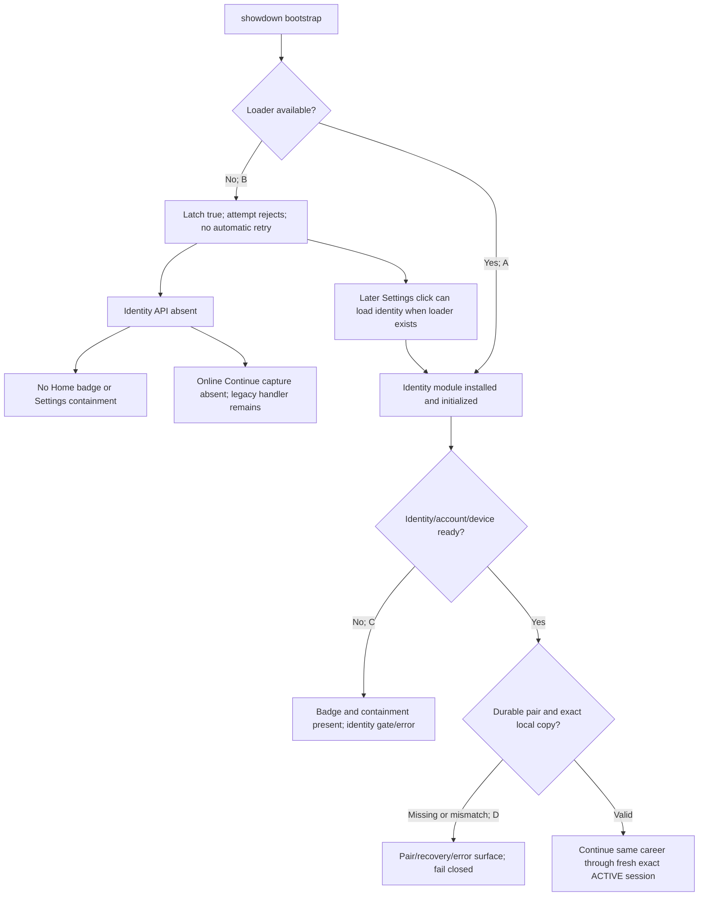

# Studio Z — CODEX RETURN INTEGRATED SINGLE HANDOFF
**October 8, 2026 · source-only GPT-6 reconciliation · Claude/Team G implementation decision pending**

> This **one portable handoff** combines GPT-6's updated decision and the complete unabridged Codex diagnostic as Appendix A. It supplements, but does not overwrite, the earlier Studio Z Olympiad crosswalk and acceptance matrix. All game/production code remains unchanged; reports are not instructions authorizing any action. Studio Z is a finite repair/acceptance task for three owner-observed October 7 incidents, not a permanent service.

## 1. Lead decision — ten-minute briefing

**C FIRST, B CONDITIONALLY, A IN TWO SMALL SLICES.** The highest-evidence first review candidate is the early one-shot `initializeOnlinePlayerEntry` bootstrap in pinned `js/showdown.js`: deferred `showdown.js` can schedule its timer while `document.readyState === 'interactive'` and before the subsequently deferred `optionalModules.js` provides `loadRuntimeScript`. An **imported checked unchanged Chromium delayed-response test** demonstrated a latched bootstrap and missing identity UI. There is **no new independent browser run in Codex's present report** and **no production/physical proof** of the original October 7 cause.

The module's other responsibilities make a **single C mechanism** plausible for multiple surface symptoms:
- `js/onlinePlayerIdentity.js:42` installs the Home badge.
- `line 24,43–46` inserts online containment CSS and hides legacy `.settingsOfflinePanel`.
- `line 57` installs an online capture-phase Start/Continue gate.
- `line 21` loads the remembered pair sidecar only when registered identity exists.

When identity never loads, Home badge/online containment/capture handler can all be absent, so legacy Settings and legacy Continue are reachable. This is a *source-supported joint hypothesis*, not independently reproduced on owner devices. **Important limit:** the checked run reached the Create Showdown screen **without proving successful unsigned creation**. `js/showdown.js:7` independently guards `createShowdown()` on online identity ready/manager, online status and Save Library readiness. Preserve it. Once deferred dependencies arrive, a **later Settings click** may independently load identity, so the early race need not be permanently visible after every action.

**Conditional separate popup question:** `onlinePlayerIdentity.js:50` awaits online dependencies, `sparkConnectedAccount.js:177–183` awaits initialization before `signInWithPopup`, and that SDK call's failure can be returned as a status which the wrapper doesn't inspect before retry-initialization. Possible cold/warm transient user activation timing, busy/UI liveness and swallowed actionable status are **source-supported uncertainties only**, not a physical popup diagnosis. **Do not bundle an auth redesign into the first C fix.** Diagnose only if C becomes demonstrably healthy and physical sign-in still hangs.

## 2. Live GitHub reconciliation (GPT-6 connector, Oct 8 after Codex's 17:37 ET checkpoint)

| Resource | Exact verified state |
|---|---|
| `main` | `bc77a0b934c3d43279f27f73a72db21c2db2b4f2` (source revision 1.9.1-r62; actual old device served bytes unknown) |
| `qa/bug-olympiad` | `6fc04f6823115525eb7950f75576b82d5dc2cbfe` |
| Studio research branch immediately before this report | `e3a281c040b215447da02af40035d008d78dea53` |
| PR #425 | OPEN, **NOT MERGED**, head `2b88d4ae727c20e4329ca7b74d92befd70872e2b` |
| Formal PR reviews and review threads for #425 | **0 reviews / 0 inline threads** at latest connector check. A Codex bot issue-level “review activity complete” banner is **not approval** |
| Problem Z issue #426 | OPEN at latest connector check; owner/lead implementation approval remains unestablished |

Codex lacked GitHub issue/PR API access and therefore marked these two states stale; GPT-6 separately verified the currently shown values. This does not authorize changing them. Before any mutation, Claude must recheck the *then-current* exact refs, permissions, POS20 candidate and safety/proof gates.

## 3. Critical Codex evidence improvements to preserve

**Imported proof and traceability:**
- Identical official `tests/browser/two-manager-browser-journey.cjs` SHA-256 across main, QA and PR: `b3bbc92fa9b92003e5c8f2d99c30d451a6a56e2502d52daf292911f0df923d54`. Codex records four **separate invocation batches**, all on the pinned main, with overlapping **same test family**, not independent root-cause designs or owner device replications.
- `codex-1006-1957` 3× J1.1 failure (2 passed checks each); `2237` and `2308` each 2× J1.1 + 1× J9.1 after **24 passed**; PR-only `2350` 3× J1.1 (2/36 passed, 3/36 reached including failed checkpoint). **Zero clean complete journeys.**
- **Precise J9 correction:** `tests/browser/two-manager-browser-journey.cjs:497–503` reloads Daniel and waits for CAREER READY *before* it proceeds to Nik. The aborted J9.1 observation therefore documents **Daniel's lost UI after his reload; Nik was still in his earlier state**. Don't claim both had reloaded or that the unseen J9.2/J9.3 passed.
- The checked causal startup test held original `optionalModules.js` delivery until a recorded timer observation; it was not a matched three-way fixed-400-ms `optionalModules` / unrelated-image control. The prepared **X-01 remains UNEXECUTED**. Extra test execution needs Team G authority; neither a service worker-free synthetic page nor a code hypothesis proves real Google/Auth/owner browser behavior.
- **38 finding files, 20 checked = 11 real + 9 not_real**. Initial finding statuses are overridden by checked dispositions; duplicate bug records must not be treated as unique causes. Concrete disprovals include supposedly absent Rule Book (actually lazy-built), supposedly mandatory exactly 3 guesses (actual **up to 3**), stale Legacy cache (already invalidated), retired tie ranking/current table claims, and missing shared button dispatcher.
- `codex-1006-1312-1` and `-2`: **two independent Restore Keep-current defects**, incomplete `currentRaw` planning and `destinationIsClean` override. Do NOT use destructive Restore/Apply as Continue recovery. Separate Candidate C safety escalation. Ordinary Continue has not been shown to delete durable saves.

**A remains separate, with narrowly evidenced boundaries:**
- Exact ambiguous label `Primera División` can silently select Argentina instead of requiring an explicit country; unique exact typed leagues already work. Must preserve normal typed unique input.
- 390×844 PHONE list choice target was occluded by a V10 H2/footer, although keyboard selection worked. Test pointer/hitbox in `css/transfer.css`, `css/v10Transfer.css` and V10 plate CSS; do not mistake that for actual tablet-landscape proof.
- Signing 1 completeness/validation needs independent UI/provider-boundary observation. Unlocked signing drafts lost on reload are reported; **draft persistence is a product-decision question**, not established committed-loss bug.
- Likely private-guess public-hash information leakage and production Firestore Rules/client catalog mismatch deserve a **separately authorized security/integrity triage**, not silent scope creep. Checked stale prior-season result inputs likewise separately triaged.

## 4. Smallest safe approval sequence (NOT an implementation order)

1. **Lead receipt:** Claude explicitly accepts finite three-incident scope and resolves live `AGENTS.md`, POS20/POS10, guards, product head, candidate branch/review and physical owner proof authority. 8:00 PM ET is a planned handoff, not an authorization trigger.
2. **C diagnostic gate, conditional:** Review imported unchanged Chromium reproduction. If more independent contrast is necessary, authorize existing research-only X-01 once with **baseline / delayed loader / delayed unrelated image** and record exact hit counts and badge/containment/capture outcomes. If sufficient already, review/authorize just a **small safe bootstrap** change; no broad rewrites.
3. **C regression:** startup under healthy and delayed dependencies, module installed once, sign-in/retry reachable, legacy panel hidden after module initialization, Settings later recovery works, unsigned screen navigation does **not** create a career, no reduction to popup-only auth or exact ACTIVE authority.
4. **B conditional on C:** Execute existing two-manager journey J1.1 and **J9.1–J9.3** on the approved exact candidate. Same durable pair, local save/profile binding, clubs and committed Season 1/2 history preserved; a **new finite ACTIVE private session** after reload is expected, not new pairing. Official J9.2 expects Season 2/3 and 9–3 score; J9.3 expects unchanged completed signings/verdicts. Only add B patch if still independently broken.
5. **A independent:** scoped resolver ambiguities and pointer stacking. Preserve canonical IDs, normal keyboard/unique typed values, phase locks, privacy and provider write boundaries. Don't add unlocked draft autosave without owner acceptance.
6. **Proof and closure:** inherited POS20/POS10 exact-head gates, independent review, production/device runtime verification, consented real two-device Daniel/Nik journeys + SSJR-2.1 hash-bound owner attestation as appropriate, **separate original tablet-landscape and mid-career Continue physical coverage**. Do not award any score from this report. Stop Studio and close #426 only after authorized owner acceptance across all three incident clusters, or specifically accepted limits.

### Fail-closed permanent guards
Exactly 2 managers Daniel/Nik; Firebase Spark with billing OFF forever; App Check enforcement OFF; no Cloud Run/Functions; Firestore memory-only; Google popup-only `browserSessionPersistence` with no scopes added; paired exact ACTIVE private session before league/clubs; canonical `careerModeShowdown.saveLibrary`, `careerModeShowdown.legacyShowdowns`, `careerModeShowdown.preferences` preserved; no public rankings/lobby/discovery; Candidate C exclusive destructive remote-to-local Apply with exact backup/rollback. Do not log raw UID, token, code, email, save, or unsealed guesses.

## 5. Research & game state

**FOUNDATION:** source-supported lead decision produced; Codex diagnostic received; GPT-6 independently refreshed GitHub refs/review/issue. **PRODUCT:** no fix, merge, deployment, new tests or device acceptance from this task; all three original complaints remain open. **EXACT FIRST ACTION:** Claude accepts handoff and decides whether approved matched X-01 contrast is required before one minimal online identity bootstrap candidate. **Conditional unresolved:** true popup hang if identity loads; local save/paired session state if J9 remains; original tablet validation/draft expectations. The optional GPT-only Lens is a self-contained countdown/snapshot for owner visibility, not a Team G/plugin runtime or product milestone authority.

---

# APPENDIX A — COMPLETE CODEX RETURN (verbatim source artifact)

The following is the complete user-provided Codex Markdown report, included so this file remains transferable without access to Codex's `/workspace`. It contains no newly executed tests by GPT-6.

# Executive decision

The first repair candidate is the one-shot online identity bootstrap in `js/showdown.js`, subject to independent Team G review and separate implementation authorization. Pinned main schedules startup while the document may be `interactive`, before the later deferred loader and error reporter exist. An imported, checked Chromium experiment demonstrates this interleaving: the bootstrap latch stays set, the identity module remains absent after dependencies arrive, and unsigned Start navigates to the Create Showdown screen. It does **not** demonstrate unauthorized career creation; the inner `createShowdown()` identity check still rejects it.

Source ownership connects this one missing module to the absent Home badge, missing online Settings containment, and missing capture-phase Continue handler. It therefore plausibly explains C’s missing sign-in surface, legacy Settings fragments, and part of B’s apparent restart. It does not prove that the October 7 devices encountered this ordering, that a durable career changed, or that every sign-in failure shares this cause. A later Settings click can load identity again. A visible “Opening Google sign-in…” state implies a different execution stage and needs a conditional follow-up if startup repair leaves it unresolved: observe actual popup invocation, cold versus warm dependencies, transient user activation, returned status, terminal error, and retry usability under separate approved observation.

Transfer evidence independently supports ambiguous league-label resolution and a phone pointer occlusion defect; neither proves the original tablet clipping or signing-1 error. Unlocked draft persistence remains an owner decision. Two confirmed Restore/Apply Keep-current defects are urgent separate safety blockers; possible private-guess leakage, Rules/catalog disagreement, and stale season inputs need separate triage.

**One next Team G action:** independently review and authorize a narrowly bounded C startup candidate, retaining all identity/session/storage guards and requiring Continue’s existing J9 preservation oracles before claiming B resolved. This report implements nothing and grants no physical acceptance credit.

## 2. Live source and authorization ledger

Research observation checkpoint: **October 8, 2026, 5:37:21 PM America/New_York** (21:37:21 UTC). Git refs were checked at entry and again at this checkpoint; all four matched. The planned 8 PM handoff grants no additional authority.

| Boundary | Live Git observation | Interpretation |
|---|---|---|
| `main` | `bc77a0b934c3d43279f27f73a72db21c2db2b4f2` | Local HEAD matches; source runtime `1.9.1-r62`. This does not establish served production or October 7 device bytes. |
| `qa/bug-olympiad` | `6fc04f6823115525eb7950f75576b82d5dc2cbfe` | Exact imported findings/checks source. |
| `investigation/problem-z-z-studio-2026-10-08` | `e3a281c040b215447da02af40035d008d78dea53` | Existing research, read through Git objects without switching branches. |
| PR #425 `refs/pull/425/head` | `2b88d4ae727c20e4329ca7b74d92befd70872e2b` | PR-only 2350 evidence read at this head, not substituted with QA head. |
| Current working branch | `work` | No research-branch ownership or branch-write authority assumed. |
| [Incident #426](https://github.com/nikahanghojjati-oss/fifa17-career-showdown2/issues/426) | Live API unavailable | Imported Studio evidence says open and “ESCALATED FOR TRIAGE, NOT APPROVED FOR IMPLEMENTATION.” Current issue body/state not independently refreshed. |
| [PR #425](https://github.com/nikahanghojjati-oss/fifa17-career-showdown2/pull/425) review/merge state | Live API unavailable | Imported state: open/unmerged, reporting PR. A Git head ref alone does not establish that it remains open. |

Actual read-only remote query, exit 0:

```text
git ls-remote origin refs/heads/main refs/heads/qa/bug-olympiad refs/heads/investigation/problem-z-z-studio-2026-10-08 refs/pull/425/head
```

The four returned SHAs are in the table. `git fetch --no-tags origin <Studio-SHA> <QA-SHA> <PR-SHA>` downloaded evidence objects, exit 0; it did not check out, reset, push, merge, or edit source. `gh api .../issues/426 --jq '{number,state,title,body,updated_at}'` returned `Forbidden`, exit 1, both normally and with sandbox escalation. This was a service/access failure, not an automatic-approval-review rejection. No credentials were extracted or requested, and review/issue facts remain explicitly stale.

**Authority reviewed:** current `AGENTS.md`, `CURRENT_PRODUCT_GUARDS.json`, `PROJECT_OPERATING_SYSTEM_POS20.json/.md`, `POS20_CURRENT_STATE.json`, `NEXT_TASK.md`, inherited `PROJECT_OPERATING_SYSTEM_POS10.md`, the existing SSJR/MDP ledgers, `SHARED_SHOWDOWN_JOURNEY_MODEL_SSJR2.json`, `authority-history/OWNER_SSJR21_ONE_LONGER_RUN_AUTHORIZATION_2026-09-29.md`, `SSJR2_PHYSICAL_RUN_GUIDE.md`, and the standing merge/deploy authorization. Recorded r18/main/candidate claims in older planning files are historical observations, not this research’s source boundary. Broad standing merge authority does not override this assignment’s express research-only scope.

**Studio authority and continuity:** inspected the four requested integrated/causal/acceptance/calibration documents, `README.md`, `RESEARCH_PROTOCOL.md`, `NEXT_RESEARCH_SESSION.md`, and prepared X-01 at the pinned Studio head. Its README states: “The owner has reserved all further browser/provider/physical checks and application engineering for Claude/Team G.” The latest request authorizes this research; it supplies no separate disposable-probe execution approval. Source and imported evidence suffice for the first decision, so no new probes are needed.

`CODEX_NEW`: this is a new diagnostic turn in the existing onboarding chat. No prior diagnostic report was present at the pinned Studio path or current checkout. Other-session ownership is unknown. Existing work was reused rather than overwritten. A standalone Markdown artifact outside the checkout is the brief’s permitted fallback; no research branch was created or claimed.

Permanent boundaries remain: Daniel/playerOne and Nik/playerTwo only; Firebase Spark, billing permanently OFF; no Cloud Run/Functions; App Check enforcement OFF; Firestore memory-only; Google popup-only `browserSessionPersistence`, no extra scopes; exact finite ACTIVE private session before league/club authority; canonical Save Library/Legacy/preferences preserved; Candidate C exclusively owns destructive remote-to-local Apply with exact rollback. No production actions or progress-score updates occurred.

Evidence tiers used here: **OWNER-REPORTED**, **SOURCE-VERIFIED**, **CHECKED-EXECUTED (IMPORTED)**, **INFERENCE**. **CODEX-NEW-LOCAL-RUN: NONE. PHYSICAL-ACCEPTED: NONE.** Transfer reporter execution is identified separately where it lacks a later `checked/` adjudication.

## 3. Claim-quality ledger

Direct enumeration and JSON inspection at pinned QA found **38 findings, 20 checked reports: 11 `real`, 9 `not_real`**. The remaining 18 findings are unadjudicated by that directory. These are file counts, not unique causes, completion percentages, or defect prevalence. A finding’s earlier `status=confirmed` cannot override a later `checked.result=not_real`.

All rows below refer to [the exact QA checked directory](https://github.com/nikahanghojjati-oss/fifa17-career-showdown2/tree/6fc04f6823115525eb7950f75576b82d5dc2cbfe/project-documents/gameplay-factory/sweeps/olympiad/checked).

| Checked record(s) | Disposition / recorded exit | Decision-grade meaning |
|---|---|---|
| `codex-1006-1957-1` | real / 0 | Positive assertion of the loader race and missing identity/navigation gate. No repaired behavior tested. |
| `codex-1006-1251-1`, `codex-1006-1301-1` | real / 1 each | Overlapping stale Season 1 inputs used as Season 2 results; one substantive integrity cause, different reproductions. |
| `codex-1006-1312-1` | real / 1 | Populated-library Apply plans using incomplete snapshot; preview promise violated. |
| `codex-1006-1312-2`, `chat-1006-1335-1` | real / 1 each | Explicit Keep current overridden on clean destination; duplicate reports of the second Restore defect. |
| `chat-1006-1346-1` | real / 0 | Rule Book omits exact season-tie DRAW; scoring already handles the tie. |
| `codex-1006-1303-1` | real / 1 | Rule Book omits mutually agreed early end of transfer window. |
| `codex-1006-1303-2` | real / 1 | Rule Book omits final accumulated-score/DRAW explanation. |
| `codex-1006-1313-1` | real / 1 | Readable abandoned/zero-season career shown as unavailable instead of empty. |
| `codex-1006-1939-1` | real / 1 | Closed/reloaded final trophies missing despite history retaining the counts. Display/reconciliation distinction; not proof of lost seasons. |
| `chat-1006-0418-1` | not_real | Shared presentation capture handler already owns the real buttons. Exclude missing-dispatch repair. |
| `chat-1006-0534-1` | not_real | Current Career Table renders correctly; allegation targets retired helper. |
| `chat-1006-1331-1` | not_real / 0 | Rule Book lazily created on actual click. Repeated `chat-1007-0103-1` suspicion is not new contrary evidence. |
| `chat-1006-1333-1`, `chat-1006-1355-1` | not_real / 0 | Actual archive transaction already invalidates Legacy cache/revision. |
| `chat-1006-1334-1`, `chat-1006-1336-1`, `chat-1006-1342-1` | not_real / 0 | Rule is **up to three** guesses; partial/empty entries are supported. Do not mandate exactly three. |
| `chat-1006-1345-1` | not_real / 0 | Tied ranks correct on current screens; retired local helper is not current entrypoint. |

For the first two not-real records, this table does not invent a common `evidence.exit_code`; their evidence schemas differ. Their adjudication is explicit.

Relevant unadjudicated records: `2238-1` ambiguous typed league and `2238-2` phone hit target carry reported Codex execution and `confirmed` finding status, but no later checked entry; `2238-3` draft reload is `likely` and needs a product contract. `2237/2308` official journey failures corroborate symptoms within the same test lineage. `chat-1006-0441-1` and `chat-1006-0503-1` remain `likely` security/integrity hypotheses. `codex-1007-0355-1` is a later reported reproduction of the populated Restore class, not a third independent Restore cause.

**Correction to older handoff:** the integrated packet still lists `chat-1006-0418-1` as an adjacent likely dispatcher concern. The later checked/calibrated evidence refutes it; this report adopts that disproof. Dormant timer-helper suspicions and incomplete initial markup do not expand Studio.

Exit 1 from a reached correctness assertion can substantiate a defect. Exit 0 from an assertion expecting defective behavior also substantiates a defect. Neither means a fix passed. An unexplained crash or fixture failure would need separate diagnosis; the imported checked records describe their actual failure semantics.

## 4. Run provenance and review authenticity

All four official journey batches tested main `bc77a0b...`, using `tests/browser/two-manager-browser-journey.cjs`, not game changes from a reporting branch. The test’s SHA-256 is identical on main, pinned QA, and PR head:

```text
b3bbc92fa9b92003e5c8f2d99c30d451a6a56e2502d52daf292911f0df923d54
```

| Batch and evidence location | Attempt starts on October 6, EDT (UTC) | Actual outcomes |
|---|---|---|
| QA `runs/codex-1006-1957.json` | 3:57:38 PM (19:57:38); 3:58:42 (19:58:42); 3:59:38 (19:59:38) | All three exit 1 at J1.1; 2 passed checks each. No J9 reached. |
| QA `runs/codex-1006-2237.json` | 6:38:02 PM (22:38:02); 6:40:19 (22:40:19); 6:41:08 (22:41:08) | Attempts 1/2 exit 1 at J1.1 after 2 passes; attempt 3 exits 1 at Daniel J9.1 after 24 passes. |
| QA `runs/codex-1006-2308.json` | 7:08:12 PM (23:08:12); 7:12:50 (23:12:50); 7:13:53 (23:13:53) | Same outcome pattern: 2, 2, 24 passes; final failure Daniel J9.1. |
| PR-only `runs/codex-1006-2350.json` | 7:50:04 PM (23:50:04); 7:53:27 (23:53:27); 7:54:18 (23:54:18) | All three exit 1 at J1.1; **2/36 passed, 3/36 reached** per attempt; 33 later checks not reached. |

These are distinct invocation batches with recorded different times, not distinct causal designs or physical replications. None completed cleanly. 2237/2308 attempt 3 completed the first 24 numbered checkpoints through J8.2, then failed J9.1; the remaining 11 later checkpoints were not reached. J9.2/J9.3 passed in none of the cited batches. Blank page-error arrays at failure are diagnostics, not completed JZ.1/JZ.2 global assertions.

The recorded common environment includes Node 24.19.0, Java 21.0.12.1, Playwright 1.62.1, bundled Chromium 149 (1957/2237 report 149.0.7827.0), Firebase CLI 15.28.1, SDK 12.17.0, rules-unit-testing 5.0.1, admin 14.2.0, three-season plan, local demo Auth/Firestore emulators, and fresh browser contexts. 2237/2308 report Daniel 393×660 and Nik 360×640. The emulators are synthetic provider authority; they are not real Google authentication or production acceptance. J0.1 confirms composed Rules replace the initial emulator-open configuration; the warning about initially open emulator Rules does not itself invalidate that later assertion.

Recorded official command, **not executed in this investigation**:

```bash
npx --yes firebase-tools@15.28.1 emulators:exec --config tests/browser/support/firebase.browser-journey.json --only auth,firestore --project demo-cms-browser-journey "CMS_SHOWDOWN_LENGTH=3 node tests/browser/two-manager-browser-journey.cjs"
```

**The discriminating checked startup intervention is distinct from those official runs.** `checked/codex-1006-1957-1.json` records unchanged local Chromium, 390×844, service workers blocked, delayed delivery of original `optionalModules.js`, and observation/forwarding of the original bootstrap timer. Before release: `readyState=interactive`, loader/reporter undefined, bootstrap true, identity undefined. After release: loader/reporter functions, bootstrap still true, identity absent. Start then reaches `createShowdown`, overlay/sign-in button absent, page errors empty; exit 0. It holds the response until the timer is observed rather than establishing a fixed 400 ms three-condition comparison. It contains **no matched unrelated-image negative control**. The later 2308 record describes a 300 ms startup delay; natural official failures were not internally instrumented, so their causal attribution remains inferred.

The prepared Studio X-01 would supply baseline/400 ms loader/400 ms unrelated-image conditions, but remains unexecuted. The older source-excerpt VM model is supporting imported model evidence, not a full-browser or owner-device test. Neither is promoted to an independent physical confirmation.

**Review provenance:** the pinned calibration packet reports one `chatgpt-codex-connector[bot]` issue-level “Code Review activity completed” comment and zero submitted PR reviews/inline threads at its check. Current API access is unavailable, so these counts are imported, not fresh. A banner is not patch approval, an exact-head review seal, a merge, or a successful repair test.

## 5. C/B/legacy Settings causal map

Primary source boundaries on pinned main:

- [Deferred script order, index.html:410](https://github.com/nikahanghojjati-oss/fifa17-career-showdown2/blob/bc77a0b934c3d43279f27f73a72db21c2db2b4f2/index.html#L410): showdown before optionalModules and app.
- [Bootstrap/Settings recovery/inner guard, showdown.js:4](https://github.com/nikahanghojjati-oss/fifa17-career-showdown2/blob/bc77a0b934c3d43279f27f73a72db21c2db2b4f2/js/showdown.js#L4): loader required; latch set before attempt; loading document waits DOMContentLoaded, other states schedule timer; top-level call at line 21.
- [Pair sidecar and containment, onlinePlayerIdentity.js:21](https://github.com/nikahanghojjati-oss/fifa17-career-showdown2/blob/bc77a0b934c3d43279f27f73a72db21c2db2b4f2/js/onlinePlayerIdentity.js#L21); badge at 42, hidden panels/settings observers 43–46, online Continue 55, capture handler 57.
- [Legacy Settings panel, settings.js:366](https://github.com/nikahanghojjati-oss/fifa17-career-showdown2/blob/bc77a0b934c3d43279f27f73a72db21c2db2b4f2/js/settings.js#L366).
- [Legacy Continue, screens.js:643](https://github.com/nikahanghojjati-oss/fifa17-career-showdown2/blob/bc77a0b934c3d43279f27f73a72db21c2db2b4f2/js/screens.js#L643), registered at 775.



Predictions are source-based, not new DOM observations. Panels can be missing because Settings has not yet mounted; computed visibility must be tested only while the Settings overlay itself is open.

| Condition | Badge / containment style / legacy offline panel | Identity overlay | Continue owner and legacy fallback | Pair panel | Inner creation guard |
|---|---|---|---|---|---|
| **A: loader ready; module executes** | Badge and `onlineInternalSurfaceContainment` are installed during initialization/render; `.settingsOfflinePanel` hidden when present. Label depends on state: SIGN IN, CHOOSE PLAYER, CONNECTING, RECONNECT, or manager. | Conditional on gate and identity state; a healthy startup does not require an always-open overlay. | Capture handler owns enabled gameplay clicks. Non-ready identity is gated; ready Continue uses canonical pair path. | Sidecar starts when account present and registered; actual pairing remains conditional. | Requires online connectivity, identity `ready` + manager, valid setup field, and ready Save Library. Module loading alone does not authorize a new career. |
| **B: bootstrap runs without loader; loader arrives later** | Badge/style absent until another load succeeds. Legacy offline panel can be visible if Settings mounts without identity. | Identity module cannot mount its overlay; checked delayed run observed absence. | Online capture absent; legacy listener may win **if enabled**. No saved local Showdown routes to setup; a present local save uses older resume logic. | Missing sidecar through this identity path; a separately installed module is a counterexample. | Identity absent: fails before Save Library creation. Create screen navigation is not successful creation. |
| **C: module loaded, account/device initialization or sign-in fails** | Badge/style remain installed; legacy panel remains hidden. Typical badge SIGN IN or CONNECTING, rather than absent. | Signed-out gives sign-in; device/error/offline gives retry; pending sign-in gives busy CONNECTING copy. | Capture stays installed and blocks enabled gameplay until identity ready. Legacy handler is stopped. | Not a valid paired career through sidecar without registered account; stale/independently mounted surface not excluded. | Fails while identity not ready. |
| **D: module registered/identity ready, pair or local copy fails** | Manager badge/style remain; legacy panel hidden. | Identity overlay normally closes when identity is ready; pair/recovery problems belong to another surface. | Canonical pair Continue/render wins. Missing local copy yields recovery-required; mismatch/error fails closed. No intentional legacy fallback. | Unpaired/waiting/recovery-required/error depending on actual provider/local condition. | Identity part can pass, but canonical online Start/session path must retain pair + exact ACTIVE authority before league/club. The inner guard alone is not a session check. |

**Settings counterexample matters.** The earlier document-level capture listener in `showdown.js:5` intercepts Settings, concurrently starts `ensureOnlinePlayerIdentitySurface()`, loads Save Library cutover, invokes its Settings action, and awaits identity preparation afterward. Once the loader exists, this can install the previously absent identity even though startup’s latch remains true. It is a separate load attempt, not proof of automatic bootstrap retry. The earlier capture handler also stops later propagation; identity’s own Settings callback need not run on that first click. Initialization nevertheless schedules containment/observer preparation at 0/80/250/800 ms. Transient panel visibility before installation and later recovery are therefore both plausible; neither was directly reproduced here.

**Certainty:** loader failure and skipped module are CHECKED-EXECUTED (IMPORTED) for the forced interleaving. Ownership of badge/style/Continue is SOURCE-VERIFIED. The joined October 7 explanation is INFERENCE. It cannot establish Google popup failure, provider data loss, wrong deployed revision, missing local copy, or universal permanence.

**Falsifiers:** an affected device with initialized identity API, badge/containment present, and online capture demonstrably winning would falsify the missing-module explanation for that occurrence. A matched unrelated-image delay causing the same loss would weaken loader-specific attribution. Verified changes to durable pair/save bindings would defeat a surface-only explanation for B. A healthy matched loader-delay run would limit portability of the imported interleaving rather than erase the recorded reproducer.

## 6. Conditional popup assessment

[onlinePlayerIdentity.js:50](https://github.com/nikahanghojjati-oss/fifa17-career-showdown2/blob/bc77a0b934c3d43279f27f73a72db21c2db2b4f2/js/onlinePlayerIdentity.js#L50) sets `Opening Google sign-in…`, awaits dependency loading, awaits `account.signIn()`, then reinitializes identity. [sparkConnectedAccount.js:154](https://github.com/nikahanghojjati-oss/fifa17-career-showdown2/blob/bc77a0b934c3d43279f27f73a72db21c2db2b4f2/js/sparkConnectedAccount.js#L154) awaits runtime services, session persistence, bootstrap loading, and possibly activation before lines 177–183 invoke `signInWithPopup()`.

These awaits can create a cold/warm difference in timing; transient user-activation expiration is a browser-dependent **INFERENCE**, not a reproduced physical failure. A pending promise before popup invocation can also leave busy UI. The code at lines 184–190 returns failed/cancelled states instead of necessarily throwing, while identity’s sign-in wrapper ignores that returned state before reinitialization. That can replace useful error detail with generic status. No independent terminal timeout is visible in these methods; other runtime layers must not be assumed absent. A displayed spinner is evidence that some identity code executed and cannot automatically be attributed to a module that never loaded on that same page.

**One conditional next diagnostic, only if C startup is healthy and stall persists:** in a separately authorized disposable browser fixture or consented owner observation, compare cold and warmed dependencies; record sanitized `popupInvoked`, `navigator.userActivation.isActive/hasBeenActive` at the actual invocation, returned SDK/account `status`, promise completion/error, busy-to-terminal transition, and whether retry is usable. Suppress tokens, user identity, and popup result contents. Keep popup-only, browserSessionPersistence, no new scopes. A fixture can test state propagation but cannot prove real Google/browser permission success. Execution here: **BLOCKED_NEEDS_APPROVAL / UNEXECUTED**. This is a diagnostic question, not an auth redesign or an addition to the first patch.

## 7. Continue preservation matrix

Three authorities must stay distinct: **durable paired rivalry**, **exact local Save Library recovery binding**, and **finite page-memory private session**. A new session after reload is expected; a new rivalry, club draw, or reset is not implied.

Source flow: online capture (identity:57) → canonical Continue (55) → registered-account pair sync (21) → `pairContinueOnlineShowdown` ([persistentNikDanielPair.js:224](https://github.com/nikahanghojjati-oss/fifa17-career-showdown2/blob/bc77a0b934c3d43279f27f73a72db21c2db2b4f2/js/persistentNikDanielPair.js#L224)) → exact local binding and recovery pointer → shared entry panel → exact ACTIVE verification → confirmed setup/accepted-season continuation ([productionSharedJourneyEntry.js:234](https://github.com/nikahanghojjati-oss/fifa17-career-showdown2/blob/bc77a0b934c3d43279f27f73a72db21c2db2b4f2/js/productionSharedJourneyEntry.js#L234)). Entry at 257 checks exact session/account/device/rivalry equality, no pending action, finite expiry, and current time before expiry.

| Case | Required routing/interpretation | What must not be inferred |
|---|---|---|
| 1. Identity never installed | If Continue enabled, legacy `resumeSavedShowdown()` may run; missing local saved Showdown goes to Create screen. Diagnose display/handler loss first. | Navigation is not proof of provider deletion or unsigned creation. |
| 2. Identity ready; durable pair active; exact local copy exists; old session lost/expired | Show CAREER READY, Continue on same pair; host/join a fresh exact ACTIVE session, then resume accepted provider season. | A fresh session is not re-pairing, a new career, or a reason to redraw clubs. |
| 3. Identity ready; active provider pair; exact local recovery copy missing | `pairInitialize` (192) returns recovery-required; Continue’s exact binding check (224) rejects before entry. | Cloud pair existence does not establish that this browser has the required local career identity. Do not silently create a replacement. |
| 4. Wrong manager/account/device/rivalry/save/profile binding | Enforce role and context checks; reject mismatch or show unavailable/error. Exact local slot uses matching save/profile/manager role, then exact session binding. | Surface repair must not weaken fail-closed authority or swap manager slots. |
| 5. Accepted season and completed shared transfers exist | `resumeAcceptedSeason()` selects current provider-authoritative season; no Career Start replay/new league draw; completed transfer inputs/verdicts match. | A generic dashboard opening does not prove full J9.2/J9.3 preservation. |
| 6. Local save genuinely absent/corrupt | Distinguish storage/read failure from missing UI. Stop for separately approved recovery or safe use of existing verified copy. | No Restore/Apply, Reset, Delete, Forget, or Start Over as this report’s workaround. |

`pairHasExactLocalRecoveryCopy` (92) checks readiness plus exact Save Library save/profile role linkage. `pairExactLocalBindingForProviderSlot` (93) also calls `runtime.switchActiveSave`; Continue then calls `pairAttachRecoveryPointer` (165), which invokes connected attach/initialize. These operations may mutate persistent state. Likewise legacy resume may normalize/write a save or archive a completed one (screens:664/675). They were not executed and are not described as intrinsically read-only. Source inspection shows no new-pair creation call in canonical Continue, but is not a before/after proof that all downstream storage is unchanged.

**Official acceptance oracle, source requirements rather than documented passes:** [two-manager-browser-journey.cjs:491](https://github.com/nikahanghojjati-oss/fifa17-career-showdown2/blob/bc77a0b934c3d43279f27f73a72db21c2db2b4f2/tests/browser/two-manager-browser-journey.cjs#L491).

- **J9.1:** both managers reload after completed Season 2 transfers, retain session auth, see CAREER READY for the same pair, and have no GET READY overlay. Existing imported failures stop at Daniel’s CAREER READY wait; Nik had not yet reloaded.
- **J9.2:** both Continue, Daniel hosts and Nik joins a **new exact ACTIVE private session**; both return automatically to **Season 2 of 3, score 9–3**, without Career Start, new rivalry, club draw, or Season 1 replay.
- **J9.3:** completed Season 2 signings and verdicts remain identical and both can proceed to Season 2 results. The test has a conditional transfer-screen branch; an explicit completed-transfer comparison strengthens owner evidence if routing skips that branch.

Future approved before/after observation should export **only equality booleans/counts**: `rivalrySame`, `providerSaveIdSame`, `profileIdSame`, `managerSlotSame`, `localSaveStillPresent`, `leagueAndClubsSame`, `seasonProgressSame`, `scoreSame`, `completedTransfersSame`, `historySame`, `newRivalryNotCreated`, `newExactSessionAllowed`. No values or payloads were collected here. Expected preservation is not reported as observed preservation.

The current SSJR-2.1 guide’s recovery steps occur **after Season 3**, whereas J9 is mid-career with Season 2 transfers completed. The guide is not equivalent proof. Obtain a separately consented mid-career acceptance observation without inventing a second mandatory full three-season scoring run.

## 8. Transfer minimum patch contracts

These are independent A discriminators, not consequences of the identity race.

**A-ID: ambiguous exact label.** [transferSelector.js:189](https://github.com/nikahanghojjati-oss/fifa17-career-showdown2/blob/bc77a0b934c3d43279f27f73a72db21c2db2b4f2/js/transferSelector.js#L189) clears canonical metadata, then repopulates it when the resolver’s normalized label matches typed text. [transferOptions.js:52](https://github.com/nikahanghojjati-oss/fifa17-career-showdown2/blob/bc77a0b934c3d43279f27f73a72db21c2db2b4f2/data/transferOptions.js#L52) indexes the first match for duplicate normalized labels. Imported `findings/codex-1006-2238-1.json` and its targeted script report that typing `Primera División` silently assigns Argentina even though Spain is listed; the signing locks and a Spain guess fails to match. Explicit country selection works.

Minimal candidate surface: `js/transferSelector.js`, with a narrowly reviewed `data/transferOptions.js` resolver/index adjustment **only if needed**. Contract: ambiguous human labels remain unresolved until explicit canonical choice; unambiguous exact typed league names and direct canonical IDs remain valid. Test both countries, a unique typed league, explicit pointer and keyboard choice, and editing a prior choice. Do not ban typing globally or change catalog, verdict, scoring, or provider semantics.

**A-HIT: phone selector target.** Imported `2238-2` uses 390×844 PHONE, option rectangle approximately x11–379/y735–783; center hit-testing returns `H2 #tw-transferChallengeTitle`, normal click fails, keyboard and desktop selection work. [css/transfer.css:127](https://github.com/nikahanghojjati-oss/fifa17-career-showdown2/blob/bc77a0b934c3d43279f27f73a72db21c2db2b4f2/css/transfer.css#L127) makes the list fixed at bottom 12 px below 760 px; its base z-index is 80. That cannot overcome ancestor stacking/clipping. `css/v10Transfer.css:14` gives the fixed host its own layer; plate CSS assigns inner panel children z=1, fixed footer z=5 then later z=8 at line 912, with its own fixed control layers.

Minimal candidate surface: scoped selector placement/layering in `css/transfer.css` and/or `css/v10Transfer.css`, with `visual-assets/v10_1/tr2/slice-02-plate/plate.css` only if the owning layer cannot be addressed through glue. Choose the smallest actual owner of the hit-test failure after inspection; do not blindly increase a child z-index or blanket-disable footer pointer events. A DOM portal via selector code is a conditional alternative if CSS cannot escape the ancestor, not a preapproved rewrite. Preserve footer/actions, focus/keyboard behavior, safe areas, scroll access, overlay priority, and role privacy.

The generic QA harness uses ArrowDown/Enter **below 600 px**, so its passing canonical selection helper cannot prove phone tapability. It also uses in-memory protocol/provider boundaries, not real Firebase acceptance. The targeted pointer script, rather than that helper, is the relevant imported failure oracle. Require real pointer `elementFromPoint` and normal clicks on all options, with keyboard/desktop/unique-label negative controls. **Original tablet landscape remains unproved:** owner dimensions, browser, zoom, keyboard state and actual hit targets are unknown. Inspect representative landscape only after authorization, and require distinct original-tablet owner acceptance; a phone pass cannot close it.

**Signing 1 validation is separate.** `productionSharedTransferChallenge.js:194–195` rejects a nonempty row missing trimmed player name, canonical league, or nationality with “Complete signing 1…”. `sparkSharedTransferChallenge.js:55–57` additionally enforces catalog membership, trimmed nonempty name ≤80 characters, valid unique slot, and max three rows. Capture sanitized completeness booleans, validation code and whether a provider call was reached before assigning cause. CSS overlap can prevent a selection but does not alone explain the owner error. The shipped error mapping/input limit does not prove the original physical failure is fixed.

**Draft hold:** `2238-3` reports unlocked text gone after page reload while locked guesses/signings and completed verdicts persist in its fixture. `productionSharedTransferChallenge.js:181,211–212` clears/repopulates forms by context and authoritative locked inputs. Ordinary refresh retaining a draft differs from a page reload. Expected draft durability is **PRODUCT_DECISION_REQUIRED**; no owner promise found. Do not add provider auto-save, cross-role storage, or replay writes as an incidental A fix.

Imported targeted script SHA-256 fingerprints, verified by hashing the exact QA Git blobs during this research:

| QA `test/` file | SHA-256 |
|---|---|
| `CMS03-codex-1006-2238-ambiguous-league.cjs` | `773dcc3a87f79d66744c3020c423d857b9ab9eee58d45dda56581882deadba14` |
| `CMS03-codex-1006-2238-phone-league-pick.cjs` | `905ff1f84b17337da5130ce2cacd39622bfe3d8699c8266554e211a0a4325b03` |
| `CMS03-codex-1006-2238-draft-reload.cjs` | `b6524d24eae7bc697a19997de609e998f38350582318cc5cdc82f99f5566848e` |

The reporter describes failed correctness assertions. The first two support concrete bug candidates; the draft assertion embeds an unresolved product expectation. None is a passing fix, and none was rerun here.

## 9. Safety and scope exceptions

**Separate immediate Restore safety blocker, designated Candidate C/Team G owner:** [restore.js:264](https://github.com/nikahanghojjati-oss/fifa17-career-showdown2/blob/bc77a0b934c3d43279f27f73a72db21c2db2b4f2/js/restore.js#L264) captures both `currentRaw` and fuller `completeRaw`, but line 283 plans against incomplete `currentRaw` without Save Library. Separately, [restore.js:144](https://github.com/nikahanghojjati-oss/fifa17-career-showdown2/blob/bc77a0b934c3d43279f27f73a72db21c2db2b4f2/js/restore.js#L144) treats clean destination as a reason to restore the full backup despite explicit Keep current. Checked `1312-1/2`, overlapping `1335`, and later reported `0355` support two independent defects. Fixing one does not necessarily fix the other. This report does not designate a named person beyond the authorized Team G/Candidate C owner because assignment is unverified. No Restore/Apply, Reset, Delete, Forget Device, Start Over, or actual-save experiment was performed or recommended as a diagnostic. **Do not use the existing recovery UI’s restore wording as authorization.** Ordinary Continue has not been shown to delete provider data.

**Private-guess risk, separate security review:** `sparkSharedTransferChallenge.js:147–150` hashes normalized private guesses together with operation metadata that is public, and its ledger records operation hashes/IDs. `chat-1006-0441-1` posits low-entropy offline inference by an entitled rival. SOURCE-VERIFIED hash construction, **LIKELY** exploit hypothesis; no checked-real exploit, enumeration, real guesses, or production read performed. Keep role-document privacy and finite-scope threat review separate from Studio repair.

**Rules/client mismatch, separate integrity gate:** `firestore.transfer-challenge-production.fragment.rules:5,212–222` checks option-ID slug syntax and name length; client at `sparkSharedTransferChallenge.js:55–57` requires exact catalog membership and trim equality. Completed reads (142) read both role documents. SOURCE-VERIFIED predicate difference; `chat-1006-0503-1` remains **LIKELY** modified-authorized-client poisoning risk. No proof of an accepted invalid production transaction, no emulator write here, no inference that the owner submitted forged data, no Rules edits authorized.

**Stale results:** checked-real `1251/1301` demonstrate stale prior-season form values can be published as new results; separate adjacent integrity triage, not a fourth Studio incident. Closed trophies/empty-history presentation and three Rule Book wording defects likewise do not establish B data deletion. Checked-refuted clicks/cache/table/guess-count/markup allegations remain excluded.

This report is the escalation artifact. It sends no messages to other people and performs no issue/PR comment or closure action.

## 10. New probes and minimally discriminating proposal

**NO_NEW_TESTS_RUN. New local experiment count: 0 of maximum 3.** No browser, Node VM, emulator, Google sign-in, provider attach/session, gameplay, recovery, or actual-save action was executed for this diagnosis. The earlier onboarding contract/operations/stability checks prepared the environment; they are not Studio race/Continue/transfer evidence and are not credited here.

Actual work: read repository instructions/source and imported Git objects; query refs; inspect selected findings, checked records, run metadata and runner source; hash existing files; write this report. A JSON inspection initially encountered differing evidence schemas and was corrected; no application execution or conclusion depends on that failed inspection. Missing target-report lookup at Studio returned exit 128 because the path is absent; that is not a failing game test.

If Team G requires one additional causal contrast before implementation review, the existing X-01 is the minimally discriminating proposal. **BLOCKED_NEEDS_APPROVAL / UNEXECUTED** here because Studio reserves new execution to Team G. The command is documented for the existing Studio checkout, where the probe resides; it is not runnable by pretending it already exists on main’s current `work` checkout:

```bash
# After authorized Team G execution responsibility, from existing pinned Studio checkout:
# Terminal A
npm run serve:test
# Terminal B
CMS_CHROMIUM_MULTI_CONTEXT=1 node investigations/problem-z/tools/x01-local-browser-probe.cjs
```

Do not create another worktree/branch merely for this proposal. Verify unchanged served main product blobs and prepare disposable local contexts. The existing script refuses non-loopback/authenticated URLs, blocks outbound non-local requests, uses 1200×800, and checks five Git blob pins. Its three conditions are baseline; 400 ms `optionalModules.js` delay; equal delay to `assets/marco-reus-2015-cc-by.webp`. Require hit counts 0/1/1, and record readyState, bootstrap latch, loader/reporter types, identity API/initialized/status, badge/style/pair presence, computed legacy-panel visibility with Settings open, and observed Continue click ownership without invoking real recovery or provider actions. The prepared script’s current observations must be reviewed against that expanded oracle; presence alone does not prove initialized state, computed visibility, or actual handler ownership.

A no-hit unrelated-image control, source mismatch, indiscriminate external-load failure, or inability to isolate handler ownership makes the relevant inference inconclusive. Blocking Google/Firebase is appropriate for this no-provider probe, but may itself cause account initialization errors; compare **module installation**, not successful account readiness. Existing imported evidence suffices to recommend independent review, so repeating it is optional and must earn new discriminating information. Any authorized run must retain command, source SHA, fixture hash, intercept counts, viewport, output/errors, exit status and artifact hash; no invented results are supplied here.

## 11. Claude repair gate and finite closure

The first bounded candidate is **C startup only**, after Claude independently accepts the finite mandate, resolves current refs/reviews/guards, and receives separate implementation authority. In `initializeOnlinePlayerEntry`, make dependency readiness govern first attempt and make failure distinct from successful module initialization. A plausible smallest file-level candidate waits for completion of deferred scripts when the document is still `interactive` rather than starting the zero-delay timer early, while retaining idempotence/in-flight ownership and a visible retry/error path. `DOMContentLoaded` is the existing loading-state readiness boundary; merely clearing the latch without arranging a later legitimate attempt is insufficient. This is a review contract, not supplied patch code. Successful module initialization is distinct from successful authentication. Preserve Settings recovery, inner `createShowdown` guard, exact ACTIVE session gate, canonical Save Library and provider safety. Do not simultaneously redesign auth or weaken online gating to hide the failure.

Required candidate oracles: healthy baseline, targeted loader delay, matched unrelated-image control, no duplicate initialization, installed badge/containment/capture, signed-out Start unable to create, and later Settings recovery. Then follow **B through J9.1–J9.3 on the same candidate**; if C fixes that family, avoid a second B patch. A failing independent B storage/session condition needs separate source diagnosis and authority, not automatic Restore.

**A-ID/A-HIT are independent acceptance obligations.** After their narrow authorization, reuse targeted selector/pointer assertions plus unique-label, explicit-country, keyboard/desktop and role/phase controls. Require original tablet-landscape signing/input/pointer acceptance separately; keep unlocked draft persistence on hold until the owner sets a contract. No scoring, timer, role privacy, provider, durable-save or phase-lock change belongs in incidental selector/CSS repair.

For any authorized implementation, select inherited deterministic/heavy proofs through POS20/POS10 impact routing; POS20 cannot reduce the POS10 floor. Unknown executable risk or changes to router/workflow/dependencies/service worker/proof authority require the full seal. Candidate mutation freezes while validation is pending. Merge requires one exact head, required product proofs and POS20 benchmark/exact-head seal, current clean review/thread state, and expected-head protection. None of those live candidate gates was established here, and no merge/deploy instruction is authorized by this report.

Production/physical acceptance requires genuine Daniel/Nik accounts on two physical devices and independent networks, consented actions, exact production runtime and live automated evidence, plus SSJR-2.1’s hash-bound owner attestation and unchanged scoring policy. Automated source/tests/emulators earn zero physical SSJR/MDP credit. Distinct mid-career Continue and original tablet observations fill their acceptance gaps; they do not manufacture another score or silently require a second full scored run. Assign Restore and likely security/integrity triage separately.

Finite stopping condition: enough source/imported evidence for the first safe decision is present, so this research closes with this report. Studio itself remains open until approved repairs satisfy all three incidents’ acceptance and the owner authorizes issue closure/archive. No automatic 8 PM takeover, new platform, dashboard, research program, PR, or test infrastructure.

## 12. File/change manifest and next task

**One deliverable written:** standalone `/workspace/STUDIO_Z_CODEX_DISCRIMINATING_DIAGNOSTIC_RETURN_2026-10-08.md`, outside the repository. Intended research-path name is `investigations/problem-z/STUDIO_Z_CODEX_DISCRIMINATING_DIAGNOSTIC_RETURN_2026-10-08.md`; placing it on an existing owned research branch is deferred to the recipient. Current checkout is `work`, and concurrent Studio ownership is unknown, so no branch write, checkout, commit, push, or replacement of another session’s research occurred. The exact report path was absent from pinned Studio.

**Repository changes:** none to tracked files, application source, manifests/lockfiles, official tests, QA/main/Studio branch refs, Rules, CI, runtime/release version, or deployment. Evidence fetch updated local Git object storage/FETCH_HEAD only. The uploaded prompt remains in its attachment location. No helper/probe/test infrastructure was created. No raw identities, tokens, private codes, save payloads, or unsealed opponent guesses were added to the report.

**Limits requiring separate authority:** new local/browser/provider/physical probes, popup/Continue observations with side effects, every implementation/release action, destructive recovery, and unchosen draft persistence. Live issue/review API access is unavailable; no need to supply secrets or stop independent source research. No actual repair, full-journey pass, physical acceptance, receipt by Claude, or publication is claimed.

**One next task:** Team G independently reviews this source-bound decision and decides whether to authorize the single minimal C startup candidate with preserved guards and J9 acceptance gates. If matched negative-control evidence is required first, authorize the existing X-01 rather than duplicate the research program.

RETURN_TO_GPT6: Upload this complete file for integration before Claude's handoff; preserve evidence, contradictions and permission boundaries.


---

## APPENDIX B — 18:03–19:00 ET foundation sprint

**Status:** bounded GPT-6 source audit before the scheduled 19:00 ET research checkpoint. This extends the source-level decision evidence only. No authorized product changes, browser/provider/emulator/physical experiments, new game tests, scored SSJR/MDP proof or Claude acceptance occurred in this session. Preserve Appendix A Codex report verbatim.

### B1. Identity startup minimal patch *contract*, not patch

The precise current main callgraph now checked as a whole:

- `index.html:410–416` puts deferred `js/showdown.js` before `js/optionalModules.js` and `js/app.js`.
- `showdown.js:6` writes `window.__cmsOnlinePlayerEntryBootstrap=true` *before* its asynchronous startup attempt and schedules the attempt with `setTimeout(...,0)` whenever `document.readyState !== 'loading'`; for a deferred script, `interactive` does not imply that later deferred scripts executed.
- `optionalModules.js:92–137` defines `loadRuntimeScript`; main `js/app.js` assigns `window.reportApplicationError` at source offset approximately 2502, then its `sa()` (near offset 7220) initializes screens and optional modules and opens Home. It invokes `sa()` immediately when its deferred execution sees `readyState !== 'loading'`. A `DOMContentLoaded` handler registered by the earlier deferred `showdown.js` would fire only after that script processing is complete, so it is a plausible **readiness boundary**, not a guarantee in dynamic-async/error cases.
- `onlinePlayerIdentity.js:24,42–46,57` supplies the containment style, identity badge, Settings observer and capture-phase gameplay Continue; legacy `screens.js:643–656,774–775` binds older Continue. Existing imported checked Chromium confirms one failed load interleaving; no new experiment here.

**First candidate minimum acceptance:** all source-defined loader dependencies available before one identity attempt; no latch permanently representing failed initialization; duplicate scheduling and Settings entry do not mount duplicate badge/style/capture handlers; missing script/loader has actionable reporter/retry; signed-out Start/Continue cannot commit a new career; normal mobile online Home/Settings survive; working old local recovery is not overwritten; no change to Google popup-only persistence or ACTIVE/private authority. **A single `DOMContentLoaded` delay alone must not be claimed to solve Google popup hangs, absent local saves, or offline/failed dependencies**. Test the failed/late-load path only with separate approved harness execution, and preserve the existing inner `createShowdown()` ready-identity check at `showdown.js:7`.

**Alternative script-reorder risk:** moving `optionalModules.js` before `showdown.js` in `index.html` may solve dependency order but touches broader application shell/asset ordering and must still independently prove reporter/UI initialization and all existing runtime contracts. Neither patch location is preapproved.

### B2. Exact proof-routing release trap (fresh static router check)

At pinned main, `POS10_IMPACT_GRAPH.json` patterns and `scripts/pos10-impact-router.mjs:79–120` show:
- A **source-only** change to `js/showdown.js` matches `core-runtime` and its inherited CORE_RUNTIME_RELEASE deterministic/proof bundle floor. The prior Studio final-lap proof table documents that static projection.
- A **source-only** change to `index.html` matches `core-runtime`, `home-inline`, and `v1-visual-inline`, so it adds the Home and V1 visual inline routes. **This is why script reordering is not automatically a smaller release.**
- Most importantly `service-worker.js` is explicitly inside `graph.fullSealPatterns`; `pos10-impact-router.mjs:79–80` selects `FULL_SEAL` when that file changes, *before* ordinary artifact routing. GitHub Pages shell SW `service-worker.js:298–302,337–345` can serve a retained verified runtime/cache when a current one is missing and assets are looked up with `?v=...`. Source `main` = r62 is not proof the affected phone/tablet served r62.
- Therefore **do not promise an end-to-end “showdown.js-only low-cost patch”**. Actual publication may require updated HTML asset URL/runtime revision and service worker/release files. The **actual final diff union** (not a hypothetical one-file mutation) determines POS10 proof, POS20 benchmark/seal, live review, deployment, cache coherence, and owner physical proof. Avoid doing a code change solely to reduce test selection.

No router, browser, emulator or release job was executed for this source observation. It is an inspectable rule/regex consequence, not a completed proof.

### B3. Newly explicit data-safety trap along canonical Continue

`onlinePlayerIdentity.js:55` → `persistentNikDanielPair.js:224` does not construct a replacement rivalry, but:
1. `pairEnsureSaveLibraryAuthority():177` can activate `js/saveLibraryCutover.js` if the local Save Library runtime is not ready. Readiness setup is **not guaranteed read-only**.
2. `pairHasExactLocalRecoveryCopy():92` requires matching `saveId` and manager `profileId` inside canonical saves. `pairExactLocalBindingForProviderSlot():93` deliberately calls `runtime.switchActiveSave(saveId)` and verifies the resulting selected ID. An expected active-save switch is a permitted controlled state change, not evidence of game loss.
3. `pairAttachRecoveryPointer():165` calls a provider attachment/initialization routine; it is **not** a read-only UI navigation. Equality checks of durable rivalry, save/profile, unrelated saves and committed scores/history before/after must be part of independent approved tests. No remote production provider action may be run by Studio research.
4. On absence of the exact local copy, `pairInitialize():192` currently displays advice to *“Restore a backup … or delete the old Showdown and start fresh.”* `pairContinueOnlineShowdown():224` can also recommend a verified backup. Both source strings are dangerous to follow as immediate user troubleshooting while confirmed **Restore/Apply Keep current** defects remain unresolved. **Operational safety no-go**: do not instruct the owner to tap Restore/Apply, Delete, Forget device, Reset, or Start Over in response to these strings. Escalate under assigned Candidate C/recovery authority. Do **not** rewrite UI strings from GPT research without approval.
5. `js/screens.js:643–656` old Continue can navigate to Create Showdown after a missing local saved Showdown. That is *navigation*, not proof old provider history or local canonical Save Library was erased. Likewise an expected fresh private session is never a new rivalry.

### B4. Transfer discrimination refined to avoid resolver collateral damage

`data/transferOptions.js:52–77` uses **first-match normalized option** lookup. `js/transferSelector.js:189–203` auto-sets canonical metadata for exact typed labels. Because duplicate league labels exist (Spain and Argentina both `Primera División`), the naive index collapses country-distinct choices. **Preferred review question:** can the UI typing-path ambiguity be resolved without globally changing `resolveFifa17TransferOption`, whose existing canonical/alias callers may rely on exact ID and unique-label behavior? Check all callsites and negative controls; never silently remap locked signings or scoring.

`css/transfer.css:127–143` fixes a mobile dropdown to 12px from bottom at <=760px, and Codex's phone repro sees a V10 footer/title intercept. `css/v10Transfer.css:67–74` applies a distinct portrait <=760px layout; the owner's landscape tablet is a **different viewport/orientation**. Do not infer that curing the 390×844 phone layering will cure the tablet's 3-column signing/card fit. Tablet acceptance must separately record dimensions, orientation, keyboard open/closed, complete signing-1 field hitboxes and safe error copy. Keyboard ArrowDown/Enter at small widths is a valid functionality check but **not** touch acceptance. Draft persistence still needs product-owner decision; committed guesses/signings/verdicts must remain unchanged on reload.

### B5. Evidence-based use of the 18:00–20:00 period

The planned checkpoint and cutoff are **scheduled individual tasks**, not a silently operating long-running worker:
- **Before 19:00:** finish only material source gaps (startup timing, proof-routing, active save/pair side effects, ambiguous transfer UI and true tablet distinction), preserve contradictions and stop speculative bug hunting. This appendix records them.
- **19:00 ET reset checkpoint:** separately scheduled GPT-6 task reads current research branch, rechecks heads and only truly new evidence, measures which of C/B/A decision questions are answered, and returns **one complete portable checkpoint**. No reserved probe or software implementation.
- **19:00–19:40 (if actively invoked):** use returned checkpoint to resolve at most **one** high-value new source uncertainty; no 40-block study or duplicated Codex diagnostics.
- **19:40–20:00:** consolidate final handoff; no new independent scope.
- **20:00 ET final:** existing scheduled task provides **one** fully portable report and closes the GPT-6 foundation effort, pending Claude's explicit receipt and authority. A clock alone does not appoint, authorize or merge; the game remains unresolved without repair and real two-manager acceptance.

**Research speed/throughput estimate:** budget by **decision value**, not fake percentages or unobserved “compute hours.” Each narrow source thread should take roughly one evidence question plus explicit falsifier, expected file/proof footprint and no-go checklist. Reuse already checked Olympiad/Codex fixtures before creating any new tests. The actual source inspection cannot establish physical readiness or automated test pass.

**Lens interpretation:** research milestones reflect files/evidence read and reconciled, not developer implementation or product acceptance. No progress scoreboard should count a Codex diagnostic as a verified fix, or a scheduled checkpoint as completed before its execution.

**Current state:** `main` `bc77a0b9...`, Studio research before this appendix `cdfbd9de...`, QA `6fc04f68...`, PR #425 QA-only/open at latest check; core game unchanged; zero new product tests/probes/deploys/physical attestations; 19:00/20:00 checkpoint pending. **First next authorized action for Claude remains review of the narrow C bootstrap candidate and whether independent X-01 matched delay is needed.** Do not endorse a particular patch as already approved.
