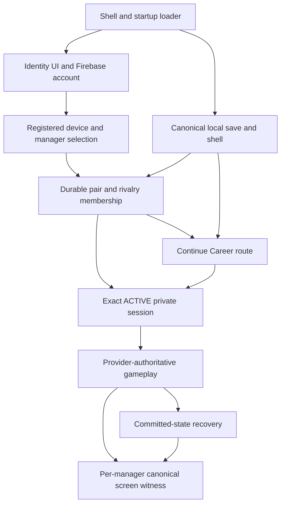

# Studio Z — complete one-file Claude Opus 5.5 takeover packet

**As of 2026-10-08 EDT.** Owner Nik. Incoming Team G Lead Claude Opus 5.5 requested at 8 PM EDT; actual receipt/approval has **not been evidenced**. Prepared by GPT-6 on a documentation/research-only branch. **One file, 16 embedded exact source documents.** Original full earlier Astra transfer remains a separate historical attachment; all active recovered research artifacts and the exact unexecuted X-01 runner are embedded below.

**Purpose and closure:** Factory G's small **finite** Studio Z addresses three owner-reported October 7 clusters: online identity/sign-in; Continue same durable career with fresh exact session; tablet transfer signing/viewport and safe replay. Investigate only until enough evidence supports bounded Team G implementation, prove through inherited gates and genuine Nik/Daniel physical acceptance, close approved issue #426 and retire Studio. Historical 40 IDs / 32 selected catalog are OPTIONAL, not a research quota or long-lived dashboard. Optional Lens is strictly read-only/on-demand and not required.

**Completed on the research side:** Recovered Astra causal/model audit and ledger, consolidated finite charter, source mapping and implementation envelopes, tracked existing X-01 Node VM source-excerpt evidence, identified possible online-vs-legacy Continue handler interaction and transfer canonical-ID issue through static source reading, prepared **unexecuted** standalone local X-01 browser probe (Section 4) with exact revision pins and external-network denial. All product code, production data, Rules, deployment and real account state remain untouched by this handoff work.

**Still reserved for Claude/Team G:** every further full-source browser/provider/dual-device check and implementation authorization. The Node VM source-excerpt result is not a full-site browser or original-device diagnosis; prior PR #425 QA results remain imported evidence. The browser probe in Section 4 **has not been run, debugged or passed**; it requires local checkout, Node >=24, Playwright/Chromium, pre-running `npm run serve:test`, and POS20 authorization. It cannot test actual Google sign-in since outbound requests are blocked. If its source pin or navigation fails, stop and record the blocker.

**One and only next task:** independently execute X-01 three scenarios on pinned app: baseline, 400ms `optionalModules.js` only, 400ms `app.js` unrelated downstream control; record timing/loader/latch/badge/error facts, exact HEAD and private data untouched, then make a stop/go decision on the smallest authorized startup repair. `Z-003` is *in-progress*, 1 original research baseline complete, 0 independent verifications, implementation permission **FALSE**, no owner physical acceptance. If not reproduced, do not force a patch. Pursue the other two failures only through similarly minimal discriminating checks.

**Repo:** `nikahanghojjati-oss/fifa17-career-showdown2`. Pinned product main: `bc77a0b934c3d43279f27f73a72db21c2db2b4f2`. Research branch: `investigation/problem-z-z-studio-2026-10-08` at pre-export commit `e74c31efa25ffff4302fd7d244021812f018b1a8`. Resolve current GitHub refs again when Claude takes over. POS20/AGENTS/guards and owner authority control over this file; clock time does not grant credentials or merge rights.

**Fast path:** Sections 1–3 show mission, prepared repair boundaries and exact X-01 command. Section 4 includes full runnable-but-unexecuted source. Other sections preserve evidence/causal limitations and original plan only when relevant.

## Source snapshot manifest

| Section | Investigation artifact | GitHub blob SHA |
|---|---|---|
| 1 | `investigations/problem-z/STUDIO_Z_FOUNDATION_AND_LEAD_HANDOFF_2026-10-08.md` | `3564b0c00275c83e0f024cf5f8261fe8a7d67206` |
| 2 | `investigations/problem-z/STUDIO_Z_BUILD_READINESS.md` | `ec26549684fd64ccbe7d1a7a7316eacf3e9c9de1` |
| 3 | `investigations/problem-z/NEXT_RESEARCH_SESSION.md` | `2a98ea6e38c63ed6d27d7e28fd199995632f0eb6` |
| 4 | `investigations/problem-z/tools/x01-local-browser-probe.cjs` | `426e11ff9159e3c9bcdda61fba39c393447cf195` |
| 5 | `investigations/problem-z/research-blocks/Z-003_STARTUP_SOURCE_EXCERPT_MODEL_2026-10-08.md` | `f7f1f0bc535ec97c9c3aa0b4f41342366639fd89` |
| 6 | `investigations/problem-z/RESEARCH_LEDGER.json` | `1e0cb856499d5023ea914d76d8561169baf0e7c4` |
| 7 | `investigations/problem-z/EVIDENCE_REGISTER.md` | `8cda2f203db4adf96b832d2364b0cdd286fd79b4` |
| 8 | `investigations/problem-z/CAUSAL_MODEL.md` | `7553a29d4676751c34067e0b909ed28d128ccb2b` |
| 9 | `investigations/problem-z/ARCHITECTURE_AUDIT.md` | `3720326972b774fb95422f39bcf73a724c6cddaf` |
| 10 | `investigations/problem-z/RESEARCH_PROGRAM.md` | `0246cce3b291d100f889c213400ea8fc1c1a3245` |
| 11 | `investigations/problem-z/RESEARCH_PROTOCOL.md` | `0f5a5895246719cc3843f764b304595fc871db6d` |
| 12 | `investigations/problem-z/TEAM_G_REVIEW_GATE.md` | `cb78fec2a189ca5faec2edcb1321a27ca2817f09` |
| 13 | `investigations/problem-z/README.md` | `7d34c52621b6e55439f52e67e7a23d7a821e7a71` |
| 14 | `investigations/problem-z/research-blocks/Z-001_INCIDENT_BASELINE.md` | `8236fd1018c05fa51b6e8cdc41ff320fdb316a80` |
| 15 | `investigations/problem-z/Z_STUDIO_TRIAGE_PROPOSAL.md` | `411893b31837109c7259b7dbeca9d73b51e57f0a` |
| 16 | `investigations/problem-z/BLOCK_TEMPLATE.md` | `3d0c94aec2fe649462c4ea75e83a5b6ba16a5f01` |

---

## SECTION 1: `investigations/problem-z/STUDIO_Z_FOUNDATION_AND_LEAD_HANDOFF_2026-10-08.md`

*Exact GitHub research source e74c31efa25ffff4302fd7d244021812f018b1a8, blob 3564b0c00275c83e0f024cf5f8261fe8a7d67206.*

~~~~~~~~markdown
# Studio Z — finite foundation and Team G build handoff

**Prepared:** 2026-10-08 EDT | **Owner:** Nik | **Receiving lead:** Team G Lead, Claude Opus 5.5, Factory G | **Scheduled handoff:** 2026-10-08 20:00 EDT

**Status:** Foundation prepared; incident unresolved; engineering authorization **NOT GRANTED** by this document. Receipt, review, approval, implementation, release and physical acceptance have not occurred merely because this file exists or the clock reaches 8 PM.

## Foundation completion addendum — later on October 8, 2026

The owner subsequently authorized continued **research/documentation foundation work only**, not building/repairing the application. Since this charter's first commit:

- Astra's unpublished audit and causal model were recovered from the owner-supplied handoff and committed as [ARCHITECTURE_AUDIT.md](ARCHITECTURE_AUDIT.md) and [CAUSAL_MODEL.md](CAUSAL_MODEL.md). **Recovered text is not asserted byte-for-byte identical to the original unsaved files; the full earlier export remains independent historical preservation.**
- Astra's revised [RESEARCH_PROGRAM.md](RESEARCH_PROGRAM.md) (32 selectable units, 40 preserved IDs) and reconciled [RESEARCH_LEDGER.json](RESEARCH_LEDGER.json) were committed; **no additional research question was marked independently verified**. The old paragraph below suggesting those drafts remain unpublished is historical and now superseded.
- The small, conditional [STUDIO_Z_BUILD_READINESS.md](STUDIO_Z_BUILD_READINESS.md) provides engineering candidate options, explicit entry/exit tests and physical acceptance for the three incident clusters. It is a **specification**, not a repair.
- [EVIDENCE_REGISTER.md](EVIDENCE_REGISTER.md) now records scoped S-10–S-19/T-01/P-01 provenance including imported-versus-direct review; [RESEARCH_PROTOCOL.md](RESEARCH_PROTOCOL.md) and [TEAM_G_REVIEW_GATE.md](TEAM_G_REVIEW_GATE.md) enforce finite scope and the one-file-per-session export. [NEXT_RESEARCH_SESSION.md](NEXT_RESEARCH_SESSION.md) still selects only X-01.
- This work **did not execute X-01, modify game/test files, assign workers, test real accounts, mutate Firebase, release anything, grant Team G authority, or establish a physical cause**. Do not confuse source-check corroboration with browser test T evidence.

**Lead entry order:** this addendum → current foundation → build readiness → NEXT_RESEARCH_SESSION → ledger/causal/evidence only as needed → live POS20/guards. Do not read the entire historical catalog before making the first discriminating decision. The latest **single-file export** is linked from the workspace README when available; actual lead receipt/acceptance remains a separate recorded action.

---

### Targeted post-foundation research update

The [Z-003 source-excerpt model report](research-blocks/Z-003_STARTUP_SOURCE_EXCERPT_MODEL_2026-10-08.md) now records a **locally executed Node VM event-order experiment** using verbatim pinned startup function excerpts. Three deterministic loader-availability schedules discriminated the latched failure in the model, but a Chromium real-browser attempt was **blocked at environment navigation**, so X-01 remains **in progress, not independently browser verified**. The research ledger/evidence and next session have been updated. No application patch, real account, production provider activity, deployment or original physical incident reproduction occurred.

## 1. Mission and stop rule

Studio Z is a **temporary, narrow Factory G incident team** for GitHub issue [#426](https://github.com/nikahanghojjati-oss/fifa17-career-showdown2/issues/426). Its purpose is to:
1. Diagnose only the failures witnessed in the October 7, 2026 two-manager physical playtests.
2. Enable Team G to authorize and build the **smallest independently justified corrections**.
3. Demonstrate reliable entry, same-career continuation and usable transfers without weakening private authority or destroying data.
4. Obtain required real Nik/Daniel acceptance and **close Studio Z**, archive the evidence and retire temporary diagnostics.

Do **not** create an indefinite research lab, require all 40 historical IDs or 32 optional revised units, fabricate completion percentages, build a parallel management platform or make the optional Lens an engineering dependency. Decision-changing evidence, not document count, determines the next step. After two nondiscriminating attempts against an unchanged evidence fingerprint, reframe or report the exact blocker. Stop researching a mechanism once a safe, testable repair decision can be made; preserve incident attribution uncertainty where unavoidable.

## 2. Exact authority and repository state

- **Repo:** `nikahanghojjati-oss/fifa17-career-showdown2`.
- **Research/documentation branch:** `investigation/problem-z-z-studio-2026-10-08`; observed original head `740a706129d963ec2ff1c5f35c68e3c71b0a7a3f` immediately before this foundation was written.
- **Product main:** `bc77a0b934c3d43279f27f73a72db21c2db2b4f2` at this review. Re-resolve before work. App source pinned to this SHA for comparisons.
- **Historical imported test:** PR [#425](https://github.com/nikahanghojjati-oss/fifa17-career-showdown2/pull/425), report at `project-documents/gameplay-factory/sweeps/olympiad/findings/codex-1006-2350-1.json` on `qa/codex-two-manager-1006-2350`. Its reported runs are **not** an independent rerun by this Studio.
- **Authority:** live `AGENTS.md`, `CURRENT_PRODUCT_GUARDS.json`, active POS20, inherited POS10 proof floor, and applicable SSJR-2.1/MDP rules always govern. Historic `POS20_CURRENT_STATE.json` and old research instructions may be stale.
- **Allowed documentation changes under this foundation:** only `investigations/problem-z/` on the research branch. Team G Lead must separately authorize any application code, worker branches, PRs, tests involving real private accounts, merges, provider change or deployment.

The owner's complete **STUDIO_Z_HANDOFF_2026-10-08(1).md** export preserves 12 prior research snapshots, including Astra's architecture audit, causal model and revision-2 ledger **that had not been committed** as of that export. The export's opening reconciliation supersedes stale appendix claims. Do not assume those drafts exist in GitHub, blindly run their generator or overwrite newer branch work.

## 3. Incident scope and current evidence

**A — tablet transfers:** Daniel reported an ill-fitting Transfer War Room; signing 1 requested player name, previous league and nationality; refresh disrupted continuity. **B — Continue Career:** after league/club selection, Continue appeared to restart or require repeated pairing/setup. **C — entry/UI:** Home sign-in absent while Season 1/1 remained; Connecting / Opening Google sign-in could persist; Settings login failed to make the manager game-ready and legacy DEVICE / OFFLINE APP surfaced.

Neither original screenshot bytes nor actual October 7 device runtime/auth/provider trace are available in this handoff. Apparent UI resets do **not** establish deleted canonical saves or durable pair. These are three potentially distinct defects; do not force a single explanation.

### Findings imported from Astra's prior research, plus direct current source checks

| Lead | Evidential status | Small next discriminator |
|---|---|---|
| **H-03 startup ordering/latch.** Pinned `index.html` defers `showdown.js` before `optionalModules.js` and `app.js`. `showdown.js` sets `__cmsOnlinePlayerEntryBootstrap` before calling the optional runtime loader; a premature throw can leave an unretried bootstrap. | Source path confirmed directly; PR #425 reports three sign-in-entry failures and 0/400 ms loader-response contrast. **Not independently rerun here and not the proven physical root cause.** | **Z-003 / X-01**, unchanged pinned files, ordinary load, 400 ms optional-loader delay, *unrelated-asset* 400 ms delay control. |
| **H-02/H-11 auth readiness.** Google/Firebase user, connected-account bootstrap, registered device, local manager, durable pair and exact ACTIVE private session are distinct authorities; signed-out rendering can hide bootstrap problems. | Prior source review, no original provider/auth trace. | Synthetic successful-auth/bootstrap-fail versus popup rejection/pending state only if X-01 does not explain access sufficiently. |
| **H-05 signing canonical ID.** `pstcBuildSignings` uses canonical league/nationality IDs, and `pstcHandleAction` builds signings **before** `lockSignings`. A visible label may lack the ID; the error need not be a provider rejection. | Direct source check at pinned `js/productionSharedTransferChallenge.js`; no physical field trace. | **X-05** same visible labels with valid/missing canonical IDs and a zero-provider-call spy. |
| **H-07 tablet reachability.** Reported layout/keyboard accessibility problem is independent of validation and may exacerbate it. | Owner report; original viewport and screenshots unavailable. | **X-06** actual control bounds/scroll/focus in labelled synthetic viewports; physical confirmation only with consent. |
| **H-04/H-08 continuity.** Page-memory private-session capability can disappear on reload without erasing pair/career; a fresh **exact ACTIVE** session may be required. Repeat permanent pairing, destructive reset or new career are not acceptable substitutes. | Prior source/contract review, no original local/remote before-and-after proof. | **X-04** disposable exact save/pair fixtures; expired/absent/valid/wrong-session controls and snapshot invariants. |
| **H-06 mixed runtime.** Current public asset sampling may match main yet the historical device cache could differ. | Previously sampled public assets; **not** a record of physical device bytes. | Investigate only if coherent-source timing and actual failure evidence warrant it; never clear real storage by default. |

**Important contradiction:** A visible Connecting overlay in one physical attempt means an always-absent identity module cannot explain every symptom without different chronology or an additional mechanism. Preserve that uncertainty.

## 4. Minimal Studio construction inside Factory G

No new standing organization is needed. The lead may assign one investigator/engineer plus an independent verifier **per active defect**, reusing Factory G tooling. Keep only **one active repair slice** unless there is a concrete blocking dependency that makes parallel work safer and faster.

| Slice | Enter when | Output | No-go |
|---|---|---|---|
| **Access/UI** (first priority) | Independently reproduced H-03 or other bounded auth mechanism | Small patch proposal with race/error recovery proof; Home sign-in and legacy containment regression | No changed auth persistence, provider policy or popup scopes; no silent bypass of identity guard |
| **Career continuity** | Exact-context trace distinguishes new session authorization from incorrect new pairing/career route | Same-career non-destructive resume correction and local/remote invariant tests | No routine re-pair, reset, storage clear, unsolicited remote Apply or persisted old session token |
| **Tablet transfers** | Canonical ID or measured reachability defect independently demonstrated | Accessible input/validation correction with replay/commit invariants | No leaking rival private selections or claiming client rejection is provider denial without a call trace |

A slice can be deferred or dropped when evidence disproves it or shows it is not needed. Do not turn research catalog entries into mandatory worker tasks.

## 5. First ready-to-run assignment — X-01 (not a fix)

**Question:** Can a targeted 400 ms delay only to `js/optionalModules.js` make the pinned source latch identity initialization before `loadRuntimeScript` exists, with no automatic recovery once it becomes available?

**Execution boundary:** disposable local browser contexts, static pinned product files, no code edits, no real Google login and no production Firebase mutations. Reproduce the imported PR's environment only to the degree needed; inspect fixture interception and record limitations. Compare (A) ordinary response, (B) delayed optional loader, (C) equally delayed unrelated asset, with identical environment/source fingerprints.

**Capture:** clocked readyState; bootstrap flag; loader/reporter availability; identity API/badge/overlay; Start click route; console/page errors; screenshot hashes; exact test command and environment. **Falsifier:** identity reliably recovers after loader arrival under the targeted delay. If all controls fail, check harness assumptions rather than award root-cause credit.

**Gate:** attach an independently executed comparison or a precise blocker. Explain what it proves about source **and what it cannot prove about October 7 physical play**. Then ask Team G Lead whether evidence justifies a bounded access repair, and what regression gates apply. Do not implement a patch as part of this research-only assignment.

## 6. Acceptance and non-negotiable safety

- **Exactly two private managers**: Nik and Daniel. UID, registered-device and provider membership remain authoritative; mere manager display selection is never authorization. Exact ACTIVE session, right context, and per-manager canonical screens are retained.
- **Permanent zero billing:** Firebase Spark only, no Blaze/billing account/Cloud Run/Cloud Functions; App Check enforcement OFF; Firestore browser memory-only; Google popup-only `browserSessionPersistence`, no added scopes.
- **Data safety:** canonical save and durable pairing preserved; no automatic delete, cache/storage clear, account switching, device revocation, pairing discard or active Showdown abandonment. Candidate C remains the sole destructive remote-to-local Apply with backup and exact rollback.
- **Privacy:** no tokens, UIDs, private invite codes, account/device identifiers, complete saves or raw provider payloads in public diagnostics or exports. Init/restore/attach/sign-in can write; never call them as “passive reads.”
- **Proof to close:** both legitimate managers enter and reach game-ready authority, recover the **same** rivalry/career and committed progress through relevant interruptions, can use measured tablet transfer controls with canonical selections, and independently witness required screens. Execute applicable POS20/POS10, regression, provider, SSJR-2.1 and genuine physical gates before lead review, release and Nik's acceptance; no simulated credit.
- **Exit:** exact approved build/test/deployment evidence, remaining debt, Team G Lead decision and Nik's acceptance. Close issue #426 only on actual authorized resolution. If owner accepts unresolved limits, record **closed-inconclusive**, not “fixed.” Archive Studio Z and stop Lens/research.

## 7. Optional progress Lens, deliberately tiny

Default to the existing ledger/checkpoint as source of truth and an **on-demand read-only Markdown snapshot**, showing active question, verified finding, blocker, next decision and authority state. No plugin/backend/dashboard deployment is justified now; no duplicated status entry, polling, heartbeat, permanent infrastructure or synthetic percentage. Lens effort must remain incidental and never block a fix.

## 8. Mandatory one-file session handoff and lead acceptance

**Every Studio Z chat/session ends with ONE downloadable, self-contained transferable Markdown file**, including: objective; exact repo/branch/source fingerprints; what was actually read/run/written; evidence tiers and artifacts; controls and contradictory results; changed files/commit SHA; guard review; current status; approval/acceptance states; blockers; **one** next action; and clear closure criteria. When draft research is not committed, embed it verbatim or otherwise preserve it in that one export; do not pretend a remote pointer carries unpublished work. A short lead-facing summary may accompany the one file, but not replace it. An unexpected interruption requires honest partial preservation on the next session, not invented completion.

**Lead receipt checklist:** (1) acknowledge actual handoff receipt, (2) check live POS20/guards/repo refs and unpublished Astra draft state, (3) accept/amend this finite scope, (4) review independent X-01 outcome and choose first bounded slice, (5) specify separate implementation branch/workers, verification and publication authority, (6) record acceptance or blocker. **The 8:00 PM schedule is not an automatic model switch, permissions transfer or message delivery.**

**Prepared for Claude Opus 5.5:** Continue only this finite Studio Z incident within Factory G. Treat the uploaded complete historical handoff as evidence history and this file as the current small execution charter. Do not execute 40/32 units by default. Independently discriminate X-01 first, then select the smallest supported repair slice. Obtain the necessary approvals, preserve all guards, verify Nik/Daniel's physical outcomes, and close the temporary Studio when accepted.
~~~~~~~~

---

## SECTION 2: `investigations/problem-z/STUDIO_Z_BUILD_READINESS.md`

*Exact GitHub research source e74c31efa25ffff4302fd7d244021812f018b1a8, blob ec26549684fd64ccbe7d1a7a7316eacf3e9c9de1.*

~~~~~~~~markdown
# Studio Z — build-ready incident work packages (decision-only, no implementation)

**Authority status:** prepared by GPT-6 on 2026-10-08 for Team G Lead Claude Opus 5.5; **not an authorization** to modify game code, allocate workers, run real-account experiments, publish, deploy, reset data or close issue #426. Nik owns reserved decisions. Lead must confirm receipt/authority against the live repository and POS20.

**Scope limit:** exactly the three *reported problem clusters*. Activate a package only when its own discriminatory evidence warrants a change; completing every package is **not** an automatic requirement. Preserve the original failures and separately identified alternatives. One active implementation slice by default. No independent Studio platform or permanent workers.

## A. Verified source context versus incident attribution

| Evidence | What is presently known | What must not be inferred |
|---|---|---|
| Owner runs A/B/C, 2026-10-07 | Tablet transfer fit/signing error, apparent reset after Continue, missing sign-in and stuck Connecting/legacy UI | Original screenshot bytes, exact device revisions, provider deletions and common root cause were **not** obtained |
| Pinned main `bc77a0b934c3d43279f27f73a72db21c2db2b4f2` | Inspectable source with runtime `1.9.1-r62` | That this was actually loaded by both physical devices |
| PR #425, QA head `2b88d4ae727c20e4329ca7b74d92befd70872e2b` | **Imported** three journey sign-in gate failures plus reported optional-loader 0/400 ms contrast | Independent Studio replication, real Google popup/root cause, successful downstream journey |
| Fresh Studio source checks | `index.html` defers `showdown.js` before `optionalModules.js` and `app.js`; `showdown.js` sets startup latch first. Transfer `pstcBuildSignings` checks canonical IDs before `lockSignings`. Session code has memory/expiry context. | End-to-end causality on October 7 or physical tablet measurements |

**Exact source links** at pinned main:
- [index.html script order, ~lines 410–417](https://github.com/nikahanghojjati-oss/fifa17-career-showdown2/blob/bc77a0b934c3d43279f27f73a72db21c2db2b4f2/index.html#L410-L417)
- [showdown.js bootstrap latch, ~lines 4–7](https://github.com/nikahanghojjati-oss/fifa17-career-showdown2/blob/bc77a0b934c3d43279f27f73a72db21c2db2b4f2/js/showdown.js#L4-L7)
- [optionalModules.js loader, ~line 92](https://github.com/nikahanghojjati-oss/fifa17-career-showdown2/blob/bc77a0b934c3d43279f27f73a72db21c2db2b4f2/js/optionalModules.js#L92)
- [onlinePlayerIdentity.js state/readiness and containment, ~lines 1–60](https://github.com/nikahanghojjati-oss/fifa17-career-showdown2/blob/bc77a0b934c3d43279f27f73a72db21c2db2b4f2/js/onlinePlayerIdentity.js#L1-L60)
- [screens.js local Continue route, ~line 643](https://github.com/nikahanghojjati-oss/fifa17-career-showdown2/blob/bc77a0b934c3d43279f27f73a72db21c2db2b4f2/js/screens.js#L643)
- [persistentNikDanielPair.js source of online Continue and binding, ~lines 223–225](https://github.com/nikahanghojjati-oss/fifa17-career-showdown2/blob/bc77a0b934c3d43279f27f73a72db21c2db2b4f2/js/persistentNikDanielPair.js#L223-L225)
- [sparkRemoteJoining.js session status and expiry, ~lines 107–133](https://github.com/nikahanghojjati-oss/fifa17-career-showdown2/blob/bc77a0b934c3d43279f27f73a72db21c2db2b4f2/js/sparkRemoteJoining.js#L107-L133)
- [productionSharedTransferChallenge.js canonical signing builder, ~lines 173 and 193–196](https://github.com/nikahanghojjati-oss/fifa17-career-showdown2/blob/bc77a0b934c3d43279f27f73a72db21c2db2b4f2/js/productionSharedTransferChallenge.js#L193-L196)
- [Transfer submit path before provider, ~lines 268–276](https://github.com/nikahanghojjati-oss/fifa17-career-showdown2/blob/bc77a0b934c3d43279f27f73a72db21c2db2b4f2/js/productionSharedTransferChallenge.js#L268-L276)

### Universal implementation contract

Every proposed patch must specify the exact cause it addresses, untouched authorities, minimal file changes, its pre-fix failing case, negative controls, required inherited contract/browser/provider tests, one independently reviewed exact-head proof, and affected genuine dual-device owner acceptance. No fix may retroactively claim the other clusters resolved. Do not solve by changing authentication persistence, weakening guard, showing gameplay before authoritative identity, resetting storage, or re-creating the career.

## B. Slice 1 — access, identity startup and correct feedback (FIRST)

**Enter only after:** X-01 independent control/intervention test confirms a reproducible startup race, *or* X-02 independently confirms a different access boundary. This is highest priority because absent sign-in blocks all later playtesting.

**Supported mechanism:** `initializeOnlinePlayerEntry` sets `window.__cmsOnlinePlayerEntryBootstrap` before the optional runtime loader is available; an early failure may remain latched and the error reporter may also be missing. PR #425 is supporting **imported** evidence, not a new verification.

**Smallest candidate repair strategies for lead to evaluate (not prescriptions):**
1. Make identity startup dependent on loader readiness using explicit one-time ordering; ensure missing loader cannot permanently mark bootstrap complete.
2. Implement a bounded retry/idempotent startup state machine, with a permanent fallback sign-in/error route if loader fails. If choosing this, prove no double initialization, bypass or stale identity callback.

**Accept only if:** unchanged-source X-01 fails under targeted delay (or correct alternative failing case); candidate recovery works for the same control; Home sign-in/status remains actionable; legacy Settings panels remain contained; Start/Continue cannot bypass identity gate; signed-in-but-bootstrap-not-ready state is distinguishable from signed-out; terminal error/pending behavior is bounded under precisely tested failure conditions; second manager remains isolated. The Connecting overlay in original Run C may require independent X-02 and cannot be assigned to H-03 by assumption.

**Proof:** pinned browser startup targeted-delay control, unrelated-delay control, repeat under candidate; `tests/browser/two-manager-browser-journey.cjs` J1.1 and required selected inherited checks; identity Settings surface test. Real popup/affected device later under approval; no provider state changes in investigation.

**Stop:** If X-01 falsifies H-03, do *not* patch this race merely to make the plan true. Examine X-02 only with a narrower discriminating oracle.

## C. Slice 2 — Continue Career and exact same-career recovery

**Enter only after:** synthetic X-04 authority and before/after canonical state demonstrate a wrong route or unsafe recovery. The reported user-visible restart alone does not prove save loss.

**Authority states to distinguish:** Firebase authenticated; Connected Account active; registered device; UID-bound manager role; provider pairLink and rivalry membership; canonical local save/profile binding; ephemeral private-session capability with exact ACTIVE, correct rivalry/account/device and future expiry. A renewed session capability **may be expected** after reload; permanent pair and existing career **must survive**.

**Smallest candidate strategies for lead:**
1. Repair selection/guard of the Continue route to rejoin the existing exact binding and require fresh private-session authorization without new pairing/setup.
2. Fix only the missing/mismatched local recovery path where documented, preserving Candidate C's exclusive destructive Apply and backups.

**X-04 minimum fixtures:** exact valid pair+save with active session; identical pair+save with expired session; absent page-memory session; wrong rivalry/account/device; existing provider pair with missing local canonical binding; unsigned or unpaired negative control. Snapshot/hashes of **synthetic** canonical local/provider state before/after. Distinguish blocked/reauthorize/new pair route and count writes. Preserve each manager's mandatory full-screen stage witnesses when peer progress is ahead. Never log capability contents.

**Accept only if:** both managers can Continue/reconnect into the same rivalry/career and committed history under valid authority; absent/expired capability prompts safe new session without violating provider restrictions; wrong-context fails closed; no unexplained reroll, repeated permanent pairing, deleting save, or silent identity reassignment.

**Safety review note:** current `persistentNikDanielPair.js` contains an error message around source line 205 suggesting deleting the current Showdown, and other recovery copy suggesting START OVER around line 241. These are **source messages, not approved repair instructions**. Review any affected error UX specifically; do not treat destructive suggestions as a default user action or proof that deletion is required.

## D. Slice 3 — tablet transfers, canonical input and replay

**Enter only after:** X-05 proves a client canonical-ID mismatch or X-06 demonstrates measured unreachable controls. If both occur, fix each root cause separately inside one small transfer package.

**X-05 matrix:** through actual selector interaction, compare (a) fully valid visible name, league, nationality plus canonical IDs, (b) identical visible text with missing league ID, (c) missing nationality ID, (d) partial row, (e) fully blank row. Spy on `lockSignings`: client rejection must be recorded as **zero provider calls**. Direct test dataset injection alone cannot prove visual selector behavior. Confirm field-level actionable errors and rerender invariants.

**X-06 matrix:** portrait/landscape synthetic widths with exact reported actual tablet viewport only when measured; open software keyboard/visual viewport where browser actually supports it. Record control bounding rectangles, viewport scroll extents, focus/scroll-to-control, zoom, sticky CTA and overlay conditions. An emulator viewport is NOT evidence that the original tablet keyboard worked. Never invent actual tablet model/browser.

**X-07 conditional:** draft versus locked provider data after reload, which role owns each secret, committed provider state and per-manager replay witness; immutable snapshots, zero replay writes and no leak of rival private inputs.

**Accept only if:** every required field and submit action is discoverable/reachable at measured affected conditions; canonical selector IDs survive actual interaction; valid signing commits exactly once; invalid entries say precisely what to correct; interrupted committed progress is recoverable; no unauthorized rival data exposure.

## E. Release/acceptance matrix (design prepared, not executed)

| Gate | Evidence owner | Minimum proof to attach before calling resolved |
|---|---|---|
| Root-cause discrimination | Investigator | Exact source & fixture hashes, intervention/negative controls, alternative explanation and falsifier |
| Implementation permission | Team G Lead with applicable Nik reserved decisions | Explicit approved limited branch/files/tests; no implicit permission from this packet or scheduled 8 PM |
| Candidate integrity | Implementer | Exact-head changed-path diff, tests and regression results, zero forbidden config/storage/provider changes |
| Independent review | Different authorized verifier | Re-run/inspect chosen controls, evidence refs, security/rollback/no-op assessment; no self-awarded verification |
| Publication | Team G under POS20/POS10 | Required current exact-head checks, reviews, expected-head merge protection, applicable Rules/deployment authority |
| Genuine acceptance | Nik and Daniel, independently | Both identity ready, same pair+career and committed history after interruption, measured tablet signing use and each required canonical screen, current SSJR-2.1/MDP rules |
| Closure | Team G Lead and Nik | Verified or accepted-limitation decision linked to #426; exact residual debt, retirement of Studio task/Lens, final single-file handoff |

**Do not manufacture physical proof or SSJR/MDP credit** from source, mocks, CI, emulators, screenshots of synthetic test runs, merges or publication alone. Higher POS20/POS10 proof gates win over this minimum.

## F. No-go triggers

A proposed remedy is blocked if it requires: Firebase billing/Blaze, Cloud Run/Functions, App Check enforcement change, durable Firestore browser persistence, added OAuth scopes, non-popup auth, public identity/discovery, additional production managers, authority bypass, publishing private identifiers, mutating real providers as a read, routine storage clear, deleting canonical saves, implicit re-pairing, persisting raw session capability, remote-to-local destructive Apply outside Candidate C, relaxing two-manager screen witness, modifying unrelated Factory G application behavior, or skipping exact-head review/publication gates.

## F.1. Precise source-mapped implementation shelf — review before coding (NO CHECKS EXECUTED)

This is **preparation, not implementation or test credit**. The following findings are based on directly reading exact pinned `main` source, not inferring physical state. A Team G-approved implementer may use these as the starting code-review map after independent browser X-01. All names/lines below are **pinned**, not assumed live at takeover.

### Startup: single function and loader sequencing, no large refactor

- [`index.html` lines 410–416](https://github.com/nikahanghojjati-oss/fifa17-career-showdown2/blob/bc77a0b934c3d43279f27f73a72db21c2db2b4f2/index.html#L410-L416) has `defer` scripts in the order storage → showdown → scoring → screens → menu → optionalModules → app; `showdown.js` line 21 calls the entry initializer as the file executes.
- [`showdown.js` line 6](https://github.com/nikahanghojjati-oss/fifa17-career-showdown2/blob/bc77a0b934c3d43279f27f73a72db21c2db2b4f2/js/showdown.js#L6) sets `__cmsOnlinePlayerEntryBootstrap` **before** its eventual async loader use. When `document.readyState !== "loading"`, it schedules `setTimeout(0)`; when `loading`, it registers `DOMContentLoaded`. **A deferred script is often executing at readyState `interactive`; don't claim the ordering always races.** A delayed subsequent `optionalModules.js` can make this window relevant. The synthetic T-02-MODEL exercised this ordering only with stand-ins.
- [`optionalModules.js` `loadRuntimeScript`](https://github.com/nikahanghojjati-oss/fifa17-career-showdown2/blob/bc77a0b934c3d43279f27f73a72db21c2db2b4f2/js/optionalModules.js#L90) manages promise caching, timeout/failure, and expected API readiness; the implementer must **not** bypass this module lifecycle or create a second independent loader. A loader failure after it executes has a different recovery path than a loader that was never defined.
- [`onlinePlayerIdentity.js` `initializeOnlineIdentity` / `signInOnlineIdentity`](https://github.com/nikahanghojjati-oss/fifa17-career-showdown2/blob/bc77a0b934c3d43279f27f73a72db21c2db2b4f2/js/onlinePlayerIdentity.js) distinguishes signed-out, device-error, choose-manager, ready, error and signing-in. Do not conflate stuck `Opening Google sign-in…` with missing loader; it can also be downstream signed-in/provider flow.
- **Minimal repair contract, if H-03 independently confirmed:** make startup wait for the loader's *actual* readiness (for example bounded scheduled initialization after required modules are present) **without permanently latching a failed attempt**; preserve the module's own retry/timeout semantics. Show a recoverable explicit error if identity startup cannot complete, keep the sign-in gate enforced and the UI on a safe route. Verify exactly one successful initialization, no rapid duplicate listeners, and no hidden sign-in overlay. This is a **candidate design only**, not a preapproval of a code diff.

### Continue: two visible handlers and their different authority

- [`screens.js` `initializeScreens` ~line 770](https://github.com/nikahanghojjati-oss/fifa17-career-showdown2/blob/bc77a0b934c3d43279f27f73a72db21c2db2b4f2/js/screens.js#L768-L785) binds the `continueCareer` button to legacy `resumeSavedShowdown`. That routine reads `loadSavedShowdown()`; if the local save is absent, it navigates to `createShowdown`. **This is a source-observed local-route behavior, not proof that the user's save disappeared.**
- [`onlinePlayerIdentity.js` capture-phase `click` listener near line 51](https://github.com/nikahanghojjati-oss/fifa17-career-showdown2/blob/bc77a0b934c3d43279f27f73a72db21c2db2b4f2/js/onlinePlayerIdentity.js#L51) normally intercepts `#continueCareer` with `preventDefault` and `stopImmediatePropagation` to call `openCanonicalCareerContinue`. It checks published identity first. **If the identity runtime module/listener was never installed, the old click handler may remain.** This creates a *shared hypothesis* for user-visible Run B and C, not one established common root cause.
- The online handler [`openCanonicalCareerContinue`](https://github.com/nikahanghojjati-oss/fifa17-career-showdown2/blob/bc77a0b934c3d43279f27f73a72db21c2db2b4f2/js/onlinePlayerIdentity.js) resolves persistent pairing and delegates to `pair.continuePair()` only if an active rivalry is present; the [pair continuation code](https://github.com/nikahanghojjati-oss/fifa17-career-showdown2/blob/bc77a0b934c3d43279f27f73a72db21c2db2b4f2/js/persistentNikDanielPair.js#L223-L225) requires exact saved provider-bound local recovery data. The separate [`screens.js` canonical route](https://github.com/nikahanghojjati-oss/fifa17-career-showdown2/blob/bc77a0b934c3d43279f27f73a72db21c2db2b4f2/js/screens.js#L266) may correctly show league/club selection **if those stages were actually uncommitted**.
- **Minimal repair contract, only if a fixture proves the bug:** preserve the online handler's capture priority and fail-closed startup. Where identity isn't ready, never allow the local legacy Continue binding to masquerade as an authorized pair resume; don't delete the local handler unless its supported offline/legacy work is first identified. An online Continue must restore the same durable pair/save and verified staged progress or safely explain the exact missing binding; it may request a fresh private session but not start a new permanent rivalry. Verify provider/local writes remain zero for ordinary resume.

### Transfers: visible labels are not canonical values

- [`productionSharedTransferChallenge.js` `pstcBuildSignings` ~line 193](https://github.com/nikahanghojjati-oss/fifa17-career-showdown2/blob/bc77a0b934c3d43279f27f73a72db21c2db2b4f2/js/productionSharedTransferChallenge.js#L193-L199) demands player name, `pstcCanonical(league)` and `pstcCanonical(nationality)` for a touched signing row. If either ID is missing, it throws the exact `Complete signing N with player name, previous league and nationality` user-observed message **before provider lock**.
- [`transferSelector.js` `getTransferSelectorCanonicalValue`](https://github.com/nikahanghojjati-oss/fifa17-career-showdown2/blob/bc77a0b934c3d43279f27f73a72db21c2db2b4f2/js/transferSelector.js) reads `dataset.canonicalId`, not the text label. `setTransferSelectorValue` clears that ID when the stored value cannot resolve to a valid FIFA 17 option. Therefore visible completed-looking text can still fail canonical validation — a **discriminating mechanism to check later, not physical proof**.
- **Minimal repair contract, only after actual selector-interaction reproduction:** correct how a legitimate selection commits its canonical ID and report the specific missing field. Do **not** silently accept typed free-text as a valid canonical ID, loosen provider constraints, or auto-commit partial entries. Independently check viewport/keyboard reachability because a layout defect may be separate from selector state.

### Research-only instructions for the receiving lead

**All test execution intentionally deferred to Claude/Team G.** Proposed checks remain in sections B–E and `NEXT_RESEARCH_SESSION.md`. Preserve the order: (1) real browser X-01 discriminator and negative control; (2) authorized minimal repair only if confirmed; (3) source-revision-matched local/provider continuation fixtures, then tablet selector/viewport tests as indicated by new evidence; (4) reviewer and genuinely independent dual-device owner acceptance. Never run actual signed-in/auth/session operations as 'harmless reads'; `initialize`, `refresh`, `attach` and retry can write remote or local state.


## G. One active next action and lead decision

**Selected:** independently perform **Z-003 / X-01** on unchanged pinned source with three matched response timing conditions. Its gate is an attributable comparison or the exact blocker. Then the Team G Lead decides whether to authorize the small startup repair or select another single discriminating boundary. Z-002 public/device revision provenance is a *separate historical attribution debt*, not a reason to postpone useful pinned-source experiments.

**Lens:** not part of build. On-demand read-only checkpoint from ledger is sufficient; no plugin, background automation, polling, backend or second state database.

**Continuity:** every session exports exactly **one self-contained transferable Markdown file** holding new evidence and any unpublished work, fixed SHAs, decisions, unresolved contradictions, permissions, and only one next assignment. Close Studio Z once accepted rather than maintaining a lab.
~~~~~~~~

---

## SECTION 3: `investigations/problem-z/NEXT_RESEARCH_SESSION.md`

*Exact GitHub research source e74c31efa25ffff4302fd7d244021812f018b1a8, blob 2a98ea6e38c63ed6d27d7e28fd199995632f0eb6.*

~~~~~~~~markdown
# Studio Z — selected next experiment and precise blocker

**Date:** 2026-10-08 EDT · **Status:** `Z-003 / X-01` in progress, **completion gate not met** · **Implementation approval:** none.

**Start here:** [Finite foundation](STUDIO_Z_FOUNDATION_AND_LEAD_HANDOFF_2026-10-08.md) → [build decision/acceptance packets](STUDIO_Z_BUILD_READINESS.md) → [partial source-excerpt model](research-blocks/Z-003_STARTUP_SOURCE_EXCERPT_MODEL_2026-10-08.md) → active POS20/AGENTS/guards.

## What was actually established in the most recent research session

Pinned main `bc77a0b934c3d43279f27f73a72db21c2db2b4f2` runs `showdown.js` before `optionalModules.js` and `app.js`. The excerpted `ensureOnlinePlayerIdentitySurface` and `initializeOnlinePlayerEntry` functions were run unchanged in a local deterministic Node VM with controlled stand-ins. When the startup timer ran before loader readiness, identity remained absent and a later repeated invocation did not retry because the latch had already been set. Ready-loader and unrelated-latency controls loaded the modeled identity. **This is T-02-MODEL, not proof of real browser ordering or the October 7 device incident.**

Full Chromium X-01 could not run locally: all synthetic/local browser navigations failed at the environment boundary with `net::ERR_BLOCKED_BY_ADMINISTRATOR`; direct git clone failed DNS. **No new physical/product browser test has been passed and no root cause is verified.** Existing PR #425 remains imported support only. The model runner/log digests and exact limitations are in the new report.

## Claude-ready local probe (PREPARED, NOT EXECUTED)

A small zero-auth [research-only browser probe](tools/x01-local-browser-probe.cjs) is staged under the **investigation directory**, not in the production game or official test suite. It uses the existing test server and Chromium resolver, refuses non-loopback URLs, blocks **all** outbound non-local requests, isolates three new disposable browser contexts, and compares baseline vs a 400ms delay of `js/optionalModules.js` vs the same delay to `js/app.js` (a script sequenced **after** optionalModules). It also refuses to start unless five pinned game files have the exact expected Git blob digests. It writes coarse identity state, badge existence, script timing and controlled request counts to a local temporary JSON file, not user identities or codes. This is a **prepared unexecuted test artifact** and must not be credited as evidence or a passed test.

After accepting actual Team G research execution responsibility, Claude may run in an isolated pinned-source checkout with current Node `>=24` and installed devDependencies:

```bash
# Terminal A, disposable local checkout, no production credentials:
npm run serve:test

# Terminal B:
CMS_CHROMIUM_MULTI_CONTEXT=1 node investigations/problem-z/tools/x01-local-browser-probe.cjs
```

The script default output goes to OS temp, prefixed `studio-z-x01-`. Environment variable `CMS_Z_X01_OUTPUT` can override. If local navigation is still blocked, record the exact environment blocker and **stop**; do not route around administrator policy. If the source pin fails, re-resolve current authority/source and prepare a new explicitly versioned fixture before running. Do not force source hashes.

**Limits:** because Firebase and Google resources are blocked, the probe can discriminate *startup module/identity surface readiness*, **not** Google popup success, Firebase state, real sign-in, or physical Run C. Failure to sign in is expected under this isolation and is not a product defect. The 400ms app-script control is a downstream deferred-script timing control, not a perfect asset-load control; record this limitation. If deeper sign-in flow is justified, separately use the repo's existing `tests/browser/two-manager-browser-journey.cjs` emulator-only fixture under Team G's normal test approval and exact-head POS20 gates. That fixture can perform emulator writes and must not be treated as a pure read. Do not point it at production.

**Operator proof ledger:** exact Git HEAD, five verified blob SHAs, command, environment, case reports, negative control, failure observations, fixture diff/no product diff, external request blocking, and a separate reviewer. Do not award a browser result based only on the script existing or command being documented.


## The single next task

Independently test H-03 with a **permitted isolated full product checkout and browser harness** against pinned unmodified main:

1. Resolve live repo/GitHub branch and read `AGENTS.md`, guards, POS20/POS10, imported PR #425 fixture, the model result and its limitations. Do not treat report duplication as independent execution.
2. Use fresh disposable browser contexts, no real Google sign-in, no production service/provider mutation, no application source edits and no manufactured passing tests.
3. Compare ordinary startup, **400 ms delay only to `js/optionalModules.js`**, and an equally delayed **unrelated asset** with the same source/fixtures and matched controls. Confirm environment/race conditions rather than assuming an injected stub is identical to production.
4. Capture clocked `document.readyState`, `__cmsOnlinePlayerEntryBootstrap`, loader/reporter/identity APIs, Home badge/sign-in overlay, Start route, page errors, exact source/relevant fixture hashes, commands and artifacts. A later Settings-triggered identity load is a separate chronology, not automatic startup recovery.
5. If the delayed loader alone prevents sign-in after its arrival and controls recover, submit a **cause-limited repair authorization question** to Team G Lead. If not, mark H-03 as not reproduced in that environment and narrow the next auth/runtime alternative. After two nondiscriminating experiments with unchanged evidence, stop and reframe.

**Completion:** attributable real-browser matched comparison or a precise new blocker. A prior synthetic event-order model is useful support, but **does not close Z-003**, receive independent review credit, or authorize a patch.

**Session end:** one self-contained portable file with this outcome, exact refs, actual evidence/code changes, limitations, permission state and **one next assignment**. Keep research-only commits under `investigations/problem-z/` until Team G authorizes a separate implementation path.

**Leadership:** planned 8 PM EDT October 8 handoff to Claude Opus 5.5 in Factory G. Actual receipt, acknowledgment, authority, engineering permission, release and acceptance are separately evidenced; none is automatic.
~~~~~~~~

---

## SECTION 4: `investigations/problem-z/tools/x01-local-browser-probe.cjs`

*Exact GitHub research source e74c31efa25ffff4302fd7d244021812f018b1a8, blob 426e11ff9159e3c9bcdda61fba39c393447cf195.*

~~~~~~~~javascript
"use strict";
// Studio Z research-only X-01 browser probe. NOT a game fix or a production test.
// Prepared 2026-10-08 for Team G Lead; intentionally NOT EXECUTED by the author.
// Run ONLY against a locally served, disposable, unchanged repository checkout.
// Terminal 1: npm run serve:test
// Terminal 2: CMS_CHROMIUM_MULTI_CONTEXT=1 node investigations/problem-z/tools/x01-local-browser-probe.cjs
// Prerequisites: Node >=24, npm dev dependencies installed, permitted local Chromium.
// Outputs synthetic/non-sensitive startup flags only. No OAuth, Firebase or external requests.
const { createHash } = require("node:crypto");
const fs = require("node:fs");
const os = require("node:os");
const path = require("node:path");
const { chromium } = require("playwright");
const { resolveChromiumRuntime } = require("../../../tests/support/chromium-runtime.cjs");

const source = process.env.CMS_BASE_URL || "http://127.0.0.1:4173/";
const base = new URL(source);
const permittedHost = base.hostname === "127.0.0.1" || base.hostname === "localhost";
if (base.protocol !== "http:" || !permittedHost || base.pathname !== "/" ||
    base.username || base.password || base.search || base.hash) {
    throw new Error("X-01 refuses non-loopback, non-root or authenticated URLs.");
}
// Fail closed on a mixed/new source revision, rather than misattributing timing to pinned main.
// Git blob SHA-1 is computed from actual working-tree bytes; no repo mutation is required.
const root = path.resolve(__dirname, "../../..");
const expectedBlobs = Object.freeze({
    "index.html": "85bcd2f1d7677f5c1979940e426e741a4ed5821b",
    "js/showdown.js": "b1a09367635c0d9a5b72db8e4e312f83ba6ed26f",
    "js/optionalModules.js": "f3fc6c751ef2c4c3a779682c05b3c23c458ffe08",
    "js/app.js": "5b3627d2a1727cf1c621fbcdf9ea98718cea7952",
    "js/onlinePlayerIdentity.js": "24f57222575b3bf9018ad795d9dabcf6003717eb"
});
const blobDigests = {};
for (const [relative, expected] of Object.entries(expectedBlobs)) {
    const bytes = fs.readFileSync(path.join(root, relative));
    const sha = createHash("sha1")
        .update(Buffer.from("blob " + bytes.length + "\0")).update(bytes).digest("hex");
    if (sha !== expected) throw new Error(
        "X-01 source pin mismatch for " + relative + " (operator must re-resolve source; no test run)."
    );
    blobDigests[relative] = sha;
}
const delayMs = 400;
const scenarios = [
    { id: "baseline", target: null },
    { id: "delay-optional-module", target: "/js/optionalModules.js" },
    { id: "delay-unrelated-app-script", target: "/js/app.js" }
];
const output = process.env.CMS_Z_X01_OUTPUT ||
    path.join(os.tmpdir(), "studio-z-x01-" + Date.now() + ".json");

async function sample(page) {
    return page.evaluate(() => {
        const identity = window.CareerModeOnlinePlayerIdentity;
        let state = null;
        try { state = identity && identity.getState && identity.getState(); }
        catch (_) { /* Preserve only the fact that identity state is unavailable. */ }
        const relevant = performance.getEntriesByType("resource")
            .filter(e => /\/js\/(showdown|optionalModules|app|onlinePlayerIdentity)\.js/.test(e.name))
            .map(e => ({
                path: new URL(e.name).pathname,
                fetchStartMs: Math.round(e.fetchStart),
                responseEndMs: Math.round(e.responseEnd),
                durationMs: Math.round(e.duration)
            }));
        return {
            clockMs: Math.round(performance.now()),
            readyState: document.readyState,
            startupLatch: window.__cmsOnlinePlayerEntryBootstrap === true,
            loaderDefined: typeof window.loadRuntimeScript === "function",
            identityModuleAvailable: Boolean(identity),
            identityInitialized: state ? state.initialized === true : null,
            identityStatus: state ? String(state.status || "unknown") : null,
            identityBadgePresent: Boolean(document.getElementById("onlinePlayerIdentityBadge")),
            identityOverlayPresent: Boolean(document.getElementById("onlinePlayerIdentityOverlay")),
            currentScreen: typeof window.getActiveScreenName === "function"
                ? String(window.getActiveScreenName() || "") : null,
            resources: relevant
        };
    });
}

async function runOne(browser, scenario) {
    const context = await browser.newContext({
        viewport: { width: 1200, height: 800 },
        serviceWorkers: "block",
        acceptDownloads: false
    });
    const entry = {
        id: scenario.id,
        delayTarget: scenario.target,
        delayMs: scenario.target ? delayMs : 0,
        sameOriginOnly: true,
        blockedExternalRequestCount: 0,
        expectedDelayIntercepts: 0,
        pageErrorCount: 0,
        checkpoints: [],
        navigationError: null
    };
    try {
        await context.route("**/*", async route => {
            let u;
            try { u = new URL(route.request().url()); }
            catch (_) { return route.abort(); }
            if (u.origin !== base.origin) {
                entry.blockedExternalRequestCount += 1;
                return route.abort();
            }
            if (scenario.target && u.pathname === scenario.target) {
                entry.expectedDelayIntercepts += 1;
                await new Promise(resolve => setTimeout(resolve, delayMs));
            }
            return route.continue();
        });
        const page = await context.newPage();
        page.on("pageerror", () => { entry.pageErrorCount += 1; });
        await page.addInitScript(() => {
            window.__studioZReadinessTrace = [];
            const trace = label => window.__studioZReadinessTrace.push({
                event: label,
                atMs: Math.round(performance.now()),
                readyState: document.readyState,
                loaderDefined: typeof window.loadRuntimeScript === "function",
                latch: window.__cmsOnlinePlayerEntryBootstrap === true
            });
            document.addEventListener("readystatechange", () => trace("readystatechange"));
            document.addEventListener("DOMContentLoaded", () => trace("domcontentloaded"));
        });
        await page.goto(base.href, { waitUntil: "domcontentloaded", timeout: 25000 });
        entry.checkpoints.push(await sample(page));
        await page.waitForTimeout(200);
        entry.checkpoints.push(await sample(page));
        await page.waitForTimeout(1400);
        entry.checkpoints.push(await sample(page));
        entry.lifecycle = await page.evaluate(() => window.__studioZReadinessTrace || []);
    } catch (error) {
        entry.navigationError = error && error.name ? String(error.name) : "UnknownError";
        entry.navigationFailed = true;
    } finally {
        await context.close();
    }
    return entry;
}

(async () => {
    const runtime = await resolveChromiumRuntime();
    const browser = await chromium.launch({
        executablePath: runtime.executablePath,
        headless: true,
        args: runtime.args
    });
    const results = [];
    try {
        for (const scenario of scenarios) results.push(await runOne(browser, scenario));
    } finally {
        await browser.close();
    }
    const report = {
        title: "Studio Z X-01 three-condition LOCAL startup timing observation",
        testExecutionOwner: "Team G operator, not the research author",
        executedAt: new Date().toISOString(),
        fixedDelayMs: delayMs,
        localOrigin: base.origin,
        pinnedMainRevision: "bc77a0b934c3d43279f27f73a72db21c2db2b4f2",
        checkedWorkingTreeSourceBlobs: blobDigests,
        pinnedSourceVerification: "Five source blob hashes checked on execution; operator must also record git HEAD and clean-tree status separately",
        interpretationLimit: "External runtime resources intentionally blocked; no OAuth/provider/physical device proof.",
        cases: results
    };
    fs.mkdirSync(path.dirname(output), { recursive: true });
    fs.writeFileSync(output, JSON.stringify(report, null, 2) + "\n", { mode: 0o600 });
    process.stdout.write("X-01 observational report saved: " + output + "\n");
    for (const item of results) process.stdout.write(item.id + ": " +
        (item.navigationError || "observations captured") + "\n");
    if (results.some(item => item.navigationError)) process.exitCode = 2;
})().catch(error => {
    console.error("X-01 local probe could not execute:", error && error.name || "Error");
    process.exitCode = 1;
});
~~~~~~~~

---

## SECTION 5: `investigations/problem-z/research-blocks/Z-003_STARTUP_SOURCE_EXCERPT_MODEL_2026-10-08.md`

*Exact GitHub research source e74c31efa25ffff4302fd7d244021812f018b1a8, blob f7f1f0bc535ec97c9c3aa0b4f41342366639fd89.*

~~~~~~~~markdown
# Z-003 / X-01 — source-excerpt event-order model (partial, NOT full-app reproduction)

**Date:** 2026-10-08 EDT. **Question:** does the startup code latch before the loader exists and then fail to automatically recover? **Status:** `in-progress`, declared X-01 browser completion gate **NOT MET**. **Engineering authorization:** none. **Production action:** none.

## Sources and pinning

- Pinned application main: `bc77a0b934c3d43279f27f73a72db21c2db2b4f2` (runtime `1.9.1-r62`).
- Direct exact function bodies copied **verbatim** for the model from [`js/showdown.js` lines 4 and 6](https://github.com/nikahanghojjati-oss/fifa17-career-showdown2/blob/bc77a0b934c3d43279f27f73a72db21c2db2b4f2/js/showdown.js#L4-L6). The model also invokes `initializeOnlinePlayerEntry()` as the pinned file does at line 21.
- Script order checked at [`index.html` lines 410–416](https://github.com/nikahanghojjati-oss/fifa17-career-showdown2/blob/bc77a0b934c3d43279f27f73a72db21c2db2b4f2/index.html#L410-L416): `showdown.js` precedes `optionalModules.js` and `app.js`.
- Existing **imported** [PR #425](https://github.com/nikahanghojjati-oss/fifa17-career-showdown2/pull/425) reported three identity-entry journey failures and its own 0/400ms browser contrast. That test lineage has **not** been rerun independently here.
- This new observation is **T-02-MODEL**, a deterministic Node VM simulation of the exact two pinned startup functions. It is not a full app, a real browser/DOM/deferred-download execution, a physical reproduction, or a proof that October 7 failures had this cause.

## Actions actually attempted

1. Checked availability of repository/source and tools. A full repo clone was **unavailable** because this isolated container could not resolve github.com. Pinned source was read safely through the connected GitHub read tools instead.
2. Constructed a disposable Playwright/Chromium synthetic page with the same two copied source functions, three asset-delay cases and stand-in loader/identity UI. The Chromium navigation attempt failed before any UI experiment with `net::ERR_BLOCKED_BY_ADMINISTRATOR` even for an isolated synthetic/local origin. A second basic navigation probe also failed, including a data URL. **No Chromium X-01 result exists from these attempts.** Neither failure implies anything about the game.
3. Ran a deterministic event-order model in Node `v22.16.0` using `vm.runInNewContext`: an `interactive` document and captured `setTimeout(0)`, then three manually controlled loader-availability schedules. The real function bodies were unchanged; the loader, document, identity state and reporter were **stand-ins**. No network, real Google popup or Firebase was used.
4. No application, official test, configuration, provider or deployment file was changed. The model source file and output remained in a disposable local research directory; exact recorded content digests appear below.

## Observations — deterministic model, not product proof

| Controlled schedule | Loader invoked | Latch true | Identity available after callback | Repeating bootstrap without reset | Errors after reporter later appears |
|---|---:|---|---|---|---|
| Loader ready **before** startup timer | 1 | yes | yes | already initialized | none |
| Startup timer runs **before** loader; loader appears later | 0 | yes | **no** | **still absent** | none, since original error occurred before reporter was available |
| Unrelated latency ahead of startup; loader ready by callback | 1 | yes | yes | already initialized | none |

Console:
```text
{"first":{"case":"loader available before scheduled start","loaderUsed":1,"bootstrapFlag":true,"identityLoaded":true,"reporterReady":false,"errors":[]},"afterRepeatedBootstrap":{"loaderUsed":1,"identityLoaded":true}}
{"first":{"case":"loader appears only after scheduled start","loaderUsed":0,"bootstrapFlag":true,"identityLoaded":false,"reporterReady":true,"errors":[]},"afterRepeatedBootstrap":{"loaderUsed":0,"identityLoaded":false}}
{"first":{"case":"unrelated latency before bootstrap, loader available at start","loaderUsed":1,"bootstrapFlag":true,"identityLoaded":true,"reporterReady":false,"errors":[]},"afterRepeatedBootstrap":{"loaderUsed":1,"identityLoaded":true}}
PASS: deterministic source-excerpt ordering discriminator; NOT independent full-app browser X-01 reproduction
```

**Reproducibility identifiers:** local runner `x01_node_order_model.cjs` SHA-256 `c2fb27076638c9bd2458b70239f72a3e6fccea4fd8753d0450add6685e7497ff`; emitted console file `x01_node_result.txt` SHA-256 `19270bb15ce54c44ed9c04bb1a5fa7956028bc915c4f77cd9774e9660d927d17`; Node `v22.16.0`. The local runner is preserved in the owner-facing session export, not assumed to be present on GitHub. The scope of the digest is local research material, not a hash of application source. `showdown.js` at pinned main had Git blob SHA `b1a09367635c0d9a5b72db8e4e312f83ba6ed26f` at source read time.

## Causal interpretation and honest limitations

- **Supported within the synthetic event schedule:** the actual pinned startup function sets the bootstrap latch before checking loader availability; if the timer callback reaches the absent-loader branch, a rejection is caught, the latch persists, and a call to `initializeOnlinePlayerEntry()` later returns early without retrying. A reporter installed after that failure has no retained error event in this model.
- **Not independently established:** that the real browser/deferred script order reaches this timing on unchanged complete source; whether an unrelated-asset delay control behaves identically in the real application; whether Settings or another interaction later calls `ensureOnlinePlayerIdentitySurface`; whether any specific October 7 device reached this schedule; whether the visible Connecting overlay belongs to the same causal branch.
- **Alternative mechanisms remain:** H-02 auth/connected bootstrap state collapse, H-06 mixed revision, H-10 stale async completion, and H-11 provider/network/config outcomes. The physical Connecting overlay still prevents a one-cause claim that the identity module was absent throughout the entire third run.
- **Scope-of-test classification:** T-02-MODEL (controlled deterministic model). It does not satisfy the declared S+T full source **real browser** comparison with 400ms targeted load and matched unrelated-delay control. The experiment is in-progress/blocked on a working permitted browser/full source fixture, **not research-complete** or independently verified.

## Next smallest actual task

Team G or an authorized researcher with a functioning isolated browser checkout should execute **Z-003/X-01 proper**: current [NEXT_RESEARCH_SESSION.md](../NEXT_RESEARCH_SESSION.md), unchanged pinned source, real browser, three matched contexts (normal, 400ms only `optionalModules.js`, 400ms unrelated asset), no Google account or production writes. Inspect J1.1 fixture carefully. Record exact timing, badge/identity API/guard, bootstrap flag, errors and route. If the race is independently reproduced, prepare Team G's bounded implementation decision and required regression gates; otherwise reframe the alternate access boundary. **Do not change product code before separate authorization.**

## Safety and decision disposition

No extra manager, real OAuth, pairing, session, Firebase service, save, production telemetry or billing was involved. Existing POS20/POS10/Firebase Spark/private authority unchanged. Neither Studio leadership acceptance nor application engineering permission was inferred. This report is a narrow new piece of evidence to help Claude decide how to verify, not a license to patch.
~~~~~~~~

---

## SECTION 6: `investigations/problem-z/RESEARCH_LEDGER.json`

*Exact GitHub research source e74c31efa25ffff4302fd7d244021812f018b1a8, blob 1e0cb856499d5023ea914d76d8561169baf0e7c4.*

~~~~~~~~json
{
  "schemaVersion": 2,
  "program": "Studio Z / Problem Z research",
  "created": "2026-10-08",
  "lastUpdated": "2026-10-08",
  "repository": "nikahanghojjati-oss/fifa17-career-showdown2",
  "branch": "investigation/problem-z-z-studio-2026-10-08",
  "issue": 426,
  "mainAnchorAtCreation": "bc77a0b934c3d43279f27f73a72db21c2db2b4f2",
  "governance": "POS20 active / POS10 inherited proof floor",
  "phase": "foundation-research",
  "implementationAuthorized": false,
  "leadReviewed": false,
  "leadApproval": "pending",
  "totalPlannedBlocks": 32,
  "researchCompleteBlocks": 1,
  "independentlyVerifiedBlocks": 0,
  "activeBlock": "Z-003",
  "nextBlock": "Z-003",
  "statusDefinitions": {
    "planned": "Research question queued and not yet investigated",
    "in-progress": "Owner/researcher explicitly opened this block and has not closed it",
    "research-complete": "Scoped question answered to its declared evidence gate with cited report; residual unknowns explicit. Not independent verification, causal proof, repair or acceptance.",
    "blocked": "Declared evidence gate cannot be met; exact missing observation/decision required. Not research-complete merely because the gap was documented.",
    "revisit-required": "Evidence changed; earlier research requires reassessment",
    "consolidated": "Historical ID retained as an alias; excluded from active-work counts, never a completion."
  },
  "evidenceTierDefinitions": {
    "O": "owner observation/screenshot",
    "S": "repo code verified at recorded head",
    "T": "repeatable deterministic/browser test",
    "P": "authorized genuine real-device/production proof",
    "H": "hypothesis only"
  },
  "blocks": [
    {
      "id": "Z-001",
      "phase": "A",
      "title": "Physical-playtest incident timeline",
      "status": "research-complete",
      "reviewStatus": "unreviewed",
      "evidenceFile": "research-blocks/Z-001_INCIDENT_BASELINE.md",
      "lastResearched": "2026-10-08",
      "blockingEvidence": [],
      "acceptedUnknowns": [
        "device exact build and browser revision unknown",
        "no live reproduction performed"
      ],
      "originalPhase": "I",
      "originalTitle": "Physical-playtest incident timeline",
      "independentVerification": {
        "status": "not-verified",
        "reviewer": null,
        "evidenceRef": null
      },
      "evidenceRefs": [
        "O-01",
        "O-02",
        "O-03",
        "O-04",
        "O-05",
        "O-06",
        "O-07",
        "S-01",
        "S-09"
      ],
      "hypothesisRefs": [],
      "priority": "recorded",
      "question": "What is actually known about each of the three attempts?",
      "dependencies": [],
      "completionGate": "Preserved timeline with O provenance and unknowns; original report retained.",
      "requiredEvidence": "O/S; original images unavailable to this review",
      "absorbs": []
    },
    {
      "id": "Z-002",
      "phase": "A",
      "title": "Live revision and deployment provenance",
      "status": "planned",
      "reviewStatus": "unreviewed",
      "evidenceFile": null,
      "lastResearched": null,
      "blockingEvidence": [],
      "acceptedUnknowns": [],
      "originalPhase": "I",
      "originalTitle": "Live revision and deployment provenance",
      "independentVerification": {
        "status": "not-verified",
        "reviewer": null,
        "evidenceRef": null
      },
      "evidenceRefs": [
        "S-08",
        "S-10",
        "P-01"
      ],
      "hypothesisRefs": [],
      "priority": "next",
      "question": "Which source, publication and device revisions can be established independently?",
      "dependencies": [
        "Z-001"
      ],
      "completionGate": "Timeline distinguishes commit, successful deployment, sampled served bytes and device runtime; exact gaps remain explicit.",
      "requiredEvidence": "S/P-public; P-device needed only for device attribution",
      "absorbs": []
    },
    {
      "id": "Z-003",
      "phase": "A",
      "title": "Application module/load graph",
      "status": "in-progress",
      "reviewStatus": "unreviewed",
      "evidenceFile": "research-blocks/Z-003_STARTUP_SOURCE_EXCERPT_MODEL_2026-10-08.md",
      "lastResearched": "2026-10-08",
      "blockingEvidence": [
        "Full pinned-source real-browser X-01 could not run here; Chromium navigation blocked by environment; no independent browser replication"
      ],
      "acceptedUnknowns": [],
      "originalPhase": "I",
      "originalTitle": "Application module/load graph",
      "independentVerification": {
        "status": "not-verified",
        "reviewer": null,
        "evidenceRef": null
      },
      "evidenceRefs": [
        "S-11",
        "T-01",
        "T-02-MODEL"
      ],
      "hypothesisRefs": [
        "H-03",
        "H-06"
      ],
      "priority": "now",
      "question": "Can deferred startup latch identity initialization before its loader exists?",
      "dependencies": [
        "Z-001"
      ],
      "completionGate": "Matched control, delayed optional loader and delayed unrelated asset discriminate H-03; record events and negative control or exact blocker.",
      "requiredEvidence": "S + isolated T; imported T-01 is a lead, not independent replication",
      "absorbs": []
    },
    {
      "id": "Z-004",
      "phase": "A",
      "title": "Authority, policy and hazards",
      "status": "planned",
      "reviewStatus": "unreviewed",
      "evidenceFile": null,
      "lastResearched": null,
      "blockingEvidence": [],
      "acceptedUnknowns": [],
      "originalPhase": "I",
      "originalTitle": "Authority, policy and hazards",
      "independentVerification": {
        "status": "not-verified",
        "reviewer": null,
        "evidenceRef": null
      },
      "evidenceRefs": [],
      "hypothesisRefs": [],
      "priority": "early",
      "question": "Which permitted diagnostic calls can themselves write or destroy state?",
      "dependencies": [],
      "completionGate": "Action inventory classifies passive reads, initialization side effects, synthetic actions and forbidden production operations.",
      "requiredEvidence": "S; relevant POS20/POS10 and provider rules",
      "absorbs": []
    },
    {
      "id": "Z-005",
      "phase": "B",
      "title": "Auth transition state machine",
      "status": "planned",
      "reviewStatus": "unreviewed",
      "evidenceFile": null,
      "lastResearched": null,
      "blockingEvidence": [],
      "acceptedUnknowns": [],
      "originalPhase": "II",
      "originalTitle": "Auth transition state machine",
      "independentVerification": {
        "status": "not-verified",
        "reviewer": null,
        "evidenceRef": null
      },
      "evidenceRefs": [],
      "hypothesisRefs": [],
      "priority": "early",
      "question": "Where can sign-in stop, and how are each return, rejection and pending state presented?",
      "dependencies": [
        "Z-003",
        "Z-004"
      ],
      "completionGate": "Transition/error table separates loader, popup, Firebase user, bootstrap, device and UI; success/popup-cancel/bootstrap-fail alternatives have distinguishable traces.",
      "requiredEvidence": "S + T; includes former Z-007",
      "absorbs": [
        "Z-007"
      ]
    },
    {
      "id": "Z-006",
      "phase": "B",
      "title": "Popup and user-activation boundary",
      "status": "planned",
      "reviewStatus": "unreviewed",
      "evidenceFile": null,
      "lastResearched": null,
      "blockingEvidence": [],
      "acceptedUnknowns": [],
      "originalPhase": "II",
      "originalTitle": "Popup and user-activation boundary",
      "independentVerification": {
        "status": "not-verified",
        "reviewer": null,
        "evidenceRef": null
      },
      "evidenceRefs": [],
      "hypothesisRefs": [],
      "priority": "conditional",
      "question": "Does delayed pre-popup preparation cause popup failure in a specified browser?",
      "dependencies": [
        "Z-005"
      ],
      "completionGate": "Record trusted click, activation at invocation, actual popup call/result and timing controls; distinguish no call from rejected call.",
      "requiredEvidence": "T real browser; P needed for original-device attribution",
      "absorbs": []
    },
    {
      "id": "Z-007",
      "phase": "B",
      "title": "Auth failure taxonomy and recoverability",
      "status": "consolidated",
      "reviewStatus": "unreviewed",
      "evidenceFile": null,
      "lastResearched": null,
      "blockingEvidence": [],
      "acceptedUnknowns": [],
      "originalPhase": "II",
      "originalTitle": "Auth failure taxonomy and recoverability",
      "independentVerification": {
        "status": "not-verified",
        "reviewer": null,
        "evidenceRef": null
      },
      "evidenceRefs": [],
      "hypothesisRefs": [],
      "canonicalBlock": "Z-005",
      "dependencies": [],
      "priority": "alias"
    },
    {
      "id": "Z-008",
      "phase": "B",
      "title": "Cross-browser login compatibility",
      "status": "planned",
      "reviewStatus": "unreviewed",
      "evidenceFile": null,
      "lastResearched": null,
      "blockingEvidence": [],
      "acceptedUnknowns": [],
      "originalPhase": "II",
      "originalTitle": "Cross-browser login compatibility",
      "independentVerification": {
        "status": "not-verified",
        "reviewer": null,
        "evidenceRef": null
      },
      "evidenceRefs": [],
      "hypothesisRefs": [],
      "priority": "conditional",
      "question": "Which affected environments differ after the same boundary is exercised?",
      "dependencies": [
        "Z-005",
        "Z-006",
        "Z-035"
      ],
      "completionGate": "Small evidence-led browser matrix; actual browser identities sourced, simulations labelled; unknown environments remain gaps.",
      "requiredEvidence": "T + separately authorized P",
      "absorbs": []
    },
    {
      "id": "Z-009",
      "phase": "B",
      "title": "Connected Account bootstrap",
      "status": "planned",
      "reviewStatus": "unreviewed",
      "evidenceFile": null,
      "lastResearched": null,
      "blockingEvidence": [],
      "acceptedUnknowns": [],
      "originalPhase": "III",
      "originalTitle": "Connected Account bootstrap",
      "independentVerification": {
        "status": "not-verified",
        "reviewer": null,
        "evidenceRef": null
      },
      "evidenceRefs": [],
      "hypothesisRefs": [],
      "priority": "early",
      "question": "Can Firebase authentication succeed while private bootstrap fails or is unavailable?",
      "dependencies": [
        "Z-005"
      ],
      "completionGate": "Account transaction/status map and success-versus-bootstrap-failure control; no claim of device readiness from auth alone.",
      "requiredEvidence": "S/T; live provider state not assumed",
      "absorbs": []
    },
    {
      "id": "Z-010",
      "phase": "B",
      "title": "Registered-device lifecycle",
      "status": "planned",
      "reviewStatus": "unreviewed",
      "evidenceFile": null,
      "lastResearched": null,
      "blockingEvidence": [],
      "acceptedUnknowns": [],
      "originalPhase": "III",
      "originalTitle": "Registered-device lifecycle",
      "independentVerification": {
        "status": "not-verified",
        "reviewer": null,
        "evidenceRef": null
      },
      "evidenceRefs": [],
      "hypothesisRefs": [],
      "priority": "early",
      "question": "What survives reload, browser replacement, storage failure or device revocation?",
      "dependencies": [
        "Z-009"
      ],
      "completionGate": "IndexedDB identity and registered-device authority map; synthetic missing/blocked/revoked cases fail closed with storage unchanged.",
      "requiredEvidence": "S/T; no live revoke, clear or re-register diagnostic",
      "absorbs": []
    },
    {
      "id": "Z-011",
      "phase": "B",
      "title": "Nik/Daniel role binding",
      "status": "planned",
      "reviewStatus": "unreviewed",
      "evidenceFile": null,
      "lastResearched": null,
      "blockingEvidence": [],
      "acceptedUnknowns": [],
      "originalPhase": "III",
      "originalTitle": "Nik/Daniel role binding",
      "independentVerification": {
        "status": "not-verified",
        "reviewer": null,
        "evidenceRef": null
      },
      "evidenceRefs": [],
      "hypothesisRefs": [],
      "priority": "early",
      "question": "How does local manager selection reconcile with UID-bound pair membership and mismatches?",
      "dependencies": [
        "Z-009",
        "Z-010"
      ],
      "completionGate": "Both roles, wrong local selection and changed synthetic UID matrix; remote membership remains authority.",
      "requiredEvidence": "S/T; includes former Z-012; no third production account",
      "absorbs": [
        "Z-012"
      ]
    },
    {
      "id": "Z-012",
      "phase": "B",
      "title": "Account/device mismatch scenarios",
      "status": "consolidated",
      "reviewStatus": "unreviewed",
      "evidenceFile": null,
      "lastResearched": null,
      "blockingEvidence": [],
      "acceptedUnknowns": [],
      "originalPhase": "III",
      "originalTitle": "Account/device mismatch scenarios",
      "independentVerification": {
        "status": "not-verified",
        "reviewer": null,
        "evidenceRef": null
      },
      "evidenceRefs": [],
      "hypothesisRefs": [],
      "canonicalBlock": "Z-011",
      "dependencies": [],
      "priority": "alias"
    },
    {
      "id": "Z-013",
      "phase": "C",
      "title": "Header and badge lifecycle",
      "status": "planned",
      "reviewStatus": "unreviewed",
      "evidenceFile": null,
      "lastResearched": null,
      "blockingEvidence": [],
      "acceptedUnknowns": [],
      "originalPhase": "IV",
      "originalTitle": "Header and badge lifecycle",
      "independentVerification": {
        "status": "not-verified",
        "reviewer": null,
        "evidenceRef": null
      },
      "evidenceRefs": [],
      "hypothesisRefs": [],
      "priority": "early",
      "question": "Can one identity lifecycle failure explain both missing badge and legacy Settings visibility?",
      "dependencies": [
        "Z-003"
      ],
      "completionGate": "Separate DOM absence, hidden DOM and containment-not-installed cases; test badge and panel independently under matched load conditions.",
      "requiredEvidence": "S/T; includes former Z-014",
      "absorbs": [
        "Z-014"
      ]
    },
    {
      "id": "Z-014",
      "phase": "C",
      "title": "Legacy Settings containment",
      "status": "consolidated",
      "reviewStatus": "unreviewed",
      "evidenceFile": null,
      "lastResearched": null,
      "blockingEvidence": [],
      "acceptedUnknowns": [],
      "originalPhase": "IV",
      "originalTitle": "Legacy Settings containment",
      "independentVerification": {
        "status": "not-verified",
        "reviewer": null,
        "evidenceRef": null
      },
      "evidenceRefs": [],
      "hypothesisRefs": [],
      "canonicalBlock": "Z-013",
      "dependencies": [],
      "priority": "alias"
    },
    {
      "id": "Z-015",
      "phase": "C",
      "title": "Navigation and event ownership",
      "status": "planned",
      "reviewStatus": "unreviewed",
      "evidenceFile": null,
      "lastResearched": null,
      "blockingEvidence": [],
      "acceptedUnknowns": [],
      "originalPhase": "IV",
      "originalTitle": "Navigation and event ownership",
      "independentVerification": {
        "status": "not-verified",
        "reviewer": null,
        "evidenceRef": null
      },
      "evidenceRefs": [],
      "hypothesisRefs": [],
      "priority": "early",
      "question": "Which capture and target handlers own each entry action?",
      "dependencies": [
        "Z-003",
        "Z-005"
      ],
      "completionGate": "Event-order table with loaded/unloaded identity and pending/ready states; no duplicate-handler cause inferred from coexistence.",
      "requiredEvidence": "S/T",
      "absorbs": []
    },
    {
      "id": "Z-016",
      "phase": "C",
      "title": "Accessible feedback and exit paths",
      "status": "planned",
      "reviewStatus": "unreviewed",
      "evidenceFile": null,
      "lastResearched": null,
      "blockingEvidence": [],
      "acceptedUnknowns": [],
      "originalPhase": "IV",
      "originalTitle": "Accessible feedback and exit paths",
      "independentVerification": {
        "status": "not-verified",
        "reviewer": null,
        "evidenceRef": null
      },
      "evidenceRefs": [],
      "hypothesisRefs": [],
      "priority": "conditional",
      "question": "Which waits have a terminal, accessible recovery path?",
      "dependencies": [
        "Z-005",
        "Z-013"
      ],
      "completionGate": "Observed deadlines distinguished from proposed deadlines; bounded-feedback/focus/close specification for every selected wait.",
      "requiredEvidence": "S/T + accessibility design, no UI implementation",
      "absorbs": []
    },
    {
      "id": "Z-017",
      "phase": "D",
      "title": "Persistent pairing authority",
      "status": "planned",
      "reviewStatus": "unreviewed",
      "evidenceFile": null,
      "lastResearched": null,
      "blockingEvidence": [],
      "acceptedUnknowns": [],
      "originalPhase": "V",
      "originalTitle": "Persistent pairing authority",
      "independentVerification": {
        "status": "not-verified",
        "reviewer": null,
        "evidenceRef": null
      },
      "evidenceRefs": [],
      "hypothesisRefs": [],
      "priority": "early",
      "question": "Which durable pair link and local recovery binding identify the same career?",
      "dependencies": [
        "Z-009",
        "Z-010",
        "Z-011",
        "Z-021"
      ],
      "completionGate": "Pair/rivalry/UID/device/local binding invariants plus safe recovery tree; pair active explicitly separated from session ACTIVE.",
      "requiredEvidence": "S/T; includes former Z-020",
      "absorbs": [
        "Z-020"
      ]
    },
    {
      "id": "Z-018",
      "phase": "D",
      "title": "ACTIVE private session lifecycle",
      "status": "planned",
      "reviewStatus": "unreviewed",
      "evidenceFile": null,
      "lastResearched": null,
      "blockingEvidence": [],
      "acceptedUnknowns": [],
      "originalPhase": "V",
      "originalTitle": "ACTIVE private session lifecycle",
      "independentVerification": {
        "status": "not-verified",
        "reviewer": null,
        "evidenceRef": null
      },
      "evidenceRefs": [],
      "hypothesisRefs": [],
      "priority": "early",
      "question": "What expires or vanishes when a private session is reloaded?",
      "dependencies": [
        "Z-017"
      ],
      "completionGate": "Capability memory, remote lifecycle and exact ACTIVE validation table, including no-session versus expired-session and wrong context.",
      "requiredEvidence": "S/T; no capability publication",
      "absorbs": []
    },
    {
      "id": "Z-019",
      "phase": "D",
      "title": "Reconnect after reload",
      "status": "planned",
      "reviewStatus": "unreviewed",
      "evidenceFile": null,
      "lastResearched": null,
      "blockingEvidence": [],
      "acceptedUnknowns": [],
      "originalPhase": "V",
      "originalTitle": "Reconnect after reload",
      "independentVerification": {
        "status": "not-verified",
        "reviewer": null,
        "evidenceRef": null
      },
      "evidenceRefs": [],
      "hypothesisRefs": [],
      "priority": "conditional",
      "question": "Which interruption outcomes preserve the same career and each manager’s screen sequence?",
      "dependencies": [
        "Z-018",
        "Z-021",
        "Z-024"
      ],
      "completionGate": "Before/after invariants for reload/offline/delayed peer; fresh session versus new rivalry distinguished; committed and draft state separated.",
      "requiredEvidence": "S/T; physical debt explicit; includes Z-023",
      "absorbs": [
        "Z-023"
      ]
    },
    {
      "id": "Z-020",
      "phase": "D",
      "title": "Safe pairing recovery boundary",
      "status": "consolidated",
      "reviewStatus": "unreviewed",
      "evidenceFile": null,
      "lastResearched": null,
      "blockingEvidence": [],
      "acceptedUnknowns": [],
      "originalPhase": "V",
      "originalTitle": "Safe pairing recovery boundary",
      "independentVerification": {
        "status": "not-verified",
        "reviewer": null,
        "evidenceRef": null
      },
      "evidenceRefs": [],
      "hypothesisRefs": [],
      "canonicalBlock": "Z-017",
      "dependencies": [],
      "priority": "alias"
    },
    {
      "id": "Z-021",
      "phase": "D",
      "title": "Local Showdown and Save Library",
      "status": "planned",
      "reviewStatus": "unreviewed",
      "evidenceFile": null,
      "lastResearched": null,
      "blockingEvidence": [],
      "acceptedUnknowns": [],
      "originalPhase": "VI",
      "originalTitle": "Local Showdown and Save Library",
      "independentVerification": {
        "status": "not-verified",
        "reviewer": null,
        "evidenceRef": null
      },
      "evidenceRefs": [],
      "hypothesisRefs": [],
      "priority": "early",
      "question": "Where do canonical saves, recovery pointers and pending markers persist?",
      "dependencies": [
        "Z-003",
        "Z-004"
      ],
      "completionGate": "Key/object ownership and write/normalization matrix; read-only snapshots or disposable synthetic fixtures only.",
      "requiredEvidence": "S/T",
      "absorbs": []
    },
    {
      "id": "Z-022",
      "phase": "D",
      "title": "Remote authority and Candidate C",
      "status": "planned",
      "reviewStatus": "unreviewed",
      "evidenceFile": null,
      "lastResearched": null,
      "blockingEvidence": [],
      "acceptedUnknowns": [],
      "originalPhase": "VI",
      "originalTitle": "Remote authority and Candidate C",
      "independentVerification": {
        "status": "not-verified",
        "reviewer": null,
        "evidenceRef": null
      },
      "evidenceRefs": [],
      "hypothesisRefs": [],
      "priority": "conditional",
      "question": "When is remote comparison read-only, and when may Candidate C Apply mutate local data?",
      "dependencies": [
        "Z-017",
        "Z-021"
      ],
      "completionGate": "Preview/explicit Apply/backup/exact rollback authority traced; no alternative destructive recovery path recommended.",
      "requiredEvidence": "S/T design; no production Apply",
      "absorbs": []
    },
    {
      "id": "Z-023",
      "phase": "D",
      "title": "Interruption and reconciliation model",
      "status": "consolidated",
      "reviewStatus": "unreviewed",
      "evidenceFile": null,
      "lastResearched": null,
      "blockingEvidence": [],
      "acceptedUnknowns": [],
      "originalPhase": "VI",
      "originalTitle": "Interruption and reconciliation model",
      "independentVerification": {
        "status": "not-verified",
        "reviewer": null,
        "evidenceRef": null
      },
      "evidenceRefs": [],
      "hypothesisRefs": [],
      "canonicalBlock": "Z-019",
      "dependencies": [],
      "priority": "alias"
    },
    {
      "id": "Z-024",
      "phase": "D",
      "title": "Continue Career route audit",
      "status": "planned",
      "reviewStatus": "unreviewed",
      "evidenceFile": null,
      "lastResearched": null,
      "blockingEvidence": [],
      "acceptedUnknowns": [],
      "originalPhase": "VI",
      "originalTitle": "Continue Career route audit",
      "independentVerification": {
        "status": "not-verified",
        "reviewer": null,
        "evidenceRef": null
      },
      "evidenceRefs": [],
      "hypothesisRefs": [],
      "priority": "early",
      "question": "Which Continue Career route wins for each exact authority and save state?",
      "dependencies": [
        "Z-015",
        "Z-017",
        "Z-018",
        "Z-021"
      ],
      "completionGate": "Trace local fallback, pair continuation and shared entry; absent/mismatched/valid binding controls explain route without assuming data deletion.",
      "requiredEvidence": "S/T",
      "absorbs": []
    },
    {
      "id": "Z-025",
      "phase": "C",
      "title": "Offline cache and fetch behavior",
      "status": "planned",
      "reviewStatus": "unreviewed",
      "evidenceFile": null,
      "lastResearched": null,
      "blockingEvidence": [],
      "acceptedUnknowns": [],
      "originalPhase": "VII",
      "originalTitle": "Offline cache and fetch behavior",
      "independentVerification": {
        "status": "not-verified",
        "reviewer": null,
        "evidenceRef": null
      },
      "evidenceRefs": [],
      "hypothesisRefs": [],
      "priority": "early",
      "question": "Can retained shell and network-only assets produce a mixed executable revision?",
      "dependencies": [
        "Z-002",
        "Z-003"
      ],
      "completionGate": "Cache/network matrix and fault experiment with byte fingerprints; same-revision load failure remains a competing explanation.",
      "requiredEvidence": "S/T; P-device required for historical cache attribution; includes Z-026",
      "absorbs": [
        "Z-026"
      ]
    },
    {
      "id": "Z-026",
      "phase": "C",
      "title": "Mixed runtime and stale UI",
      "status": "consolidated",
      "reviewStatus": "unreviewed",
      "evidenceFile": null,
      "lastResearched": null,
      "blockingEvidence": [],
      "acceptedUnknowns": [],
      "originalPhase": "VII",
      "originalTitle": "Mixed runtime and stale UI",
      "independentVerification": {
        "status": "not-verified",
        "reviewer": null,
        "evidenceRef": null
      },
      "evidenceRefs": [],
      "hypothesisRefs": [],
      "canonicalBlock": "Z-025",
      "dependencies": [],
      "priority": "alias"
    },
    {
      "id": "Z-027",
      "phase": "C",
      "title": "Network/visibility transition races",
      "status": "planned",
      "reviewStatus": "unreviewed",
      "evidenceFile": null,
      "lastResearched": null,
      "blockingEvidence": [],
      "acceptedUnknowns": [],
      "originalPhase": "VII",
      "originalTitle": "Network/visibility transition races",
      "independentVerification": {
        "status": "not-verified",
        "reviewer": null,
        "evidenceRef": null
      },
      "evidenceRefs": [],
      "hypothesisRefs": [],
      "priority": "conditional",
      "question": "Do network, visibility or controller changes expose stale async completion?",
      "dependencies": [
        "Z-005",
        "Z-018",
        "Z-025"
      ],
      "completionGate": "Ordered event schedules identify authority generation and stale completion, with single-trigger controls.",
      "requiredEvidence": "S/T",
      "absorbs": []
    },
    {
      "id": "Z-028",
      "phase": "C",
      "title": "Safe update and rollback UX",
      "status": "planned",
      "reviewStatus": "unreviewed",
      "evidenceFile": null,
      "lastResearched": null,
      "blockingEvidence": [],
      "acceptedUnknowns": [],
      "originalPhase": "VII",
      "originalTitle": "Safe update and rollback UX",
      "independentVerification": {
        "status": "not-verified",
        "reviewer": null,
        "evidenceRef": null
      },
      "evidenceRefs": [],
      "hypothesisRefs": [],
      "priority": "conditional",
      "question": "Which update or rollback paths preserve saves and remain compatible?",
      "dependencies": [
        "Z-025",
        "Z-019",
        "Z-022"
      ],
      "completionGate": "Non-destructive options and stop conditions tied to tested cache compatibility; no automatic rollback/clear recommendation.",
      "requiredEvidence": "S/T design; production action separately approved",
      "absorbs": []
    },
    {
      "id": "Z-029",
      "phase": "E",
      "title": "Photographic layout evidence map",
      "status": "planned",
      "reviewStatus": "unreviewed",
      "evidenceFile": null,
      "lastResearched": null,
      "blockingEvidence": [],
      "acceptedUnknowns": [],
      "originalPhase": "VIII",
      "originalTitle": "Photographic layout evidence map",
      "independentVerification": {
        "status": "not-verified",
        "reviewer": null,
        "evidenceRef": null
      },
      "evidenceRefs": [],
      "hypothesisRefs": [],
      "priority": "early",
      "question": "Which transfer controls are unreachable at measured viewport and keyboard conditions?",
      "dependencies": [
        "Z-001",
        "Z-003",
        "Z-035"
      ],
      "completionGate": "Screenshot provenance plus CSS/DOM constraint audit and reachability tests; unknown original viewport does not block labelled generic tests.",
      "requiredEvidence": "O/S/T; physical coverage separate; includes Z-030",
      "absorbs": [
        "Z-030"
      ]
    },
    {
      "id": "Z-030",
      "phase": "E",
      "title": "Landscape responsive constraints",
      "status": "consolidated",
      "reviewStatus": "unreviewed",
      "evidenceFile": null,
      "lastResearched": null,
      "blockingEvidence": [],
      "acceptedUnknowns": [],
      "originalPhase": "VIII",
      "originalTitle": "Landscape responsive constraints",
      "independentVerification": {
        "status": "not-verified",
        "reviewer": null,
        "evidenceRef": null
      },
      "evidenceRefs": [],
      "hypothesisRefs": [],
      "canonicalBlock": "Z-029",
      "dependencies": [],
      "priority": "alias"
    },
    {
      "id": "Z-031",
      "phase": "E",
      "title": "Signing/guess validation contract",
      "status": "planned",
      "reviewStatus": "unreviewed",
      "evidenceFile": null,
      "lastResearched": null,
      "blockingEvidence": [],
      "acceptedUnknowns": [],
      "originalPhase": "VIII",
      "originalTitle": "Signing/guess validation contract",
      "independentVerification": {
        "status": "not-verified",
        "reviewer": null,
        "evidenceRef": null
      },
      "evidenceRefs": [
        "O-02",
        "S-14"
      ],
      "hypothesisRefs": [
        "H-05",
        "H-07"
      ],
      "priority": "early",
      "question": "Can visible signing labels differ from canonical IDs before submission?",
      "dependencies": [
        "Z-003",
        "Z-004"
      ],
      "completionGate": "Client build → selector IDs → provider validation traced; identical displayed text with/without valid IDs distinguishes H-05 from provider rejection.",
      "requiredEvidence": "S/T; mutation spy in disposable harness",
      "absorbs": []
    },
    {
      "id": "Z-032",
      "phase": "E",
      "title": "Transfer reload/replay safety",
      "status": "planned",
      "reviewStatus": "unreviewed",
      "evidenceFile": null,
      "lastResearched": null,
      "blockingEvidence": [],
      "acceptedUnknowns": [],
      "originalPhase": "VIII",
      "originalTitle": "Transfer reload/replay safety",
      "independentVerification": {
        "status": "not-verified",
        "reviewer": null,
        "evidenceRef": null
      },
      "evidenceRefs": [],
      "hypothesisRefs": [],
      "priority": "conditional",
      "question": "Which transfer drafts, locks and replay witnesses survive interruption?",
      "dependencies": [
        "Z-018",
        "Z-019",
        "Z-029",
        "Z-031"
      ],
      "completionGate": "Draft versus provider-committed input and per-manager screen ledger tested across reload; idempotent locks and zero replay writes checked.",
      "requiredEvidence": "S/T; P later; preserve private rival inputs",
      "absorbs": []
    },
    {
      "id": "Z-033",
      "phase": "A",
      "title": "Competing root-cause model",
      "status": "planned",
      "reviewStatus": "unreviewed",
      "evidenceFile": null,
      "lastResearched": null,
      "blockingEvidence": [],
      "acceptedUnknowns": [],
      "originalPhase": "IX",
      "originalTitle": "Competing root-cause model",
      "independentVerification": {
        "status": "not-verified",
        "reviewer": null,
        "evidenceRef": null
      },
      "evidenceRefs": [],
      "hypothesisRefs": [],
      "priority": "early",
      "question": "Which causal models survive evidence, including independent defects?",
      "dependencies": [
        "Z-001",
        "Z-003",
        "Z-004"
      ],
      "completionGate": "Symptoms linked to alternatives and falsifiers; contradiction and observation needed to distinguish each recorded. Revisit on new evidence.",
      "requiredEvidence": "O/S/T/P as available; H remains explicitly hypothetical",
      "absorbs": []
    },
    {
      "id": "Z-034",
      "phase": "A",
      "title": "Deterministic test architecture",
      "status": "planned",
      "reviewStatus": "unreviewed",
      "evidenceFile": null,
      "lastResearched": null,
      "blockingEvidence": [],
      "acceptedUnknowns": [],
      "originalPhase": "IX",
      "originalTitle": "Deterministic test architecture",
      "independentVerification": {
        "status": "not-verified",
        "reviewer": null,
        "evidenceRef": null
      },
      "evidenceRefs": [],
      "hypothesisRefs": [],
      "priority": "early",
      "question": "Which smallest experiments separate candidate causes without changing application code?",
      "dependencies": [
        "Z-003",
        "Z-004"
      ],
      "completionGate": "Oracle, negative control, fault variable, environment, stop rule and relevant suite specified for each selected experiment.",
      "requiredEvidence": "S; T design, not execution credit",
      "absorbs": []
    },
    {
      "id": "Z-035",
      "phase": "A",
      "title": "Safe production observation plan",
      "status": "planned",
      "reviewStatus": "unreviewed",
      "evidenceFile": null,
      "lastResearched": null,
      "blockingEvidence": [],
      "acceptedUnknowns": [],
      "originalPhase": "IX",
      "originalTitle": "Safe production observation plan",
      "independentVerification": {
        "status": "not-verified",
        "reviewer": null,
        "evidenceRef": null
      },
      "evidenceRefs": [],
      "hypothesisRefs": [],
      "priority": "early",
      "question": "Which physical observations cannot safely be replaced by source or simulation?",
      "dependencies": [
        "Z-001",
        "Z-004"
      ],
      "completionGate": "Minimal consented capture protocol with allowlisted fields, redaction, retention and no initialization disguised as reading.",
      "requiredEvidence": "O/S; plan only, P requires authorization",
      "absorbs": []
    },
    {
      "id": "Z-036",
      "phase": "F",
      "title": "Two-device acceptance design",
      "status": "planned",
      "reviewStatus": "unreviewed",
      "evidenceFile": null,
      "lastResearched": null,
      "blockingEvidence": [],
      "acceptedUnknowns": [],
      "originalPhase": "IX",
      "originalTitle": "Two-device acceptance design",
      "independentVerification": {
        "status": "not-verified",
        "reviewer": null,
        "evidenceRef": null
      },
      "evidenceRefs": [],
      "hypothesisRefs": [],
      "priority": "conditional",
      "question": "What authorized physical run can verify the supported mechanism and full recovery?",
      "dependencies": [
        "Z-008",
        "Z-019",
        "Z-022",
        "Z-029",
        "Z-031",
        "Z-032",
        "Z-034",
        "Z-035"
      ],
      "completionGate": "Executable one-season diagnosis and, when justified, current SSJR-2.1 three-season acceptance plan; each manager supplies own evidence.",
      "requiredEvidence": "Plan S/T; actual P and attestation remain separate gates",
      "absorbs": []
    },
    {
      "id": "Z-037",
      "phase": "G",
      "title": "Remediation options and tradeoffs",
      "status": "planned",
      "reviewStatus": "unreviewed",
      "evidenceFile": null,
      "lastResearched": null,
      "blockingEvidence": [],
      "acceptedUnknowns": [],
      "originalPhase": "X",
      "originalTitle": "Remediation options and tradeoffs",
      "independentVerification": {
        "status": "not-verified",
        "reviewer": null,
        "evidenceRef": null
      },
      "evidenceRefs": [],
      "hypothesisRefs": [],
      "priority": "conditional",
      "question": "Which remedies address supported causes within every guard?",
      "dependencies": [
        "Z-033",
        "Z-034"
      ],
      "completionGate": "At least two feasible alternatives or reason only one is viable; security/privacy/cost and regression obligations assessed per option.",
      "requiredEvidence": "Evidence-supported recommendation only; includes Z-038",
      "absorbs": [
        "Z-038"
      ]
    },
    {
      "id": "Z-038",
      "phase": "G",
      "title": "Security, privacy and budget review",
      "status": "consolidated",
      "reviewStatus": "unreviewed",
      "evidenceFile": null,
      "lastResearched": null,
      "blockingEvidence": [],
      "acceptedUnknowns": [],
      "originalPhase": "X",
      "originalTitle": "Security, privacy and budget review",
      "independentVerification": {
        "status": "not-verified",
        "reviewer": null,
        "evidenceRef": null
      },
      "evidenceRefs": [],
      "hypothesisRefs": [],
      "canonicalBlock": "Z-037",
      "dependencies": [],
      "priority": "alias"
    },
    {
      "id": "Z-039",
      "phase": "G",
      "title": "Integrated evidence/contradictions audit",
      "status": "planned",
      "reviewStatus": "unreviewed",
      "evidenceFile": null,
      "lastResearched": null,
      "blockingEvidence": [],
      "acceptedUnknowns": [],
      "originalPhase": "X",
      "originalTitle": "Integrated evidence/contradictions audit",
      "independentVerification": {
        "status": "not-verified",
        "reviewer": null,
        "evidenceRef": null
      },
      "evidenceRefs": [],
      "hypothesisRefs": [],
      "priority": "conditional",
      "question": "Which claims withstand an independent evidence and contradiction audit?",
      "dependencies": [
        "Z-036",
        "Z-037"
      ],
      "completionGate": "Reviewer cites inspected artifacts, scope, contradictory results and unresolved debt; author self-review cannot self-award independent verification.",
      "requiredEvidence": "Independent review of actual O/S/T/P; no automatic pass",
      "absorbs": []
    },
    {
      "id": "Z-040",
      "phase": "G",
      "title": "Team G Lead decision packet",
      "status": "planned",
      "reviewStatus": "unreviewed",
      "evidenceFile": null,
      "lastResearched": null,
      "blockingEvidence": [],
      "acceptedUnknowns": [],
      "originalPhase": "X",
      "originalTitle": "Team G Lead decision packet",
      "independentVerification": {
        "status": "not-verified",
        "reviewer": null,
        "evidenceRef": null
      },
      "evidenceRefs": [],
      "hypothesisRefs": [],
      "priority": "conditional",
      "question": "What engineering decisions does the lead have sufficient evidence to make?",
      "dependencies": [
        "Z-039"
      ],
      "completionGate": "Cause-specific dossier and accept/reject/defer decisions requested; unknowns dispositioned without forced completion of irrelevant blocks.",
      "requiredEvidence": "Lead receipt/decision evidence separate; tonight’s leadership package is not this completed block",
      "absorbs": []
    }
  ],
  "history": [
    {
      "date": "2026-10-08",
      "block": "Z-001",
      "outcome": "research-complete",
      "artifact": "research-blocks/Z-001_INCIDENT_BASELINE.md",
      "note": "Physical-playtest incident and static source anchors; no physical reproductions or fixes."
    },
    {
      "date": "2026-10-08",
      "block": null,
      "outcome": "architecture-redesign",
      "artifact": "ARCHITECTURE_AUDIT.md",
      "note": "40 historical IDs retained; 8 aliases consolidated into 32 active units across 7 tracks. No additional research blocks closed. Next changed Z-002 → Z-003 due to exact-main QA evidence T-01. Leadership and final causal dossier gates separated."
    },
    {
      "date": "2026-10-08",
      "block": null,
      "outcome": "foundation-integrated",
      "artifact": "STUDIO_Z_FOUNDATION_AND_LEAD_HANDOFF_2026-10-08.md",
      "note": "Finite studio charter committed; Astra working ledger restored from owner export with historical evidence boundaries. No implementation, independent test, or physical root-cause credit."
    },
    {
      "date": "2026-10-08",
      "block": "Z-003",
      "outcome": "partial-model-not-complete",
      "artifact": "research-blocks/Z-003_STARTUP_SOURCE_EXCERPT_MODEL_2026-10-08.md",
      "note": "Executed a bounded Node VM event-order model using verbatim pinned startup functions; same-loader-timing controls discriminate, but full Chromium fixture was blocked. Not independent browser or incident verification."
    },
    {
      "date": "2026-10-08",
      "block": null,
      "outcome": "implementation-planning-only",
      "artifact": "STUDIO_Z_BUILD_READINESS.md",
      "note": "Prepared exact pinned-code repair boundaries and owner-check reservations for Team G. Static S-20/S-21 only; no test, implementation, new block completion or additional authority."
    },
    {
      "date": "2026-10-08",
      "block": null,
      "outcome": "research-instrument-prepared-not-run",
      "artifact": "tools/x01-local-browser-probe.cjs",
      "note": "Optional local-only three-condition browser observation scaffold committed for Claude; not executed; all real X-01 checks remain reserved."
    }
  ],
  "roadmapRevision": 2,
  "totalHistoricalBlockIds": 40,
  "continuityState": "READY",
  "rootCauseStatus": "unverified",
  "physicalIncidentReproduced": false,
  "sourceBaseline": {
    "observedAt": "2026-10-08T17:00:27Z",
    "mainSha": "bc77a0b934c3d43279f27f73a72db21c2db2b4f2",
    "researchParentSha": "740a706129d963ec2ff1c5f35c68e3c71b0a7a3f",
    "productTreeRelation": "Research branch differs from main only under investigations/problem-z/",
    "checkedInRuntime": "1.9.1-r62",
    "servedSampleEvidence": "P-01",
    "originalDeviceRuntime": "unknown",
    "deploymentEvidence": "S-10",
    "providerDeployment": "not verified in this review",
    "freshness": "as-of observation; re-resolve at next session"
  },
  "architectureReview": {
    "id": "AR-2026-10-08",
    "status": "documented",
    "independentReview": "not performed",
    "report": "ARCHITECTURE_AUDIT.md",
    "scope": "Astra research program review, source hypotheses and proposed experiments, not independent validation or Lens implementation",
    "newProductTestsExecuted": false,
    "importedTestEvidence": [
      "T-01"
    ]
  },
  "phases": [
    {
      "id": "A",
      "title": "Foundations and experiment design",
      "kind": "dependency-track-not-calendar-stage"
    },
    {
      "id": "B",
      "title": "Authentication and identity",
      "kind": "dependency-track-not-calendar-stage"
    },
    {
      "id": "C",
      "title": "UI and runtime consistency",
      "kind": "dependency-track-not-calendar-stage"
    },
    {
      "id": "D",
      "title": "Pairing, sessions and recovery",
      "kind": "dependency-track-not-calendar-stage"
    },
    {
      "id": "E",
      "title": "Transfer usability and persistence",
      "kind": "dependency-track-not-calendar-stage"
    },
    {
      "id": "F",
      "title": "Physical verification design",
      "kind": "dependency-track-not-calendar-stage"
    },
    {
      "id": "G",
      "title": "Causal synthesis and lead decisions",
      "kind": "dependency-track-not-calendar-stage"
    }
  ],
  "leadershipHandoff": {
    "scheduledAt": "2026-10-08T20:00:00-04:00",
    "timeZone": "America/New_York",
    "scheduledAtUtc": "2026-10-09T00:00:00Z",
    "incomingLead": "Team G Lead — Claude Opus 5.5, Factory G",
    "owner": "Nik",
    "status": "Package committed; owner transfer and lead acceptance not evidenced",
    "package": "STUDIO_Z_TEAM_G_SINGLE_FILE_HANDOFF_2026-10-08.md",
    "deliveredToLeadEvidence": null,
    "acknowledgmentEvidence": null,
    "acceptanceEvidence": null,
    "effectiveOperationalAuthority": "Owner-directed research until actual acceptance; scheduled time alone is not acceptance",
    "implementationAuthorization": false
  },
  "lens": {
    "status": "optional-on-demand-read-only-concept",
    "design": null,
    "implementationAuthorized": false,
    "mode": "on-demand snapshot",
    "continuousMonitoring": false
  },
  "selection": {
    "objective": "Independently discriminate the reported startup loader failure from generic authentication failure.",
    "selectedAction": "Z-003 / X-01, using unchanged pinned source and disposable local browser contexts.",
    "reason": "Exact-main imported control/intervention report offers high information value and no physical-account cost. Z-002 remains partial provenance debt, not a blocker for source-matched local testing.",
    "blocker": "Browser fixture unavailable in current isolated environment; deterministic source model is partial evidence only.",
    "nextVerification": "Run unchanged pinned full-site real-browser ordinary / 400ms optionalModules.js / 400ms unrelated asset controls; maintain no account/provider writes.",
    "evidenceFingerprint": "bc77a0b:S-11:T-01(imported):T-02-MODEL(synthetic);P-01(public)",
    "unchangedEvidenceNonDiscriminatingAttempts": 0
  },
  "hypotheses": [
    {
      "id": "H-01",
      "causalClaim": "Awaited pre-popup work causes loss of transient activation and prevents the Google popup in some environments.",
      "symptoms": [
        "C: pending sign-in"
      ],
      "supportingEvidence": [
        "S-03",
        "S-04"
      ],
      "contradictoryOrLimitingEvidence": [],
      "alternativeHypotheses": [
        "H-02",
        "H-11"
      ],
      "falsifyingObservation": "The popup is invoked and succeeds during the same failing attempt; that attempt must be explained after authentication.",
      "cheapestSafeExperiment": "X-02",
      "disposition": "untested-browser-mechanism",
      "remainingUncertainty": "No activation or popup trace from either physical device. Async code alone does not prove gesture loss.",
      "independentlyVerified": false
    },
    {
      "id": "H-02",
      "causalClaim": "Connected-account bootstrap failure after Firebase authentication is presented as signed out by the online identity layer.",
      "symptoms": [
        "C: Settings sign-in not game-ready",
        "C: misleading sign-in state"
      ],
      "supportingEvidence": [
        "S-03",
        "S-04",
        "S-12"
      ],
      "contradictoryOrLimitingEvidence": [],
      "alternativeHypotheses": [
        "H-01",
        "H-10",
        "H-11"
      ],
      "falsifyingObservation": "A controlled connected=false/bootstrap-error result retains a distinct actionable bootstrap error in the online UI.",
      "cheapestSafeExperiment": "X-02",
      "disposition": "source-supported-path-unverified-incident",
      "remainingUncertainty": "Source supports state collapse; no failing physical account trace. A permanently pending promise is a different mechanism.",
      "independentlyVerified": false
    },
    {
      "id": "H-03",
      "causalClaim": "Identity startup runs before the optional loader is defined, latches its bootstrap flag and never automatically retries, leaving badge and identity guard absent.",
      "symptoms": [
        "C: missing Home sign-in",
        "C: possible legacy panel exposure"
      ],
      "supportingEvidence": [
        "S-01",
        "S-02",
        "S-11",
        "T-01",
        "T-02-MODEL"
      ],
      "contradictoryOrLimitingEvidence": [
        "O-05"
      ],
      "alternativeHypotheses": [
        "H-06",
        "H-10"
      ],
      "falsifyingObservation": "On unchanged source, firing startup before the loader is ready still automatically recovers after loader availability with no intervention.",
      "cheapestSafeExperiment": "X-01",
      "disposition": "source-and-synthetic-ordering-supported-browser-not-reproduced",
      "remainingUncertainty": "Synthetic Node VM confirms source-excerpt schedule only; full pinned-site browser timing and original physical attribution remain unverified. Local Chromium navigation blocked by administrator.",
      "independentlyVerified": false
    },
    {
      "id": "H-04",
      "causalClaim": "Continue Career resolves a different or incomplete local/remote authority context and routes into setup despite a preserved existing career.",
      "symptoms": [
        "B: repeat setup/pairing",
        "A: refresh continuity"
      ],
      "supportingEvidence": [
        "S-07",
        "S-13"
      ],
      "contradictoryOrLimitingEvidence": [],
      "alternativeHypotheses": [
        "H-08",
        "H-09",
        "H-11"
      ],
      "falsifyingObservation": "The failing synthetic case preserves exact binding and takes the expected canonical resume route; actual failure lies in another boundary.",
      "cheapestSafeExperiment": "X-04",
      "disposition": "untested-causal-claim",
      "remainingUncertainty": "Multiple handlers are present, but no observed event conflict or physical deletion trace exists.",
      "independentlyVerified": false
    },
    {
      "id": "H-05",
      "causalClaim": "Partly populated signing controls have display text but missing canonical selector IDs, triggering client validation before provider mutation.",
      "symptoms": [
        "A: signing 1 error"
      ],
      "supportingEvidence": [
        "O-02",
        "S-14"
      ],
      "contradictoryOrLimitingEvidence": [],
      "alternativeHypotheses": [
        "H-07",
        "H-09",
        "H-11"
      ],
      "falsifyingObservation": "At the precise rejection, the client sees valid player text and both valid canonical IDs, and the emitted error demonstrably originates downstream.",
      "cheapestSafeExperiment": "X-05",
      "disposition": "source-supported-path-unverified-incident",
      "remainingUncertainty": "Required text exists in client source. Missing field/ID on physical tablet remains unknown; wording of screenshot wrapper not rechecked.",
      "independentlyVerified": false
    },
    {
      "id": "H-06",
      "causalClaim": "A retained shell combined with newer network-only assets or a missing versioned resource yields incompatible runtime/UI behavior.",
      "symptoms": [
        "C: missing badge/legacy panel",
        "A: transfer surface",
        "B: navigation"
      ],
      "supportingEvidence": [
        "S-08",
        "S-15"
      ],
      "contradictoryOrLimitingEvidence": [
        "P-01",
        "T-01"
      ],
      "alternativeHypotheses": [
        "H-03",
        "H-10"
      ],
      "falsifyingObservation": "The relevant loaded asset bytes and cache/controller context match one tested revision during the failure and the failure remains under that coherent runtime.",
      "cheapestSafeExperiment": "X-03",
      "disposition": "untested-runtime-attribution",
      "remainingUncertainty": "P-01 weakens a currently stale public-server sample only; it does not inspect device caches. T-01 offers a coherent-source alternative.",
      "independentlyVerified": false
    },
    {
      "id": "H-07",
      "causalClaim": "Tablet layout or keyboard constraints make required transfer controls inaccessible, increasing the chance of incomplete input.",
      "symptoms": [
        "A: cards do not fit",
        "A: possible incomplete signing"
      ],
      "supportingEvidence": [
        "O-01",
        "S-16"
      ],
      "contradictoryOrLimitingEvidence": [],
      "alternativeHypotheses": [
        "H-05",
        "H-09"
      ],
      "falsifyingObservation": "Every required input and action is reachable at the actual measured failing viewport and keyboard state, while rejection persists with valid input.",
      "cheapestSafeExperiment": "X-06",
      "disposition": "untested-layout-causality",
      "remainingUncertainty": "Original screenshot and viewport unavailable; generic responsive failure cannot be labelled the original incident.",
      "independentlyVerified": false
    },
    {
      "id": "H-08",
      "causalClaim": "Reload discards a page-memory private-session capability, and expected reauthorization is mistaken for lost pairing or lost career.",
      "symptoms": [
        "A/B: apparent disconnect after reload/Continue"
      ],
      "supportingEvidence": [
        "S-13",
        "S-17"
      ],
      "contradictoryOrLimitingEvidence": [],
      "alternativeHypotheses": [
        "H-04",
        "H-09",
        "H-11"
      ],
      "falsifyingObservation": "A valid exact unexpired session is present during failure, or the durable pair/career was actually lost.",
      "cheapestSafeExperiment": "X-04",
      "disposition": "source-supported-distinction-unverified-incident",
      "remainingUncertainty": "Fresh private session may be required; repeated permanent pairing/setup should not be assumed necessary or acceptable.",
      "independentlyVerified": false
    },
    {
      "id": "H-09",
      "causalClaim": "Uncommitted transfer draft fields are lost on rerender/reload while provider-committed state survives, producing apparent total progress loss.",
      "symptoms": [
        "A: lost inputs/continuity"
      ],
      "supportingEvidence": [
        "S-14",
        "S-18"
      ],
      "contradictoryOrLimitingEvidence": [],
      "alternativeHypotheses": [
        "H-04",
        "H-08"
      ],
      "falsifyingObservation": "Draft inputs round-trip through an identified persistence path in the failing conditions, or committed state is what is lost instead.",
      "cheapestSafeExperiment": "X-07",
      "disposition": "untested-persistence-claim",
      "remainingUncertainty": "No complete draft-storage audit yet. Observed UI reset is not proof of local or remote deletion.",
      "independentlyVerified": false
    },
    {
      "id": "H-10",
      "causalClaim": "Overlapping forced identity initialization or auth callbacks allow an older completion to overwrite newer identity/readiness state.",
      "symptoms": [
        "C: inconsistent readiness",
        "B: context mismatch"
      ],
      "supportingEvidence": [
        "S-12",
        "S-19"
      ],
      "contradictoryOrLimitingEvidence": [],
      "alternativeHypotheses": [
        "H-02",
        "H-03",
        "H-11"
      ],
      "falsifyingObservation": "Controlled old/new completions cannot publish a state inconsistent with the latest synthetic account generation because all relevant paths reject stale completions.",
      "cheapestSafeExperiment": "X-08",
      "disposition": "untested-race",
      "remainingUncertainty": "Force initialization and multiple callbacks are source facts, not a demonstrated stale-state defect.",
      "independentlyVerified": false
    },
    {
      "id": "H-11",
      "causalClaim": "Network, runtime configuration, provider quota or permission failures block private bootstrap/session operations after the UI starts.",
      "symptoms": [
        "C: sign-in/bootstrap unavailable",
        "B: failed resume",
        "A: provider rejection alternative"
      ],
      "supportingEvidence": [
        "S-04",
        "S-12",
        "S-13"
      ],
      "contradictoryOrLimitingEvidence": [],
      "alternativeHypotheses": [
        "H-01",
        "H-02",
        "H-05"
      ],
      "falsifyingObservation": "For the failing boundary, a recorded successful response and valid runtime configuration precede a purely local failure.",
      "cheapestSafeExperiment": "X-02",
      "disposition": "untested-environmental-alternative",
      "remainingUncertainty": "No provider logs, deployed Rules readback, incident network trace or safe error codes available.",
      "independentlyVerified": false
    }
  ],
  "hypothesisLineage": {
    "H-01": "Retains original popup/async lead; precise activation claim now separated from generic waits.",
    "H-02": "Retains readiness/error-presentation lead.",
    "H-03": "Refines original UI/bootstrap/cache umbrella to loader latch; runtime-mix alternative preserved as H-06.",
    "H-04": "Retains continuation lead; expected ephemeral session and draft persistence separated as H-08/H-09.",
    "H-05": "Refines original combined layout/validation lead to canonical input validation; layout preserved as H-07."
  },
  "evidenceIndex": [
    {
      "id": "O-01",
      "tier": "O",
      "scope": "owner-report",
      "label": "Tablet usability and lost continuation",
      "ref": "EVIDENCE_REGISTER.md",
      "lineageGroup": "incident-2026-10-07",
      "independentIncidentVerification": false
    },
    {
      "id": "O-02",
      "tier": "O",
      "scope": "inherited-screenshot-description",
      "label": "Signing 1 validation text",
      "ref": "EVIDENCE_REGISTER.md",
      "lineageGroup": "incident-2026-10-07",
      "independentIncidentVerification": false
    },
    {
      "id": "O-03",
      "tier": "O",
      "scope": "owner-report",
      "label": "Continue Career restart appearance",
      "ref": "EVIDENCE_REGISTER.md",
      "lineageGroup": "incident-2026-10-07",
      "independentIncidentVerification": false
    },
    {
      "id": "O-04",
      "tier": "O",
      "scope": "owner-report",
      "label": "Missing Home sign-in",
      "ref": "EVIDENCE_REGISTER.md",
      "lineageGroup": "incident-2026-10-07",
      "independentIncidentVerification": false
    },
    {
      "id": "O-05",
      "tier": "O",
      "scope": "inherited-screenshot-description",
      "label": "Connecting overlay",
      "ref": "EVIDENCE_REGISTER.md",
      "lineageGroup": "incident-2026-10-07",
      "independentIncidentVerification": false
    },
    {
      "id": "O-06",
      "tier": "O",
      "scope": "owner-report",
      "label": "Repeated sign-in failures",
      "ref": "EVIDENCE_REGISTER.md",
      "lineageGroup": "incident-2026-10-07",
      "independentIncidentVerification": false
    },
    {
      "id": "O-07",
      "tier": "O",
      "scope": "inherited-screenshot-description",
      "label": "Legacy Offline App surface",
      "ref": "EVIDENCE_REGISTER.md",
      "lineageGroup": "incident-2026-10-07",
      "independentIncidentVerification": false
    },
    {
      "id": "S-01",
      "tier": "S",
      "scope": "repository-source",
      "label": "Static Home header",
      "ref": "EVIDENCE_REGISTER.md",
      "lineageGroup": "bc77a0b934c3d43279f27f73a72db21c2db2b4f2",
      "independentIncidentVerification": false
    },
    {
      "id": "S-02",
      "tier": "S",
      "scope": "repository-source",
      "label": "Dynamic identity badge",
      "ref": "EVIDENCE_REGISTER.md",
      "lineageGroup": "bc77a0b934c3d43279f27f73a72db21c2db2b4f2",
      "independentIncidentVerification": false
    },
    {
      "id": "S-03",
      "tier": "S",
      "scope": "repository-source",
      "label": "Online identity sign-in flow",
      "ref": "EVIDENCE_REGISTER.md",
      "lineageGroup": "bc77a0b934c3d43279f27f73a72db21c2db2b4f2",
      "independentIncidentVerification": false
    },
    {
      "id": "S-04",
      "tier": "S",
      "scope": "repository-source",
      "label": "Connected Account sign-in/activation",
      "ref": "EVIDENCE_REGISTER.md",
      "lineageGroup": "bc77a0b934c3d43279f27f73a72db21c2db2b4f2",
      "independentIncidentVerification": false
    },
    {
      "id": "S-05",
      "tier": "S",
      "scope": "repository-source",
      "label": "Legacy Settings builder",
      "ref": "EVIDENCE_REGISTER.md",
      "lineageGroup": "bc77a0b934c3d43279f27f73a72db21c2db2b4f2",
      "independentIncidentVerification": false
    },
    {
      "id": "S-06",
      "tier": "S",
      "scope": "repository-source",
      "label": "Identity containment style",
      "ref": "EVIDENCE_REGISTER.md",
      "lineageGroup": "bc77a0b934c3d43279f27f73a72db21c2db2b4f2",
      "independentIncidentVerification": false
    },
    {
      "id": "S-07",
      "tier": "S",
      "scope": "repository-source",
      "label": "Local and connected continuation routes",
      "ref": "EVIDENCE_REGISTER.md",
      "lineageGroup": "bc77a0b934c3d43279f27f73a72db21c2db2b4f2",
      "independentIncidentVerification": false
    },
    {
      "id": "S-08",
      "tier": "S",
      "scope": "repository-source",
      "label": "Checked-in r62/r61",
      "ref": "EVIDENCE_REGISTER.md",
      "lineageGroup": "bc77a0b934c3d43279f27f73a72db21c2db2b4f2",
      "independentIncidentVerification": false
    },
    {
      "id": "S-09",
      "tier": "S",
      "scope": "repository-source",
      "label": "Product guards and governance",
      "ref": "EVIDENCE_REGISTER.md",
      "lineageGroup": "bc77a0b934c3d43279f27f73a72db21c2db2b4f2",
      "independentIncidentVerification": false
    },
    {
      "id": "S-10",
      "tier": "S",
      "scope": "repository-source",
      "label": "Live refs and GitHub publication metadata",
      "ref": "EVIDENCE_REGISTER.md",
      "lineageGroup": "bc77a0b934c3d43279f27f73a72db21c2db2b4f2",
      "independentIncidentVerification": false
    },
    {
      "id": "S-11",
      "tier": "S",
      "scope": "repository-source",
      "label": "Deferred startup ordering and latch",
      "ref": "EVIDENCE_REGISTER.md",
      "lineageGroup": "bc77a0b934c3d43279f27f73a72db21c2db2b4f2",
      "independentIncidentVerification": false
    },
    {
      "id": "S-12",
      "tier": "S",
      "scope": "repository-source",
      "label": "Auth, bootstrap, device and role distinctions",
      "ref": "EVIDENCE_REGISTER.md",
      "lineageGroup": "bc77a0b934c3d43279f27f73a72db21c2db2b4f2",
      "independentIncidentVerification": false
    },
    {
      "id": "S-13",
      "tier": "S",
      "scope": "repository-source",
      "label": "Pair binding and exact session continuation",
      "ref": "EVIDENCE_REGISTER.md",
      "lineageGroup": "bc77a0b934c3d43279f27f73a72db21c2db2b4f2",
      "independentIncidentVerification": false
    },
    {
      "id": "S-14",
      "tier": "S",
      "scope": "repository-source",
      "label": "Client signing validation and selector IDs",
      "ref": "EVIDENCE_REGISTER.md",
      "lineageGroup": "bc77a0b934c3d43279f27f73a72db21c2db2b4f2",
      "independentIncidentVerification": false
    },
    {
      "id": "S-15",
      "tier": "S",
      "scope": "repository-source",
      "label": "Cache versus network-only assets",
      "ref": "EVIDENCE_REGISTER.md",
      "lineageGroup": "bc77a0b934c3d43279f27f73a72db21c2db2b4f2",
      "independentIncidentVerification": false
    },
    {
      "id": "S-16",
      "tier": "S",
      "scope": "repository-source",
      "label": "Transfer visual plate and responsive constraints",
      "ref": "EVIDENCE_REGISTER.md",
      "lineageGroup": "bc77a0b934c3d43279f27f73a72db21c2db2b4f2",
      "independentIncidentVerification": false
    },
    {
      "id": "S-17",
      "tier": "S",
      "scope": "repository-source",
      "label": "Page-memory session and reconnect contract",
      "ref": "EVIDENCE_REGISTER.md",
      "lineageGroup": "bc77a0b934c3d43279f27f73a72db21c2db2b4f2",
      "independentIncidentVerification": false
    },
    {
      "id": "S-18",
      "tier": "S",
      "scope": "repository-source",
      "label": "Transfer context reset and committed replay",
      "ref": "EVIDENCE_REGISTER.md",
      "lineageGroup": "bc77a0b934c3d43279f27f73a72db21c2db2b4f2",
      "independentIncidentVerification": false
    },
    {
      "id": "S-19",
      "tier": "S",
      "scope": "repository-source",
      "label": "Forced initialization and auth callbacks",
      "ref": "EVIDENCE_REGISTER.md",
      "lineageGroup": "bc77a0b934c3d43279f27f73a72db21c2db2b4f2",
      "independentIncidentVerification": false
    },
    {
      "id": "T-01",
      "tier": "T",
      "scope": "imported-controlled-report",
      "label": "PR425 exact-main startup timing report, not independently rerun",
      "ref": "EVIDENCE_REGISTER.md",
      "lineageGroup": "qa-codex-1006-2350",
      "independentIncidentVerification": false
    },
    {
      "id": "P-01",
      "tier": "P",
      "scope": "public-http-assets",
      "label": "Four public assets match main; no physical device observed",
      "ref": "EVIDENCE_REGISTER.md",
      "lineageGroup": "http-sample-2026-10-08",
      "independentIncidentVerification": false
    },
    {
      "id": "T-02-MODEL",
      "tier": "T",
      "scope": "synthetic-source-excerpt-event-order-model",
      "label": "Node VM model reproduces latch/no-retry event order with normal, missing-loader and unrelated-latency controls; no full browser result",
      "ref": "research-blocks/Z-003_STARTUP_SOURCE_EXCERPT_MODEL_2026-10-08.md",
      "lineageGroup": "studio-z-node-event-order-2026-10-08",
      "independentIncidentVerification": false
    },
    {
      "id": "S-20",
      "tier": "S",
      "scope": "pinned source static route trace",
      "label": "Online capture-phase Continue handler and legacy local-saved Continue handler coexist; missing identity layer may expose local fallback; physical cause unknown.",
      "ref": "EVIDENCE_REGISTER.md",
      "lineageGroup": "studio-z-source-reading-2026-10-08",
      "independentIncidentVerification": false
    },
    {
      "id": "S-21",
      "tier": "S",
      "scope": "pinned source static transfer-selector trace",
      "label": "Transfer signing builder requires league/nationality canonical dataset IDs; displayed labels alone do not demonstrate canonical selection; physical UI not reproduced.",
      "ref": "EVIDENCE_REGISTER.md",
      "lineageGroup": "studio-z-source-reading-2026-10-08",
      "independentIncidentVerification": false
    }
  ],
  "contradictions": [
    {
      "id": "C-01",
      "summary": "Successful exact-main CI coexists with imported startup failures; timing/coverage differ, so neither cancels the other.",
      "evidenceRefs": [
        "S-10",
        "T-01"
      ],
      "status": "unresolved",
      "nextExperiment": "X-01"
    },
    {
      "id": "C-02",
      "summary": "An identity overlay was visible during one attempt; an absent identity module cannot explain that entire attempt without a later load or distinct chronology.",
      "evidenceRefs": [
        "O-05",
        "S-11"
      ],
      "status": "unresolved",
      "nextExperiment": "X-01"
    },
    {
      "id": "C-03",
      "summary": "Current source emits the signing text before provider mutation; inherited wording suggests provider error without a response trace.",
      "evidenceRefs": [
        "O-02",
        "S-14"
      ],
      "status": "source-attribution-corrected-incident-open",
      "nextExperiment": "X-05"
    },
    {
      "id": "C-04",
      "summary": "Original lead asks same-session recovery; current contract intentionally loses capability on reload and may require a fresh exact session for the same rivalry.",
      "evidenceRefs": [
        "S-13",
        "S-17"
      ],
      "status": "research-oracle-corrected",
      "nextExperiment": "X-04"
    },
    {
      "id": "C-05",
      "summary": "POS20 observed refs and NEXT_TASK runtime are stale relative to live refs; they do not set current execution priority.",
      "evidenceRefs": [
        "S-09",
        "S-10"
      ],
      "status": "reconciled-for-research-only",
      "nextExperiment": null
    }
  ],
  "blockers": [
    {
      "id": "B-01",
      "summary": "Original three physical screenshots were not available to this review.",
      "affects": [
        "Z-001",
        "Z-029"
      ],
      "blocks": "image-specific conclusions only",
      "needed": "Owner-supplied originals with minimal sanitized context if later authorized"
    },
    {
      "id": "B-02",
      "summary": "No original device asset, popup, session or canonical-input trace.",
      "affects": [
        "Z-002",
        "Z-008",
        "Z-019",
        "Z-029",
        "Z-031",
        "Z-036"
      ],
      "blocks": "historical physical root-cause verification",
      "needed": "Targeted consented observations under Z-035"
    },
    {
      "id": "B-03",
      "summary": "Team G Lead receipt, acknowledgment and acceptance not evidenced.",
      "affects": [
        "handoff"
      ],
      "blocks": "claiming completed transfer or operational acceptance",
      "needed": "Actual lead response linked to this package"
    },
    {
      "id": "B-04",
      "summary": "Full-site X-01 browser trial not executable in this container: Chromium navigation net::ERR_BLOCKED_BY_ADMINISTRATOR and GitHub git clone DNS unavailable.",
      "affects": [
        "Z-003"
      ],
      "blocks": "real-browser timing proof at pinned unchanged app revision",
      "needed": "Isolated permitted checkout/browser elsewhere, matched optional-loader/unrelated-delay controls; no production credentials."
    }
  ],
  "records": {
    "roadmap": "RESEARCH_PROGRAM.md",
    "auditAndRisks": "ARCHITECTURE_AUDIT.md",
    "causalModelAndExperiments": "CAUSAL_MODEL.md",
    "hypotheses": "RESEARCH_LEDGER.json#/hypotheses",
    "provenance": "EVIDENCE_REGISTER.md",
    "protocol": "RESEARCH_PROTOCOL.md",
    "nextSession": "NEXT_RESEARCH_SESSION.md",
    "reviewGates": "TEAM_G_REVIEW_GATE.md",
    "lens": null,
    "foundation": "STUDIO_Z_FOUNDATION_AND_LEAD_HANDOFF_2026-10-08.md",
    "readiness": "STUDIO_Z_BUILD_READINESS.md",
    "sessionExport": "STUDIO_Z_TEAM_G_SINGLE_FILE_HANDOFF_2026-10-08.md",
    "x01LocalProbe": "tools/x01-local-browser-probe.cjs",
    "x01LocalProbeStatus": "Prepared unexecuted on research branch; five expected application blob SHA pin checks enforced when run; blocks external requests; gives no authentication/provider proof."
  },
  "exportProvenance": {
    "source": "Owner-uploaded STUDIO_Z_HANDOFF_2026-10-08(1).md historical snapshot",
    "recoveredOn": "2026-10-08",
    "originalManifestByteHashVerified": false,
    "meaning": "Text recovered and authority/status fields minimally reconciled; imported S/T/P claims retain recorded limitations."
  },
  "statusNote": "Finite preparation complete. All actual product/browser/provider/physical checks intentionally reserved for Claude/Team G as requested; Z-003 still in-progress, source-excerpt model only, no repair permission."
}
~~~~~~~~

---

## SECTION 7: `investigations/problem-z/EVIDENCE_REGISTER.md`

*Exact GitHub research source e74c31efa25ffff4302fd7d244021812f018b1a8, blob 8cda2f203db4adf96b832d2364b0cdd286fd79b4.*

~~~~~~~~markdown
# Problem Z — Evidence register

**Status:** Initial owner/source corpus plus 2026-10-08 source/PR provenance addendum; physical root cause remains unverified. **Branch-source basis:** `main` at `bc77a0b934c3d43279f27f73a72db21c2db2b4f2` (the research branch originated at that head). **Evidence tiers:** O owner report/photo; S code/docs source; T deterministic/browser reproduction; P authorized genuine production/physical observation; H hypothesis only.

## Owner-observed corpus (O — descriptions only; screenshots are in the original conversation, not copied into the public repo)

| ID | Evidence | Supports | Does NOT establish |
|---|---|---|---|
| O-01 | Owner reports Run 1 on Daniel's tablet: Transfer War Room cards didn't fit; game couldn't safely continue; refresh lost continuity. | Usability and continuation failure during a physical two-person run. | Device resolution/browser details, server cause or code root cause. |
| O-02 | Tablet photo of Transfer War Room shows the error: "Shared Transfer Challenge league action failed. Complete signing 1 with player name, previous league and nationality." | A displayed field/validation failure during transfer stage. | That clipped UI alone caused the validation failure; which signing field/canonical value was missing. |
| O-03 | Owner reports Run 2 lost continuity after league/club draw and Continue Career, forcing repeated pairing/setup. | Resume failure during another physical run. | Whether remote state actually reset vs local navigation displaying another route. |
| O-04 | Owner reports Run 3 Home sign-in disappeared and "Season 1/1" remained. | Account UI/season indicator disagreement. | That account was really signed out, that no user badge DOM node existed, or which script failed. |
| O-05 | iOS screenshot shows overlay "CONNECTING / Opening Google sign-in…" on the hosted site. | A sign-in UI pending state was visible. | Whether Google popup was never opened, remained blocked, succeeded, or provider bootstrap failed. |
| O-06 | Owner reports attempts with other accounts, browsers/devices and Settings sign-in didn't make the game recognize the manager. | Severe repeated user-visible login/re-entry failure. | Which exact provider codes/states each attempt returned. |
| O-07 | Wide screenshot shows narrow "DEVICE / OFFLINE APP" box over stadium/background. | A Settings-derived older module became visible in an unexpected narrow layout. | Exact DOM location, applied styles, service-worker revision or its role in auth. |

## Repo-source anchors (S — at recorded code base; click through for precise lines)

| ID | Anchor | Supported statement | Boundary |
|---|---|---|---|
| S-01 | [index.html lines 41–45](https://github.com/nikahanghojjati-oss/fifa17-career-showdown2/blob/bc77a0b934c3d43279f27f73a72db21c2db2b4f2/index.html#L41-L45) | Home has `#topHeader` and static `#seasonIndicator`; no hard-coded sign-in badge in that section. | Does not prove what DOM looked like in the user's browser. |
| S-02 | [onlinePlayerIdentity.js line 42](https://github.com/nikahanghojjati-oss/fifa17-career-showdown2/blob/bc77a0b934c3d43279f27f73a72db21c2db2b4f2/js/onlinePlayerIdentity.js#L42) | Sign-in badge is dynamically inserted near `seasonIndicator` by identity module. | Root cause requires initialization trace. |
| S-03 | [onlinePlayerIdentity.js lines 49–50](https://github.com/nikahanghojjati-oss/fifa17-career-showdown2/blob/bc77a0b934c3d43279f27f73a72db21c2db2b4f2/js/onlinePlayerIdentity.js#L49-L50) | Popup message precedes `resolveOnlineDependencies()`, `account.signIn()`, and `initializeOnlineIdentity(true)`; returned signIn state is not inspected here. | Does not by itself prove popup gesture loss. |
| S-04 | [sparkConnectedAccount.js lines 154–184](https://github.com/nikahanghojjati-oss/fifa17-career-showdown2/blob/bc77a0b934c3d43279f27f73a72db21c2db2b4f2/js/sparkConnectedAccount.js#L154-L184) | Initialization and session persistence precede popup call; account state includes separate bootstrap/connected failures. | Browser behavior remains untested. |
| S-05 | [settings.js createOfflinePanel](https://github.com/nikahanghojjati-oss/fifa17-career-showdown2/blob/bc77a0b934c3d43279f27f73a72db21c2db2b4f2/js/settings.js) | Settings still creates a DEVICE/OFFLINE APP panel. | Presence in source is not evidence it should be visible in current online UI. |
| S-06 | [onlinePlayerIdentity.js lines 24, 43–46](https://github.com/nikahanghojjati-oss/fifa17-career-showdown2/blob/bc77a0b934c3d43279f27f73a72db21c2db2b4f2/js/onlinePlayerIdentity.js#L24-L46) | Online identity module inserts containment style and hides Settings Offline/internal panels. | Unexpected visibility needs CSS/JS/runtime evidence. |
| S-07 | [screens.js resumeSavedShowdown](https://github.com/nikahanghojjati-oss/fifa17-career-showdown2/blob/bc77a0b934c3d43279f27f73a72db21c2db2b4f2/js/screens.js) and [online identity continue handler](https://github.com/nikahanghojjati-oss/fifa17-career-showdown2/blob/bc77a0b934c3d43279f27f73a72db21c2db2b4f2/js/onlinePlayerIdentity.js#L53-L57) | Local and connected Continue Career routes coexist. | No direct evidence of handler conflict in physical run. |
| S-08 | [service-worker.js lines 1–13](https://github.com/nikahanghojjati-oss/fifa17-career-showdown2/blob/bc77a0b934c3d43279f27f73a72db21c2db2b4f2/service-worker.js#L1-L13) and [index.html line 6](https://github.com/nikahanghojjati-oss/fifa17-career-showdown2/blob/bc77a0b934c3d43279f27f73a72db21c2db2b4f2/index.html#L6) | Checked-in runtime is `1.9.1-r62`, service-worker tracks previous `r61`. | Deployed and device-active revisions not verified yet. |
| S-09 | [CURRENT_PRODUCT_GUARDS.json](https://github.com/nikahanghojjati-oss/fifa17-career-showdown2/blob/bc77a0b934c3d43279f27f73a72db21c2db2b4f2/CURRENT_PRODUCT_GUARDS.json) and [AGENTS.md](https://github.com/nikahanghojjati-oss/fifa17-career-showdown2/blob/bc77a0b934c3d43279f27f73a72db21c2db2b4f2/AGENTS.md) | Exactly two players, zero billing, session-only popup, non-destructive recovery boundaries and dual-full-screen invariant. | Do not infer all safeguards actually held in each device runtime. |

## Astra recovered and current checked source leads — addendum (2026-10-08)

**Important provenance distinction:** S-01–S-09 are the original baseline entries above. S-10–S-19, T-01 and P-01 were indexed in Astra's recovered ledger, but not fully integrated here until this addendum. Source paths below are exact pinned revision pointers where available; `reviewed-imported` means the underlying prior session's verification has **not** been independently repeated. **Evidence IDs are preserved** rather than silently reallocated. The historical five H labels below are superseded by the narrower H-01–H-11 and contradictions in [revision-2 ledger](RESEARCH_LEDGER.json); do not use their old phrasing for current verdicts.

| ID | Tier / lineage | Attributable finding and actual support | Limit |
|---|---|---|---|
| S-10 | S, earlier Astra GitHub/publication review | Recorded main `bc77a0b934c3d43279f27f73a72db21c2db2b4f2`, research head `740a706129d963ec2ff1c5f35c68e3c71b0a7a3f` prior to later commits, plus reported successful Pages workflow | Recorded publication sampling, not a complete deployment or device history. Current live refs must be fetched each session |
| S-11 | S, **source directly rechecked** | [`index.html` deferred ordering](https://github.com/nikahanghojjati-oss/fifa17-career-showdown2/blob/bc77a0b934c3d43279f27f73a72db21c2db2b4f2/index.html#L410-L417), [`showdown.js` startup and latch](https://github.com/nikahanghojjati-oss/fifa17-career-showdown2/blob/bc77a0b934c3d43279f27f73a72db21c2db2b4f2/js/showdown.js#L4-L7), [`optionalModules.js` loader](https://github.com/nikahanghojjati-oss/fifa17-career-showdown2/blob/bc77a0b934c3d43279f27f73a72db21c2db2b4f2/js/optionalModules.js#L92) | Code makes timing defect plausible; an executed independent delayed-load test is still required |
| S-12 | S, partially directly checked + Astra review | [`onlinePlayerIdentity.js` identity/account/device distinctions](https://github.com/nikahanghojjati-oss/fifa17-career-showdown2/blob/bc77a0b934c3d43279f27f73a72db21c2db2b4f2/js/onlinePlayerIdentity.js#L1-L60), [`sparkConnectedAccount.js`](https://github.com/nikahanghojjati-oss/fifa17-career-showdown2/blob/bc77a0b934c3d43279f27f73a72db21c2db2b4f2/js/sparkConnectedAccount.js) | No original provider success, popup invocation, device registration or account status trace |
| S-13 | S, partially directly checked + Astra review | [`persistentNikDanielPair.js` membership and continuation](https://github.com/nikahanghojjati-oss/fifa17-career-showdown2/blob/bc77a0b934c3d43279f27f73a72db21c2db2b4f2/js/persistentNikDanielPair.js#L223-L225), [`screens.js` Continue](https://github.com/nikahanghojjati-oss/fifa17-career-showdown2/blob/bc77a0b934c3d43279f27f73a72db21c2db2b4f2/js/screens.js#L643) | No original provider+local before/after state; route coexistence not proof of event conflict |
| S-14 | S, **source directly rechecked** | [`productionSharedTransferChallenge.js` canonical field IDs and client preflight](https://github.com/nikahanghojjati-oss/fifa17-career-showdown2/blob/bc77a0b934c3d43279f27f73a72db21c2db2b4f2/js/productionSharedTransferChallenge.js#L193-L196), [submit before `lockSignings`](https://github.com/nikahanghojjati-oss/fifa17-career-showdown2/blob/bc77a0b934c3d43279f27f73a72db21c2db2b4f2/js/productionSharedTransferChallenge.js#L268-L276) | No test proving the actual tablet field was missing canonical IDs |
| S-15 | S, Astra source review | [`service-worker.js` caches and revision policy](https://github.com/nikahanghojjati-oss/fifa17-career-showdown2/blob/bc77a0b934c3d43279f27f73a72db21c2db2b4f2/service-worker.js) | No October 7 device cache/controller fingerprint |
| S-16 | S, Astra source review | Transfer visual plate/layout constraints in `js/productionSharedTransferChallenge.js` and its associated responsive CSS/selector bridge | No original device dimensions or keyboard state, no independent physical test |
| S-17 | S, **source directly rechecked** | [`sparkRemoteJoining.js` page-memory context/expiry and exact session checks](https://github.com/nikahanghojjati-oss/fifa17-career-showdown2/blob/bc77a0b934c3d43279f27f73a72db21c2db2b4f2/js/sparkRemoteJoining.js#L107-L133) | Fresh session after reload may be expected, not permission to lose durable pair/career |
| S-18 | S, Astra source review | Transfer context resets and provider-committed replay paths in `js/productionSharedTransferChallenge.js` | Draft persistence not fully mapped; no evidence of committed data deletion |
| S-19 | S, Astra source review | Force-initialization/auth callbacks and possible completion-order races in `js/onlinePlayerIdentity.js` | No executed overlapping-completion proof |
| T-01 | T-imported, single QA lineage `qa-codex-1006-2350` | [PR #425](https://github.com/nikahanghojjati-oss/fifa17-career-showdown2/pull/425) and [saved run report](https://github.com/nikahanghojjati-oss/fifa17-career-showdown2/blob/qa/codex-two-manager-1006-2350/project-documents/gameplay-factory/sweeps/olympiad/findings/codex-1006-2350-1.json): three sign-in-gate timeouts and reported 0 ms / 400 ms optional-loader contrast | Underlying run/output recorded, read in this session; **not independently rerun**. 33 downstream checkpoints were not reached; original physical incident not reproduced |
| P-01 | P-public-imported, Astra sampled assets | Prior audit reports four public HTTP assets matched the pinned main and a Pages run succeeded around 2026-10-08 16:58 UTC | No full response/hash manifest integrated; public served bytes do not establish October 7 device bytes, authenticated production behavior, Firestore Rules deployment or physical playtest |

**New source safety observation (not a physical failure verdict):** `persistentNikDanielPair.js` contains a destructive DELETE CURRENT SHOWDOWN recommendation in one error around line 205 and START OVER recovery wording around line 241. Do not execute or prescribe these suggestions to Nik/Daniel. Team G should specifically review any modified recovery UX and preserve canonical data. No save was removed during this research.

**Direct verification scope in this session:** live GitHub readbacks for main/Studio refs, pinned source paths, the PR #425 JSON report and guarded documentation commits. **No product code test was run**, no real physical, provider, deployment or login state observed, and no root cause independently verified. Do not convert these source confirmations into research block completions or physical/SSJR/MDP credit.

## S-20 / S-21 — targeted source-map clarifications for lead (no checks run)

- **S-20 (S; directly read, pinned main):** `js/screens.js` `initializeScreens` binds `#continueCareer` to `resumeSavedShowdown`, which falls to `createShowdown` when `loadSavedShowdown()` is absent. Separately, `js/onlinePlayerIdentity.js` registers a **capture-phase** click listener on the same element and normally uses `stopImmediatePropagation()` to delegate to `openCanonicalCareerContinue` → permanent pair `continuePair`. A missing identity module/listener can leave the legacy binding in charge. This is a **mechanism-level joint hypothesis** linking two owner-reported symptoms, not demonstrated on the October 7 device and not proof of save deletion. See [source-anchored implementation shelf](STUDIO_Z_BUILD_READINESS.md#f1-precise-source-mapped-implementation-shelf--review-before-coding-no-checks-executed).
- **S-21 (S; directly read, pinned main):** `productionSharedTransferChallenge.js` constructs signing rows using `dataset.canonicalId` via `pstcCanonical`; `transferSelector.js` exposes the actual canonical dataset value, and clears it when a stored value cannot resolve to a valid FIFA 17 option. A visible league/nationality label is thus insufficient proof of a committed canonical selection. This identifies the precise read/check boundary, **not a reproduced selector defect**.

**New work limited to reading code and drafting specifications.** No X-01 independent full-browser test, save/account/provider session inspection, product-file modification, repair authorization, stage witness or owner physical acceptance occurred.

## T-02-MODEL — new source-excerpt deterministic event-order result (2026-10-08)

See [Z-003 source-excerpt model report](research-blocks/Z-003_STARTUP_SOURCE_EXCERPT_MODEL_2026-10-08.md). This was an actual local **Node v22.16.0 VM simulation** with **verbatim `showdown.js` source function bodies at pinned main**, but synthetic document, timer, loader, identity and reporter. Normal loader-ready and unrelated-latency controls both yielded identity present; a scheduled start *before* loader availability yielded a latched flag, no identity and no retry on invoking the bootstrap entry function again. The script's emitted outputs and local SHA-256 records are in the report. This supports only a **source-level event-order mechanism**; it is NOT independent X-01 full-browser verification, a real OAuth/provider test or October 7 physical-root-cause evidence.

A locally attempted Chromium/Playwright browser synthetic trial was **blocked before experiment execution** by `net::ERR_BLOCKED_BY_ADMINISTRATOR` for localhost, data and a routed synthetic origin; GitHub clone was unavailable through container DNS. Treat these as **environmental test access blockers**, not product failures. The next task remains a permitted source-unchanged full-site three-condition browser comparison. No application code or real private player data were touched.

## Current hypotheses (H, **unverified**)

- H-01: popup user activation or asynchronous dependency setup leaves authentication unresolved.
- H-02: app collapses distinct Firebase/Connected Account/device failures into an unhelpful signed-out or connecting experience.
- H-03: identity UI module/containment CSS failed or old/new assets were mixed.
- H-04: Continue Career active authority and local saved/pair/session routing diverged.
- H-05: tablet layout/focus hid signing requirements or data was missing/invalid independently of clipping.

## Historical baseline gaps (original subsection; updated status in addendum above)

- **No independently executed new Studio T:** imported T-01 controlled report is recorded above; this session performed no new browser product test.
- **No P-device:** no authenticated Firebase/provider trace, actual October 7 device revision or new consented physical reproduction. P-01 is imported **P-public** sampling only.
- No repair or deployment proof, no Team G Lead review/approval, no product milestone credit.

**Update rule:** Every research block records new evidence IDs, rejected alternatives, gaps and SHA provenance. Do not delete contradictory observations to make a hypothesis look certain.
~~~~~~~~

---

## SECTION 8: `investigations/problem-z/CAUSAL_MODEL.md`

*Exact GitHub research source e74c31efa25ffff4302fd7d244021812f018b1a8, blob 7553a29d4676751c34067e0b909ed28d128ccb2b.*

~~~~~~~~markdown
# Studio Z — Causal model and discriminating experiments

**Source anchor:** `bc77a0b934c3d43279f27f73a72db21c2db2b4f2`. Full provenance in [EVIDENCE_REGISTER.md](EVIDENCE_REGISTER.md). Stable hypothesis records, including evidence, alternatives, falsifiers, disposition and uncertainty, are authoritative in `RESEARCH_LEDGER.json#/hypotheses`.

## The implemented chain branches

The original linear account-to-gameplay chain is a useful list, not the actual execution order. Startup loads storage/showdown before the optional loader; identity lazily resolves runtime/account/pairing; account initialization can inspect an existing Firebase user before any popup. Save-library preparation and a pending local shell participate **before** durable pairing. Manager selection is local and later reconciled with the UID-bound provider membership. Pairing `connectionState=active` is different from private-session `sessionState=active`. The latter must be exact, finite and unexpired before shared authority. Continue Career rejoins several paths rather than simply advancing the chain.



A local draft, local canonical save, provider commit and per-device screen witness are distinct. A late device may need to render earlier screens even when remote state has advanced. A reload can retain the pair and save while losing session capability and in-memory cursors.

## Boundary inventory

Recovery entries describe permitted design directions, not authorization to run them on real accounts. Source/tests listed here were inspected or located; they were not executed in this assignment.

| Boundary / owner | Authority, persistence and preconditions | Failure propagation / UI | Safe distinguishing action and recovery boundary | Coverage / missing evidence |
|---|---|---|---|---|
| Startup: `index.html`, `showdown.js`, `optionalModules.js` | Deferred ordering; page flag; runtime script loader must exist | Flag set before failed load can leave badge and capture guard absent; optional reporter may also be absent | X-01 on unchanged files; no production script edits | S-11/T-01; existing two-manager browser journey; independent replay needed |
| Asset/runtime: service worker + Firebase runtime | Shell caches r62/r61, network-only exceptions; public config and SDK resolve before account services | Missing/mixed module or runtime-unavailable result | X-03; compare safe byte fingerprints, do not clear/activate/rollback caches | S-08/15, P-01; original cache/Rules/config not read |
| Firebase auth: Connected Account | Browser-session persistence; Google popup only, no scopes; may restore existing user | Distinct popup fail/cancel, pending or auth-state errors | X-02 invocation/result trace with synthetic services; no production account switching | S-04/12; actual popup and activation trace missing |
| Private account: `sparkAccountBootstrap` | UID-keyed Firestore envelope, active/disabled/deletion-pending; can create missing account transactionally | `signedIn=true` but `connected=false`; identity may map to signed-out | Controlled auth-success/bootstrap-fail; never run initializer as passive production diagnosis | S-12; current bootstrap transaction tests versus older Stage2I boundary must be distinguished |
| Registered device: `sparkPrivatePairing` | Browser IndexedDB identity plus account-owned provider device; connected account required | device-error/revoked/registered states; browser replacement differs from reload | Synthetic missing/blocked IDB versus provider revoked state; no actual clearing/revoking | S-12; real device registration state unknown |
| Manager identity: `onlinePlayerIdentity` | Local UID-bound role in IndexedDB; Daniel playerOne, Nik playerTwo; provider pair membership reconciles role | choose-manager, device-error, ready; stale/concurrent completion alternative | X-08 with synthetic generations; displayed manager is not authorization | S-12/19; no physical UID/role trace; store only categories |
| Local career shell: Save Library + shared entry | Canonical library/runtime, active save/profile, shared pending marker; storage ready before pairing setup | Missing/invalid binding or normalization may display new setup | Inspect exact local binding in disposable fixture; preserve production saves | S-07/13; save-runtime tests; no physical before/after snapshot |
| Durable pairing: `persistentNikDanielPair` | Account pairLink + rivalry membership and provider save/profile binding; UID/device match | unpaired/waiting/paired/recovery-required; some source text offers destructive recovery | Distinguish unavailable read from absent link and absent local copy; same-career recovery only | S-13; pair contracts/emulator; actual provider/local binding unknown |
| Connected Rivalry: `sparkConnectedRivalry` | Verified account/device/local binding + attached rivalry pointer; exact provider membership | Attach fail versus no local recovery copy | Synthetic pointer mismatch; no live attach or Apply | S-13; complete pointer schema audit remains Z-017/021 |
| Private session: `sparkRemoteJoining`, standard-auth session adapter | Capability in page memory, provider session with same rivalry/account/device, ACTIVE, no pending action, finite future expiry | No session after reload or expired session requires reauthorization; pair can remain active | X-04, no-session vs expiry vs wrong-context controls; never persist capability as a shortcut | S-17; reload/reconnect contracts exist; physical session category unknown |
| Shared setup and career: production entry/setup/career modules | Exact session, confirmed setup revision and accepted provider progression | Local shell/GET READY/Career Start/dashboard branches | Compare expected canonical routes for zero and ≥1 accepted seasons; no draw replay to rebuild data | S-13/17; entry and reload tests; causal mapping incomplete |
| Transfer UI → canonical input → provider: production transfer + selector + visual bridge | Visible text plus canonical league/nationality IDs; valid phase/role; locked inputs committed remotely | Client can throw exact signing text before provider call; layout can independently hide controls | X-05/X-06; provider-call spy in fixture, true input interaction rather than prefilled dataset | S-14/16; mock replay test doesn't establish tablet keyboard correctness |
| Transfer persistence/replay | DOM/context state and committed own inputs; provider stage plus per-manager witness | Draft loss and canonical stage recovery may differ; other manager's private inputs must stay private | X-07 compares draft/locked state and snapshot hashes; read-only replay has zero writes | S-18; complete draft persistence map and physical input state absent |
| Continue/reconnect: screens, identity capture, pair continuation, shared entry | Local fallback versus online capture; same-career binding before shared authority | Missing save routes to creation; context failure can appear like restart without deletion | X-04 event trace + pre/post synthetic snapshots; preserve exact identity and witness ordering | S-07/13/17; physical click chronology missing |
| Candidate C reconciliation | Remote preview distinct from explicit destructive Apply; backup-first transaction and rollback authority | Preview unavailable or Apply blocked must not overwrite data | Design test for failure/rollback with disposable data; no real Apply | Z-022; source `productionSharedLocalReconciliation` delegates to Connected Rivalry authority |

## Competing explanations and evidence limits

| ID | Mechanism under investigation | Best current discriminator |
|---|---|---|
| H-01 | Pre-popup work loses browser user activation | Actual popup invocation and success versus pre-call stall; X-02 |
| H-02 | Authenticated but bootstrap-unready result becomes signed-out UI | Successful synthetic Firebase user + bootstrap failure; X-02 |
| H-03 | Startup attempts identity before its loader, leaving a latched failed initialization | Matched optional-loader delay and unrelated-delay control; X-01 |
| H-04 | Continue resolves wrong/missing binding or route | Exact-context route trace and unchanged save snapshots; X-04 |
| H-05 | Visible signing fields lack canonical selector IDs | Same labels, valid/missing IDs, provider-call spy; X-05 |
| H-06 | Mixed revision or missing cached/network-only asset | Byte-matched coherent control versus controlled mismatch; X-03 |
| H-07 | Layout/keyboard makes controls inaccessible | Measured reachability with valid input held constant; X-06 |
| H-08 | Expected page-memory session loss mistaken for pair/career loss | Absent capability but preserved pair/career, fresh-session resumption; X-04 |
| H-09 | Uncommitted draft disappears while committed state survives | Same fields before/after reload, unlocked versus locked; X-07 |
| H-10 | Overlapping asynchronous identity completion publishes stale state | Deferred old/new completions, no account data; X-08 |
| H-11 | Config/network/provider permission/quota failure | Captured phase and safe error category versus local-only rejection; X-02 |

No hypothesis is an established cause of the October 7 incident. O-05's overlay limits a universal “identity never loaded” explanation. Source-identical CI success and imported CI-like failures require environment/timing comparison, not a vote. The four coherent public asset samples cannot rule out cached device drift. A visible signing error cannot establish a provider rejection. Retelling T-01 in another session adds no independent support.

## Minimal experiment catalog — design only

Each experiment records unchanged source/file hashes, environment, conditions, intervention, control, expected discriminating outcome, actual outcome and artifact hash. Local harnesses are disposable and non-production; do not edit game files or official tests. A VM stub proves only the modeled logic. Use a real isolated browser for claims about deferred script execution, popup activation or layout. Never use real credentials, provider URLs or accounts in fault injection.

| Experiment | Cheapest safe setup and controls | Distinguishing results / stop gate |
|---|---|---|
| X-01 startup | Serve pinned unchanged source locally. Fresh contexts: ordinary load, delay only `optionalModules.js` response 400 ms, delay an unrelated asset by same amount. Record readyState, bootstrap flag, loader/reporter/API presence, badge/overlay and Start route. No auth. | Loader delay alone reproduces latched absence after loader arrives: supports H-03 narrowly. All recover: falsifies the reported schedule, inspect environment. Broad delays all fail: general timing/fixture issue. One matched repeat; after two nondiscriminating designs reframe. |
| X-02 sign-in boundaries | Disposable services with (a) popup success/account active, (b) popup rejection, (c) popup success/bootstrap fail, (d) blocked persistence, (e) unresolved dependency. Record invocation and categorical state transitions. Only later, separately authorized real-browser popup observation if needed. | H-02 predicts auth success plus connected=false becomes signed-out. No popup invocation is not popup blocking. Successful popup disconfirms H-01 for that attempt. Stub result never establishes Google/mobile behavior. |
| X-03 revision | First passive source/HTTP metadata comparison. Then isolated current/retained shell with unchanged asset bytes and one controlled network-only mismatch; coherent source is negative control. | Failure only under mismatched bytes supports compatibility fault; coherent delayed-loader failure supports H-03 instead. Device-specific attribution needs original controller/cache evidence, not speculative cache clearing. |
| X-04 recovery | Disposable valid local save/pair fixtures; vary absent session, expired session, exact ACTIVE, wrong rivalry/device and absent local copy one at a time. Trace actual winning click handler and provider-call categories; hash synthetic canonical saves before/after. | Distinguish expected new session for same career (H-08), wrong route (H-04), and actual mutation. Preserve each manager's canonical screen witness ordering. No production host/join/re-pair. |
| X-05 signing | Through the actual selector, create valid labels/IDs, then same visible label with missing ID, partial row and fully empty row. Hold layout constant; spy on `lockSignings`. | Exact message with zero provider calls supports client preflight H-05. Valid IDs with downstream denial require provider branch. Direct dataset injection can be a control, not sole end-to-end input proof. |
| X-06 layout | Source audit followed by local portrait/landscape samples, e.g. 1024×768, 768×1024, 390×844, explicitly synthetic. Use visual viewport/keyboard conditions when observable; record zoom and all required field/CTA bounds. | Inaccessible controls with otherwise valid data supports H-07 usability defect. Successful reachability with rejected canonical values separates H-05. Do not claim synthetic keyboard behavior reproduces a physical keyboard. |
| X-07 drafts/replay | Disposable shared transfer fixture at entry, partial draft, locked state and completed state. Reload/rerender one condition at a time; compare DOM draft, canonical storage and provider committed inputs without exposing rival private values. | Loss only before commitment distinguishes H-09 from provider data loss; replay must not write or skip a role's screens. Unknown draft contract is a lead/owner UX decision, not permission to change storage. |
| X-08 async generations | Delay two initialize/activation completions with synthetic accounts; reverse completion order and fire one online/offline event. Compare latest intended context to published category. | Older completion overwrites newer state: supports H-10; robust generation rejection falsifies that schedule. No raw identifiers in logs; no real sign-out/account switching. |

## Existing test coverage to reuse selectively

- `tests/browser/two-manager-browser-journey.cjs`: actual entry route in an emulator-backed Chromium harness; T-01 fails before later gameplay. Its failed runs give no coverage of 33 later checkpoints.
- `tests/browser/connected-account-settings-audit.cjs`: deferred runtime/Settings containment, mobile-sized Chromium and injected timing; not a real Google popup/physical-device proof.
- `tests/contracts/shared-journey-reload-resume-contracts.cjs`: VM fixtures for confirmed setup, accepted-season route and intentionally memory-only capability. Useful oracle, not real-network behavior.
- `tests/browser/shared-journey-reconnect-audit.cjs`: candidate for route/reconnect testing; inspect its injected authority before claiming provider coverage.
- `tests/browser/shared-transfer-challenge-replay-audit.cjs`: mocked provider progression, own-input privacy, zero replay writes and selector widths at 1280×800 and 390×844. No measured original tablet viewport.
- `tests/contracts/shared-transfer-challenge-provider-contracts.cjs` and `tests/firebase/shared-transfer-challenge-fresh-session-emulator.cjs`: provider/session contract leads, subject to exact Rules composition and source fingerprint.
- `tests/contracts/persistent-nik-daniel-pair-contracts.cjs` and `tests/firebase/persistent-nik-daniel-pair-provider-emulator.cjs`: verify availability and scope at next source head before selecting.
- The older `private-account-auth-stage2i-contracts.cjs` asserts App Check/trusted-runtime boundaries. Its existence is not proof of current Spark popup/bootstrap coverage, and it does not authorize enabling App Check.

Select the narrow experiment needed for the current decision. Broader regression and physical acceptance belong to the approved repair gate, not an endless attempt to run every historical test.
~~~~~~~~

---

## SECTION 9: `investigations/problem-z/ARCHITECTURE_AUDIT.md`

*Exact GitHub research source e74c31efa25ffff4302fd7d244021812f018b1a8, blob 3720326972b774fb95422f39bcf73a724c6cddaf.*

~~~~~~~~markdown
# Studio Z — Independent architecture audit and risk register

**Review date:** 2026-10-08. **Product source:** `bc77a0b934c3d43279f27f73a72db21c2db2b4f2`. **Inherited research head:** `740a706129d963ec2ff1c5f35c68e3c71b0a7a3f`. This is an independent examination of the inherited plan, followed by author self-review; it is not a second reviewer's verification of findings.

## Executive assessment

The inherited ten-phase, forty-block outline correctly separates owner observations, source, controlled tests and physical evidence, and protects production authority. Its weakness is operational: it inventories subsystems without an executable dependency model, gives every phase the same generic exit, postpones causal/test/capture design, and risks equating forty reports with useful investigation. It also defers lead review in ways that could delay response to a serious access blocker.

**Owner correction at 2026-10-08 13:03 EDT supersedes the original long-term-laboratory framing.** Studio Z is a finite Problem Z incident project. Research ends when there is sufficient evidence to choose safe fixes or explicitly identify the one remaining decision/evidence blocker. A bounded Studio within Factory G then implements only separately approved repairs, verifies the original failures, and closes. The question catalog is optional coverage, not a work quota. No standing research lab, indefinite monitoring or Lens project is a success requirement.

Keep 40 historical IDs; consolidate eight overlaps into **32 selectable work units in seven tracks**. Select one question at a time by decision value. Do not execute all units merely because they exist. The original Z-001 report remains the only research-complete unit. This assignment seeds architecture and evidence records without declaring the underlying investigation finished.

## Material findings from this review

1. **Startup failure has existing controlled support.** PR [#425](https://github.com/nikahanghojjati-oss/fifa17-career-showdown2/pull/425), head `2b88d4ae727c20e4329ca7b74d92befd70872e2b`, reports three exact-main Chromium/emulator journeys failing at sign-in entry and a separate 0 ms/400 ms loader-response comparison. Source inspection supports the dependency ordering and latched flag. All six stored screenshot hashes match the report. This verifies artifact integrity, not the reported execution or original physical incident. Independently replicate the narrow mechanism before designing a repair. See S-11/T-01.
2. **Auth success is not game readiness.** Firebase user, Connected Account active status, registered device, chosen manager, provider membership, local recovery binding and exact ACTIVE session are distinct. Some non-connected outcomes are mapped to signed-out UI. No physical popup result or provider-state trace was obtained. See S-12.
3. **The signing message can originate before the provider call.** `pstcBuildSignings` requires canonical selector IDs as well as visible text; `pstcHandleAction` builds those rows before `lockSignings`. Describing this message as a server rejection is unsupported without a trace. Layout, canonical input and persistence need separate experiments. See S-14.
4. **Pairing survival differs from session survival.** The private session capability is page-memory state. Reload may legitimately require a fresh exact private session for the same rivalry and saved career. The existing acceptance proposal's language about the “same session” must not become a requirement to persist that capability. A new session is not permission to repeat permanent pairing, erase a save or redraw setup. See S-13/S-17.
5. **Public source delivery was sampled, not physical runtime proven.** Four public HTTP assets matched main byte-for-byte at 16:58 UTC. A successful Pages run for main was observed. Neither establishes loaded bytes on October 7, deployment history completeness, live Rules contents, or authenticated behavior. See S-10/P-01.
6. **“Read-only diagnosis” can accidentally write.** Account initialization can bootstrap a remote account; pairing initialization can register a device. Production observations must not call arbitrary `initialize`, sign-in, retry, attach or restore APIs as if they were passive readers. See S-12 and protocol.
7. **Existing tests are not interchangeable proof.** The inherited `private-account-auth-stage2i` lead concerns an older App Check/trusted-runtime boundary, whereas the inspected account path uses Spark browser transactions. Transfer replay tests mock provider responses at desktop/phone sizes and do not prove the affected tablet keyboard layout. Select coverage by current call path and inspect mocks. See causal model coverage map.

No repair, product test rerun, original screenshot inspection, physical reproduction or private provider diagnosis was performed in this review.

## Audit of every inherited block

Importance/value are qualitative and relative to the incident: **high** reduces an immediate access, continuity, integrity or authority uncertainty; **conditional** is useful only after an earlier discriminating result. “Available” below means source or inherited evidence exists, not that the block is completed. Revised prerequisites, exact questions, evidence gates and falsifiers are in the program and ledger. All rows inherit privacy and product guards; specific hazards are identified where material.

| Old ID | Importance / expected information value | Evidence available and main weakness | Decision / specificity, safety and completion improvement |
|---|---|---|---|
| Z-001 | High baseline; low value to repeat | Owner narrative and inherited screenshot descriptions; original images absent here | Preserve report; reopen only for new observations, not a new model's retelling. |
| Z-002 | High attribution | Live Git refs, Pages metadata, sampled public bytes; device history absent | Retain; separate source/publication/served/device revisions. Do not block local experiments on unavailable device history. |
| Z-003 | Highest near-term access value | Source and exact-main QA timing report | Retain and select next; intervention plus unrelated-delay control replaces generic module diagram as exit. |
| Z-004 | High harm avoidance | Guards, initialization and recovery code | Retain early; classify apparently passive calls with side effects. No permission shortcut. |
| Z-005 | High access diagnosis | Sign-in and initialization source | Absorb Z-007; require returned, thrown and never-settled outcomes across boundaries. |
| Z-006 | Conditional after popup-stage trace | Async calls exist; physical activation data absent | Retain; actual invocation/activation oracle, not “async implies blocked popup.” |
| Z-007 | High question, duplicated report | Error mapping shares Z-005 source | Alias to Z-005; taxonomy tied to state and UI transitions. |
| Z-008 | Conditional environment discriminator | Original browser details incomplete | Retain; test only justified environments, label engine simulation; do not assume tablet OS or installed PWA. |
| Z-009 | High auth-versus-account discriminator | Account envelope transaction and status handling | Retain; valid Firebase user + failed bootstrap contrast, no live account creation. |
| Z-010 | High identity/data risk | IndexedDB + provider device registration | Retain; missing/blocked/revoked synthetic states; no real revoke or storage clearing. |
| Z-011 | High private-role authority | UID-bound local role and provider membership | Absorb Z-012; role selection must not be mistaken for remote authorization. |
| Z-012 | High negative control, duplicated matrix | Shares Z-009–011 context | Alias to Z-011; both legitimate roles plus synthetic mismatch cases, no third production identity. |
| Z-013 | High observable access boundary | Static header, dynamic badge and common identity module | Absorb Z-014; distinguish node absent, hidden and initialization failed. |
| Z-014 | High symptom, shared lifecycle | Legacy panel builder + injected containment | Alias to Z-013; test separately from badge; common module is not proof of common cause. |
| Z-015 | High route discrimination | Capture/target handler source | Retain; event-order table and controls; no inference of conflict from multiple listeners alone. |
| Z-016 | Conditional repair requirement | Close control exists; some waits bounded, some not | Retain; inventory real deadlines and focus behavior before proposing UX. Not a design expansion. |
| Z-017 | High career identity | Pair link, rivalry slots and exact local recovery binding | Absorb Z-020; trace UID/device/save/profile/rivalry as one context. |
| Z-018 | High expected-versus-bug discriminator | Remote Joining memory state and exact expiry checks | Retain; no-session, expired, wrong-rivalry, unresolved action and ACTIVE distinguished. |
| Z-019 | High continuity | Existing reconnect source/tests, incomplete physical traces | Absorb Z-023; one interruption matrix; require same career, not necessarily same session capability. |
| Z-020 | High safety, duplicate state map | Pairing and recovery contracts | Alias to Z-017; forbidden destructive paths visible at every transition. |
| Z-021 | High data-integrity boundary | Canonical library, current save and pending markers | Retain early; distinguish draft, canonical local and remote committed data. |
| Z-022 | Conditional but mandatory if remedy touches reconciliation | Candidate B/C source | Retain; preview versus explicit Apply, backup and exact rollback; no live Apply experiment. |
| Z-023 | High matrix, duplicated interruption study | Same route and recovery consumers | Alias to Z-019; per-manager screen witnessing remains an independent invariant. |
| Z-024 | High Continue Career symptom value | Local resume, identity capture, pair and shared entry | Retain; bind route outcome to exact authority, not apparent restart. |
| Z-025 | High if drift implicated | Revision caches and network-only exceptions | Absorb Z-026; cache behavior plus byte-provenance experiment in one report. |
| Z-026 | High alternative, overlapping source | Public sample coherent; device cache absent | Alias to Z-025; coherent-source loader failure serves as competing explanation. |
| Z-027 | Conditional race discriminator | Online/offline/visibility events and forced initialization | Retain; controlled ordering and generation checks, not arbitrary retry storms. |
| Z-028 | Conditional remediation option | Rollback code and compatibility gaps | Retain only if selected remedy requires it; no cache deletion/update on real devices by default. |
| Z-029 | High tablet usability | Owner report, inherited photo text; no original image | Absorb Z-030; source audit can proceed, physical attribution cannot. |
| Z-030 | High source companion to photo | CSS, visual plate, canonical-input bridge | Alias to Z-029; test clipping, scroll and keyboard with recorded synthetic sizes. |
| Z-031 | High cheap validation discriminator | Exact client message and canonical ID code | Retain early in parallel with layout; provider-mutation spy identifies where rejection occurs. |
| Z-032 | High if refresh loses progress | Context reset, committed provider inputs and replay tests | Retain; split uncommitted drafts from locked/committed data, protect rival privacy. |
| Z-033 | Essential, wrongly late | Existing H leads and new contradicting/limiting evidence | Move to foundations and update incrementally; support multiple causal clusters. |
| Z-034 | Essential, wrongly late | Current deterministic/browser suites | Move early; specify controls/oracles before experiments; old test name does not prove current coverage. |
| Z-035 | Essential, wrongly late | Device evidence gaps already known | Move early; collect only irreducible safe fields with authorization; avoid creating accounts during inspection. |
| Z-036 | Conditional physical acceptance design | Current dual-screen and SSJR-2.1 rules | Retain; scoped incident acceptance first; longer run only if affected dependencies/governance require it. |
| Z-037 | High once a mechanism is supported | No independently verified incident cause yet | Absorb Z-038; alternatives with security/cost analysis; stop research when lead can choose responsibly. |
| Z-038 | Essential constraint, redundant end report | Guards available now | Alias to Z-037; continuous Z-004 safety checks remain, not delayed end-stage approval. |
| Z-039 | Essential final evidence quality | Original gate conflates reports and readiness | Retain; independent verification requires a cited reviewer/action; no self-award. |
| Z-040 | Essential decision, overly late for leadership | Owner has separately scheduled handoff | Retain for final cause-specific dossier; tonight's operational handoff is separate and can be ready now. |

## Finite execution and closure

Use four project stages: **diagnose → approved Factory G repair → verify → close**. This session is in diagnose/architecture preparation. Team G decides any bounded Studio work package, worker assignments, engineering branch, verification and release under governance; none is assigned or implemented here.

Before each question ask: “Which repair, acceptance or safety decision changes with its answer?” If none, remove it from the active queue. Stop expanding a causal cluster when one mechanism has an adequate differentiating control, competing serious explanations are addressed, repair options are clear and verification can be specified. Physical attribution uncertainty can remain explicit while a reproducible product defect is repaired with approval. Do not require proof that one cause explains all three runs.

After two nondiscriminating attempts with unchanged source/evidence, record the dead end and reframe or escalate the exact missing evidence. After each completed question, decide research-next, repair-ready, externally-blocked or closure-ready. There is no required session count. Do not spend a third session repackaging the same findings.

Success closure is conditional on all of these, with evidence references:

| Outcome | Acceptance needed before `closed-verified` |
|---|---|
| Reliable entry | Both legitimate managers can reach authorized game-ready state; targeted adverse conditions reach bounded actionable failure; Home sign-in remains accessible and legacy Offline App does not leak in the tested normal surface. |
| Career continuity | Continue Career and relevant reload/interruption cases preserve the same rivalry/career and committed progress; session reauthorization is explicit when required; no unnecessary permanent re-pairing/redraw or silent save destruction. |
| Usable transfers | At the affected measured tablet conditions, required inputs/actions are reachable; canonical selections submit correctly; invalid fields are explained; committed data and each manager's replay obligations survive the tested interruptions. |
| Safe integration | Exact approved source, selected inherited proofs, review and release evidence; guards preserved; genuine two-manager physical observations for affected journeys. Source/CI/deployment alone insufficient. |
| Owner/lead acceptance and shutdown | Team G records verification and Nik accepts incident outcomes or explicitly adjudicates remaining debt. Publish one final transferable closeout, archive the record and retire temporary Studio tasks/diagnostics. Stop routine research and Lens work. |

If unresolved risk is accepted without verified repair, use **closed-inconclusive / owner-accepted limitations**, never “fixed.” A later recurrence opens a scoped new incident or explicitly reopens this one with new evidence. Merely planning closure does not close #426.

## Risk and uncertainty register

| ID | Risk / present evidence | Response and owner of decision |
|---|---|---|
| R-01 | Severe manager access blocker; O-04–06, S-11/T-01 | Prioritize X-01 and auth boundary isolation. Lead decides urgency; do not wait for all catalog units. |
| R-02 | Data loss from misdiagnosing UI/session state; O-01/03 | Snapshot categories only; never clear, abandon, revoke or Apply as routine diagnosis. Lead/owner must authorize destructive action separately. |
| R-03 | Treating a manager label as UID/device/session authority | Model exact bindings and negative controls; no alternate-account workaround. Security review follows any proposed authority change. |
| R-04 | Public disclosure of private capability, UID, email or saves | Allowlisted categorical diagnostics, synthetic fixtures and public-code hashes only. Redact before any repository write or handoff. |
| R-05 | Mixed source, deployment, device or Rules revisions | Fingerprint relevant files; public asset and workflow observations have timestamps/scopes. Reopen affected claims on drift. |
| R-06 | Research or Lens expands beyond incident benefit | One question at a time; conditional catalog; Lens optional, design-only now; stop rule and explicit closure. |
| R-07 | 8 PM schedule mistaken for authority, acceptance or deployment grant | Handoff receipt states require links; no timed automatic transfer or credential change. |
| R-08 | Report counts masquerade as reliability or SSJR/MDP score | Separate documented, independently verified, physically linked and fixed/accepted outcomes. Aliases never count as completion. |
| R-09 | “Inspect state” executes bootstrap/device writes | Inspect source first; passive public HTTP only in this review. Any initializer on production is an action requiring a separate scoped decision. |
| R-10 | Test harness hides dependency races or supplies canonical IDs directly | Inspect injections/mocks; keep unchanged-source controls and report engine/environment. Imported repeats share one lineage, not independent evidence. |
| R-11 | Device evidence unavailable / original screenshots missing | Mark blocked only the physical attribution; continue useful safe discrimination. No invented browser, dimensions or chronology. |
| R-12 | Handoff files become a second drifting database | One canonical GitHub ledger/provenance; one immutable self-contained derivative file at each closeout, stamped to its commit. Never edit the export as live authority. |
| R-13 | Harmful current recovery wording encourages reset | Record source wording as a hazard, not endorsed advice; incorporate into later authorized repair review. |

## Adversarial self-review — weaknesses found and design changes

| Scenario | Weakness actually found | Correction and remaining limitation |
|---|---|---|
| Repeated speculation | Original H list has no evidence fingerprint or lineage | Stable hypothesis records; unchanged-evidence counter and shared lineage. Author must still honestly record failed attempts. |
| Contradictory popup tests | Original umbrella can conflate popup and bootstrap | Trace invocation/result/auth/connected/device separately; successful popup rejects only the popup explanation for that attempt. |
| Runtime drift | Top-level handoffs carry old refs and r18; current source is r62 | Freshness check against live refs + per-source fingerprint. Original device revision remains unknown. |
| Urgent defect | Lead review deferred until full dossier | Separate critical escalation path; #425 support placed prominently in handoff. No new lead receipt is claimed. |
| Seventy-session horizon | Session-count framing rewards persistence | Finite decision gates, no mandatory completion of catalog, two-attempt reframe; an unusually long run needs lead/owner scope review, not passive extension. |
| Failed experiments | Generic completion could count “unanswerable” as finished | Declared gate unmet means blocked; record what was learned and redesign the oracle. |
| Missing Lens | Native snapshot cannot self-refresh | GitHub checkpoint sufficient; no Lens dependency, polling or heartbeat. |
| Misleading progress | One count cannot convey physical verification | Distinct evidence scopes and verification states; public HTTP P never counts as physical incident proof. |
| Authority conflict | Old triage wording suggests Studio establishment/worker decisions | Research recommendations are not assignments; schedule is not acceptance; current implementation flag remains false. |
| Unexpected cause | Serial subsystem phases protect the first story | Adaptive competing hypotheses; aliases/splits and reopening preserve old evidence without defending it. |
| Efficient closure | Initial mission described a long-term lab | Owner's finite-project correction embedded in roadmap, protocol, gate, ledger and handoff; Lens cannot block closure. |
| Interrupted session | Prior chat work could be lost without a transferable artifact | Mandatory one-file closeout/checkpoint; if abruptly interrupted, next session exports the honest latest saved state, never invented completion. No chat-end automation capability is claimed. |

This is a self-review of the design, not ten successful product tests. No independent reviewer has accepted this architecture package yet.
~~~~~~~~

---

## SECTION 10: `investigations/problem-z/RESEARCH_PROGRAM.md`

*Exact GitHub research source e74c31efa25ffff4302fd7d244021812f018b1a8, blob 0246cce3b291d100f889c213400ea8fc1c1a3245.*

~~~~~~~~markdown
# Studio Z — Research program, revision 2

**Research only. Implementation authorization: none.** Branch: `investigation/problem-z-z-studio-2026-10-08`.

The inherited program is a useful inventory, but a forty-session sequence would delay the questions that distinguish causes. Revision 2 preserves **40 historical IDs**, consolidates eight overlapping reporting units into **32 active work units**, and groups them into **seven dependency tracks**. Tracks are navigational phases, not a required serial calendar. A work unit can take several sessions. Consolidation earns no progress credit. The historical revision remains available at commit `740a706129d963ec2ff1c5f35c68e3c71b0a7a3f`.

Current state: **one research-complete baseline; zero independently verified blocks; no established physical root cause; no product repair.** This architecture assignment does not close the blocks whose initial models it seeds.

## Research objective and selection

Explain the three owner-reported attempts while distinguishing authentication, private-account/device readiness, pairing, exact ACTIVE session authority, canonical local data, provider progress, runtime delivery and UI failures. Permit multiple independent causes and shared causes; do not force one story to explain every symptom.

The immediate question is **Z-003 / X-01**: independently discriminate the existing exact-main startup-loader failure report. Its reported intervention, control and source anchors offer more immediate information than repeating general popup speculation. **Z-002 remains next provenance work**, with public asset sampling already recorded but device attribution open. See [audit](ARCHITECTURE_AUDIT.md), [causal model](CAUSAL_MODEL.md) and [checkpoint](NEXT_RESEARCH_SESSION.md).

`dependencies` in the ledger are prerequisites for the full unit's conclusion. Source reading and test design may start earlier with recorded assumptions; do not close a dependent conclusion on unresolved authority. Z-033/Z-034/Z-035 and security review are updated throughout, not postponed until all technical tracks finish. Z-039 is final independent audit, not a reason to defer ordinary contradiction handling.

## Critical research paths

- Access: Z-003 → Z-005 → Z-009 → Z-010/Z-011, with Z-013 and Z-015 investigating UI separately. Distinguish no popup invocation from popup failure and successful authentication followed by failed bootstrap.
- Continuity: Z-021 + identity → Z-017 → Z-018 → Z-024 → Z-019. Required outcome is the **same rivalry/career under valid current authority**, not unauthorized persistence of the old session capability. Both managers retain their ordered screen obligations.
- Runtime: Z-002 → Z-025 → Z-027, with coherent-source timing failure as a control against mixed-revision explanations.
- Transfers: Z-031 can proceed alongside Z-029; combine only at Z-032. Client error attribution, control reachability and committed/draft persistence require separate oracles.
- Verification: Z-034/Z-035 define tests and capture early; Z-036 designs authorized physical verification; Z-037 → Z-039 → Z-040 supports cause-specific engineering decisions. A supported urgent finding can reach the lead before this final path finishes.

## Roadmap and per-unit exit gates

Priority `now` means selected next; `early` means high-value source/design work when dependencies allow; `conditional` means schedule only when evidence or a decision makes it useful. No fictional dates or numerical information-gain scores. Every unit inherits the privacy and no-production-mutation rules in [protocol](RESEARCH_PROTOCOL.md).

### A — Foundations and experiment design

| ID / priority | Focused question | Prerequisites | Evidence and completion gate |
|---|---|---|---|
| Z-001 · recorded | What is actually known about each of the three attempts? | None | O/S; original images unavailable to this review. Preserved timeline with O provenance and unknowns; original report retained. |
| Z-002 · next | Which source, publication and device revisions can be established independently? | Z-001 | S/P-public; P-device needed only for device attribution. Timeline distinguishes commit, successful deployment, sampled served bytes and device runtime; exact gaps remain explicit. |
| Z-003 · now | Can deferred startup latch identity initialization before its loader exists? | Z-001 | S + isolated T; imported T-01 is a lead, not independent replication. Matched control, delayed optional loader and delayed unrelated asset discriminate H-03; record events and negative control or exact blocker. |
| Z-004 · early | Which permitted diagnostic calls can themselves write or destroy state? | None | S; relevant POS20/POS10 and provider rules. Action inventory classifies passive reads, initialization side effects, synthetic actions and forbidden production operations. |
| Z-033 · early | Which causal models survive evidence, including independent defects? | Z-001, Z-003, Z-004 | O/S/T/P as available; H remains explicitly hypothetical. Symptoms linked to alternatives and falsifiers; contradiction and observation needed to distinguish each recorded. Revisit on new evidence. |
| Z-034 · early | Which smallest experiments separate candidate causes without changing application code? | Z-003, Z-004 | S; T design, not execution credit. Oracle, negative control, fault variable, environment, stop rule and relevant suite specified for each selected experiment. |
| Z-035 · early | Which physical observations cannot safely be replaced by source or simulation? | Z-001, Z-004 | O/S; plan only, P requires authorization. Minimal consented capture protocol with allowlisted fields, redaction, retention and no initialization disguised as reading. |

### B — Authentication and identity

| ID / priority | Focused question | Prerequisites | Evidence and completion gate |
|---|---|---|---|
| Z-005 · early (includes Z-007) | Where can sign-in stop, and how are each return, rejection and pending state presented? | Z-003, Z-004 | S + T; includes former Z-007. Transition/error table separates loader, popup, Firebase user, bootstrap, device and UI; success/popup-cancel/bootstrap-fail alternatives have distinguishable traces. |
| Z-006 · conditional | Does delayed pre-popup preparation cause popup failure in a specified browser? | Z-005 | T real browser; P needed for original-device attribution. Record trusted click, activation at invocation, actual popup call/result and timing controls; distinguish no call from rejected call. |
| Z-008 · conditional | Which affected environments differ after the same boundary is exercised? | Z-005, Z-006, Z-035 | T + separately authorized P. Small evidence-led browser matrix; actual browser identities sourced, simulations labelled; unknown environments remain gaps. |
| Z-009 · early | Can Firebase authentication succeed while private bootstrap fails or is unavailable? | Z-005 | S/T; live provider state not assumed. Account transaction/status map and success-versus-bootstrap-failure control; no claim of device readiness from auth alone. |
| Z-010 · early | What survives reload, browser replacement, storage failure or device revocation? | Z-009 | S/T; no live revoke, clear or re-register diagnostic. IndexedDB identity and registered-device authority map; synthetic missing/blocked/revoked cases fail closed with storage unchanged. |
| Z-011 · early (includes Z-012) | How does local manager selection reconcile with UID-bound pair membership and mismatches? | Z-009, Z-010 | S/T; includes former Z-012; no third production account. Both roles, wrong local selection and changed synthetic UID matrix; remote membership remains authority. |

### C — UI and runtime consistency

| ID / priority | Focused question | Prerequisites | Evidence and completion gate |
|---|---|---|---|
| Z-013 · early (includes Z-014) | Can one identity lifecycle failure explain both missing badge and legacy Settings visibility? | Z-003 | S/T; includes former Z-014. Separate DOM absence, hidden DOM and containment-not-installed cases; test badge and panel independently under matched load conditions. |
| Z-015 · early | Which capture and target handlers own each entry action? | Z-003, Z-005 | S/T. Event-order table with loaded/unloaded identity and pending/ready states; no duplicate-handler cause inferred from coexistence. |
| Z-016 · conditional | Which waits have a terminal, accessible recovery path? | Z-005, Z-013 | S/T + accessibility design, no UI implementation. Observed deadlines distinguished from proposed deadlines; bounded-feedback/focus/close specification for every selected wait. |
| Z-025 · early (includes Z-026) | Can retained shell and network-only assets produce a mixed executable revision? | Z-002, Z-003 | S/T; P-device required for historical cache attribution; includes Z-026. Cache/network matrix and fault experiment with byte fingerprints; same-revision load failure remains a competing explanation. |
| Z-027 · conditional | Do network, visibility or controller changes expose stale async completion? | Z-005, Z-018, Z-025 | S/T. Ordered event schedules identify authority generation and stale completion, with single-trigger controls. |
| Z-028 · conditional | Which update or rollback paths preserve saves and remain compatible? | Z-025, Z-019, Z-022 | S/T design; production action separately approved. Non-destructive options and stop conditions tied to tested cache compatibility; no automatic rollback/clear recommendation. |

### D — Pairing, sessions and recovery

| ID / priority | Focused question | Prerequisites | Evidence and completion gate |
|---|---|---|---|
| Z-017 · early (includes Z-020) | Which durable pair link and local recovery binding identify the same career? | Z-009, Z-010, Z-011, Z-021 | S/T; includes former Z-020. Pair/rivalry/UID/device/local binding invariants plus safe recovery tree; pair active explicitly separated from session ACTIVE. |
| Z-018 · early | What expires or vanishes when a private session is reloaded? | Z-017 | S/T; no capability publication. Capability memory, remote lifecycle and exact ACTIVE validation table, including no-session versus expired-session and wrong context. |
| Z-019 · conditional (includes Z-023) | Which interruption outcomes preserve the same career and each manager’s screen sequence? | Z-018, Z-021, Z-024 | S/T; physical debt explicit; includes Z-023. Before/after invariants for reload/offline/delayed peer; fresh session versus new rivalry distinguished; committed and draft state separated. |
| Z-021 · early | Where do canonical saves, recovery pointers and pending markers persist? | Z-003, Z-004 | S/T. Key/object ownership and write/normalization matrix; read-only snapshots or disposable synthetic fixtures only. |
| Z-022 · conditional | When is remote comparison read-only, and when may Candidate C Apply mutate local data? | Z-017, Z-021 | S/T design; no production Apply. Preview/explicit Apply/backup/exact rollback authority traced; no alternative destructive recovery path recommended. |
| Z-024 · early | Which Continue Career route wins for each exact authority and save state? | Z-015, Z-017, Z-018, Z-021 | S/T. Trace local fallback, pair continuation and shared entry; absent/mismatched/valid binding controls explain route without assuming data deletion. |

### E — Transfer usability and persistence

| ID / priority | Focused question | Prerequisites | Evidence and completion gate |
|---|---|---|---|
| Z-029 · early (includes Z-030) | Which transfer controls are unreachable at measured viewport and keyboard conditions? | Z-001, Z-003, Z-035 | O/S/T; physical coverage separate; includes Z-030. Screenshot provenance plus CSS/DOM constraint audit and reachability tests; unknown original viewport does not block labelled generic tests. |
| Z-031 · early | Can visible signing labels differ from canonical IDs before submission? | Z-003, Z-004 | S/T; mutation spy in disposable harness. Client build → selector IDs → provider validation traced; identical displayed text with/without valid IDs distinguishes H-05 from provider rejection. |
| Z-032 · conditional | Which transfer drafts, locks and replay witnesses survive interruption? | Z-018, Z-019, Z-029, Z-031 | S/T; P later; preserve private rival inputs. Draft versus provider-committed input and per-manager screen ledger tested across reload; idempotent locks and zero replay writes checked. |

### F — Physical verification design

| ID / priority | Focused question | Prerequisites | Evidence and completion gate |
|---|---|---|---|
| Z-036 · conditional | What authorized physical run can verify the supported mechanism and full recovery? | Z-008, Z-019, Z-022, Z-029, Z-031, Z-032, Z-034, Z-035 | Plan S/T; actual P and attestation remain separate gates. Executable one-season diagnosis and, when justified, current SSJR-2.1 three-season acceptance plan; each manager supplies own evidence. |

### G — Causal synthesis and lead decisions

| ID / priority | Focused question | Prerequisites | Evidence and completion gate |
|---|---|---|---|
| Z-037 · conditional (includes Z-038) | Which remedies address supported causes within every guard? | Z-033, Z-034 | Evidence-supported recommendation only; includes Z-038. At least two feasible alternatives or reason only one is viable; security/privacy/cost and regression obligations assessed per option. |
| Z-039 · conditional | Which claims withstand an independent evidence and contradiction audit? | Z-036, Z-037 | Independent review of actual O/S/T/P; no automatic pass. Reviewer cites inspected artifacts, scope, contradictory results and unresolved debt; author self-review cannot self-award independent verification. |
| Z-040 · conditional | What engineering decisions does the lead have sufficient evidence to make? | Z-039 | Lead receipt/decision evidence separate; tonight’s leadership package is not this completed block. Cause-specific dossier and accept/reject/defer decisions requested; unknowns dispositioned without forced completion of irrelevant blocks. |

## Identifier mapping and adaptation

All unlisted IDs map to themselves. Original titles and phases are retained in each ledger entry. Aliases remain searchable and excluded from active, completed and verified counts.

| Historical ID | Active unit | Reason |
|---|---|---|
| Z-007 | Z-005 | Error taxonomy is the observable output of the auth state machine. |
| Z-012 | Z-011 | Mismatch scenarios validate the same role/UID binding invariants. |
| Z-014 | Z-013 | Badge and containment share identity-module lifecycle; keep separate symptom tests within one report. |
| Z-020 | Z-017 | Recovery boundaries belong beside pairing authority, not a duplicate state map. |
| Z-023 | Z-019 | One interruption matrix covers reload, offline and delayed peer; Continue routing remains Z-024. |
| Z-026 | Z-025 | Cache policy and mixed-runtime experiments use one source/version matrix. |
| Z-030 | Z-029 | Layout observation and constraint analysis share one responsive report; missing photographs block only physical attribution. |
| Z-038 | Z-037 | Every remedy must carry its security/privacy/budget review; Z-004 remains an early diagnostic safety gate. |

Split a unit only when its questions require materially different evidence, independent acceptance or repeated sessions that cannot maintain one coherent report. Add a stable suffix or new ID with `supersedes`/`splitFrom`; never reuse an old ID. Reopening retains the old verdict at its old source fingerprint. Dropping irrelevant work requires a reason and lead/owner disposition; it is not completion.

## Research versus response

The roadmap never holds an urgent, independently supported access/data/security finding until unit 40. Prepare a narrowly scoped escalation with the exact mechanism, source, control, intervention, limitations and decision needed. Existing issue #426 and the prepared leadership package are references, not proof of acceptance. No worker assignment, application change, merge, Rules change, deployment or Lens implementation follows automatically.

The October 8 leadership transfer package may be ready while the investigation is incomplete. Its readiness gate and the later root-cause/engineering gates are deliberately separate in [TEAM_G_REVIEW_GATE.md](TEAM_G_REVIEW_GATE.md).
~~~~~~~~

---

## SECTION 11: `investigations/problem-z/RESEARCH_PROTOCOL.md`

*Exact GitHub research source e74c31efa25ffff4302fd7d244021812f018b1a8, blob 0f5a5895246719cc3843f764b304595fc871db6d.*

~~~~~~~~markdown
# Studio Z — finite evidence-first session protocol

**Current authority:** [Studio Z foundation](STUDIO_Z_FOUNDATION_AND_LEAD_HANDOFF_2026-10-08.md) and [build-readiness gates](STUDIO_Z_BUILD_READINESS.md), subordinate to live `AGENTS.md`, `CURRENT_PRODUCT_GUARDS.json`, POS20/POS10, SSJR/MDP. This is **research documentation only** on `investigation/problem-z-z-studio-2026-10-08` under `investigations/problem-z/`. Existing implementation authorization: **none**.

## Objective and work selection

Studio Z is finite: diagnose the three October 7 playtest failure clusters just enough for an authorized bounded Factory G repair, verify through applicable product/physical gates and close. The revised 32-unit/7-track catalog preserves the 40 historical IDs but **is not a schedule, quota or requirement to study everything**. Only investigate a question that changes a repair, safety or acceptance decision. Select one active question; after two nondiscriminating attempts with unchanged evidence fingerprint, reframe or escalate the precise blocker. Immediately escalate separately evidenced urgent risks; no need to complete a full catalog first.

## Required entry checks

1. Inspect live main, research branch, any newer candidate/ref and actual GitHub/lead decisions; separate pinned historic source from live source, served deployment and unknown physical device runtime.
2. Read the current foundation, build readiness, research ledger, evidence register, next checkpoint and relevant prior report. Preserve the owner-uploaded historical transfer file as background; its appendices can be stale.
3. Check live AGENTS, product guards, active POS20 and inherited POS10 proof floor. Never infer approvals from a scheduled handoff, issue/PR existence, previous AI claim or elapsed time.
4. Declare one focal question, testable alternative, falsifier, exact source/provenance, proof tier, safe action, and completion/no-go conditions.

## Observe → model → test safely → learn → decide

**Evidence:** `O`=owner reports or supplied descriptions (not actual screenshots unless bytes available), `S`=exact-revision source, `T`=actually run controlled test with command/fixture/outputs, `P-public`=served asset observation, `P-device`=authorized real device or provider observation, `H`=hypothesis. Public HTTP cannot stand in for actual device. Imported PR run observations are **imported evidence**, not independent Studio re-execution. Distinguish one shared run lineage from independent replication.

**Safety:** research work must remain within `investigations/problem-z/` on its isolated branch. Allowed artifacts are Markdown/JSON evidence and **only when owner-requested preparation requires it**, an explicitly **unexecuted**, standalone observational runner under `investigations/problem-z/tools/` using unchanged pinned game files. No product, live test-suite, governance, release or provider change is implied; higher POS20/POS10 restrictions control. Disposable source-unchanged local harnesses, synthetic fixture checks and passive public metadata are allowed only when separately authorized for execution. No production auth, Firestore, Rules, device registrations, account state, session creation, pairing, reset, save Apply, cache clearing, service-worker rollback, source/game/test edit, merge/deploy/release or credential work without separate competent authorization. Initialization/retry/attach can WRITE and cannot be called 'read-only.' No secrets, tokens, full saves, UIDs, codes or private device/account fingerprints in files.

**Analysis:** define exact environment/revision, instrument one variable, include matched negative controls, log observed outcomes and artifact hashes, preserve contradictory tests and falsifiers. A model/source-only review is not T/P. Do not treat a healthy CI run as invalidation of another different timing fixture; compare conditions. If an experiment becomes nondiscriminating, stop and articulate the missing oracle.

**Decision:** `planned → in-progress → research-complete` only when the declared gate is met; otherwise `blocked`. Source review/experimental design alone never grants independent verification, owner acceptance, repaired status, SSJR/MDP credit or implementation permission. When a supported mechanism has adequate controls and narrow repair options, **stop research** and submit the decision to Team G Lead. Irrelevant catalog units can remain unstarted.

## Mandatory one-file closeout on EVERY session

Before handing off, produce **one self-contained, downloadable Markdown file** with: objective; exact Git refs and other source fingerprints; concrete actions actually performed and commands; resulting `O/S/T/P/H` observations; positive/negative controls; hypothesis support/contradictions; safety/guard checks; changed files/commit IDs; separate review/implementation/release/owner states; precise missing evidence; one next decision or assignment; closure state. Embed every unpublished substantive draft or otherwise include its actual contents; no dead workspace links or phantom commits. A concise message may accompany the file but is not a substitute.

Update the minimum canonical research ledger, evidence register and next checkpoint if new facts actually justify it. Ensure every branch diff path stays within `investigations/problem-z/` and do not use this session protocol to authorize source implementation. An interrupted chat does not auto-save: next session exports the latest honestly recoverable work and marks unknowns.

## Repair, verification and shutdown

A Team G Lead decision is an explicit recorded review; no model or clock automatically takes authority. Team G decides implementation branches/workers, reviews, expected-head publication and release under POS20. Both Nik and Daniel must genuinely verify affected entry/reconnect/transfer paths as required by active SSJR-2.1/MDP, separately from CI/emulator proof. Closing requires actual resolution evidence or explicit owner acceptance of limitations. Final handoff closes #426 only if authorized, archives Studio Z and retires temporary Lens/tasks. Lens is optional, read-only, on-demand and never a dependency.
~~~~~~~~

---

## SECTION 12: `investigations/problem-z/TEAM_G_REVIEW_GATE.md`

*Exact GitHub research source e74c31efa25ffff4302fd7d244021812f018b1a8, blob cb78fec2a189ca5faec2edcb1321a27ca2817f09.*

~~~~~~~~markdown
# Studio Z — Team G Lead review and finite incident closure gate

**Prepared for:** Claude Opus 5.5 as incoming Team G Lead at planned 2026-10-08 8 PM EDT. **This page is a decision framework, not an approval.** Owner Nik retains reserved decisions. Receipt, model takeover, worker assignment, code changes, release authority, acceptance and closure require distinct recorded acts.

## Gate 0 — Handoff receipt and current governance

- [ ] Lead acknowledges the [foundation](STUDIO_Z_FOUNDATION_AND_LEAD_HANDOFF_2026-10-08.md) and [three optional build slices](STUDIO_Z_BUILD_READINESS.md).
- [ ] Lead resolves **live** main, Studio branch, exact PR heads, branch candidates, checks, current POS20/POS10, product guards and applicable SSJR/MDP authority. Old state SHAs are observations, not permission.
- [ ] Lead decides whether to accept this **finite incident charter**, changes if any, and the limited active question/repair slice. Do not establish a standing lab or require the entire historic 40 / revised 32 question catalog.

## Gate 1 — Evidence discrimination / diagnosis

- [ ] Classify each October 7 owner symptom as report only unless original screenshot bytes/physical traces are available. No assumed historical browser/runtime/account state.
- [ ] Independently repeat **X-01** startup optional-loader vs unrelated-delay control on pinned unchanged source, or document the exact obstruction. PR #425 is imported support only.
- [ ] Preserve competing hypotheses: auth/bootstrap UI state, source-delivery mismatch, Continue route vs expected new session, canonical ID vs clipped controls, draft vs remote commitment.
- [ ] A finding identifies what actually happened in its controlled fixture and what remains unknown in the physical run. Do not force one explanation for A, B, C.

## Gate 2 — Approve the **smallest** needed implementation slice

- [ ] Lead explicitly authorizes branch, exact source files, implementer, external testing/observation, no-go criteria, independent reviewer and selected inherited proof tests.
- [ ] Source candidate is limited to the demonstrated defect(s) in [build readiness](STUDIO_Z_BUILD_READINESS.md); if experiment falsifies the cause, do not ship an unsupported fix.
- [ ] Secure two-manager authority, UID/device binding, exact ACTIVE session, session-only Google popup, Spark zero billing, App Check OFF, Firestore memory-only, canonical save protection, exclusive Candidate C destructive Apply, dual-screen witness; no routine deletion/re-pair/cache wipe.
- [ ] No actual implementation follows from the research packet alone. Nothing may merge, deploy or mutate Firebase without a separate authorization.

## Gate 3 — Proof, review, publication and real owner acceptance

- [ ] Implementer provides exact before/after source, reproducible pre-fix failure, negative controls, regression test matrix, selected POS20/POS10 inherited lanes, and security/privacy/billing no-op assessment.
- [ ] Independent verifier examines actual source/test artifacts, contradicting outcomes and expected-head invariants; author self-review is not independent validation.
- [ ] Team G explicitly gates merge/deploy on current exact-head checks, clean review, expected-head safety, current Rules/provider authority and applicable release policy.
- [ ] Nik and Daniel each produce required **genuine** canonical full-screen observation and affected physical entry, same-career Continue/recovery and tablet transfer evidence. SSJR-2.1/MDP credits are assigned only by applicable mechanisms, never by simulated tests or repo paperwork.
- [ ] Lead records verdict and owner records acceptance of fully verified repair, or explicit accepted limitations. A clock-time handoff or issue update is not acceptance.

## Gate 4 — Finish and shut down Studio Z

- [ ] All three originally observed failure clusters are addressed by measured fix or clearly owner-accepted limitation: reliable entry, same career/progress under appropriate fresh session authority, reachable valid tablet transfer controls.
- [ ] Any unresolved cause or device attribution remains truthfully marked unknown; do not label it repaired because a plausible patch exists.
- [ ] Publish one self-contained final transferable report (exact source/verification/deployment, decision history, artifact refs, residual risks, rollback plan, closure evidence).
- [ ] With authorization, close issue #426; retire temporary Studio tasks/instrumentation/optional Lens and archive. **No indefinite research program.** Reopen only on new evidence or a scoped recurrence.

## Immediate lead-facing decision

First choose: **Is X-01 independently confirmed sufficiently to authorize one minimal access/startup patch?** If no, state the narrower next experiment or exact blocker. Parallel slices must be justified by need, not by the existence of other historical roadmap IDs.

**Working records:** [Protocol](RESEARCH_PROTOCOL.md) · [Ledger](RESEARCH_LEDGER.json) · [Evidence](EVIDENCE_REGISTER.md) · [Next](NEXT_RESEARCH_SESSION.md).
~~~~~~~~

---

## SECTION 13: `investigations/problem-z/README.md`

*Exact GitHub research source e74c31efa25ffff4302fd7d244021812f018b1a8, blob 7d34c52621b6e55439f52e67e7a23d7a821e7a71.*

~~~~~~~~markdown
# Studio Z / Problem Z — finite Factory G incident foundation

**Lead-ready source planning update (2026-10-08):** The [build-readiness shelf](STUDIO_Z_BUILD_READINESS.md#f1-precise-source-mapped-implementation-shelf--review-before-coding-no-checks-executed) now maps exact startup/Continue/transfer source boundaries and concrete minimal change contracts. Static S-20/S-21 source observations are recorded without new test credit. **The owner has reserved all further browser/provider/physical checks and application engineering for Claude/Team G**; Studio preparation is complete. No automatic 8 PM authority transfer or approval is implied.

**Single-file current transfer:** [STUDIO_Z_TEAM_G_SINGLE_FILE_HANDOFF_2026-10-08.md](STUDIO_Z_TEAM_G_SINGLE_FILE_HANDOFF_2026-10-08.md) — portable research/documentation snapshot for the receiving Team G Lead (Claude Opus 5.5). It does **not** grant build authority.

**Working entry:** [Foundation and lead charter](STUDIO_Z_FOUNDATION_AND_LEAD_HANDOFF_2026-10-08.md) → [three minimal conditional build slices + proof](STUDIO_Z_BUILD_READINESS.md) → [one next experiment: Z-003 / X-01](NEXT_RESEARCH_SESSION.md). Read live POS20/AGENTS/guards before any action.

**Prepared, unexecuted:** [Three-condition local browser probe](tools/x01-local-browser-probe.cjs) and [exact run commands, SHA pins and limitations](NEXT_RESEARCH_SESSION.md#claude-ready-local-probe-prepared-not-executed) are staged for Claude; no tests are being run or credited by the foundation author. This is a disposable research probe, not a new Studio platform or game code change.

**New narrow result:** [Z-003 deterministic source-excerpt model](research-blocks/Z-003_STARTUP_SOURCE_EXCERPT_MODEL_2026-10-08.md) supports the loader-before-start versus loader-after-start latch mechanism in an isolated Node VM. Full Chromium X-01 was environmentally blocked and remains the single next research gate. This does **not** establish the physical incident cause or a full-browser result.

**Status:** foundation documentation and Astra research integration prepared; **root cause of October 7 physical attempts unverified; no new independent product/browser test, gameplay fix, Team G acceptance, release or owner physical acceptance**. Issue [#426](https://github.com/nikahanghojjati-oss/fifa17-career-showdown2/issues/426) remains open. Dedicated documentation branch: `investigation/problem-z-z-studio-2026-10-08`; allowed changes only under `investigations/problem-z/`.

**Mission:** resolve the exact reported access/identity, same-career Continue/reconnect and tablet transfer failures through the minimum approved repairs, test them with both legitimate managers, then close and archive Studio Z. Exactly **three possible incident slices**, not a permanent team. One active slice by default. Do not require completion of the historic 40-unit or Astra's revised 32-unit question catalog. No mandatory Lens/dashboard/plugin, monitoring infrastructure, automatic account action or new governance system.

**Preserved supporting documents:** [Astra architecture audit](ARCHITECTURE_AUDIT.md) · [causal model and eight experiment designs](CAUSAL_MODEL.md) · [revised optional research catalog](RESEARCH_PROGRAM.md) · [reconciled machine-readable ledger](RESEARCH_LEDGER.json) · [scoped evidence provenance](EVIDENCE_REGISTER.md) · [finite session protocol](RESEARCH_PROTOCOL.md) · [lead acceptance and closure gate](TEAM_G_REVIEW_GATE.md) · [Z-001 incident baseline](research-blocks/Z-001_INCIDENT_BASELINE.md) · [historical initial triage](Z_STUDIO_TRIAGE_PROPOSAL.md) · [report template](BLOCK_TEMPLATE.md).

Recovered Astra text is preserved from the owner's prior full handoff and **not independently verified byte-for-byte against the earlier local draft manifest**. Reported PR #425 controlled outcomes remain imported evidence; independently reproducing X-01 is **next**, not marked complete. Older source-report narratives remain historical.

**Session closeout obligation:** every research or build handoff creates exactly one self-contained transferable file with verified revisions, actual changes/test results, negative evidence, uncommitted content, permission states, one next assignment, acceptance/closure disposition. **The 8 PM October 8 handoff is planned; actual receipt, acknowledgment and separate engineering authorization must be recorded.**
~~~~~~~~

---

## SECTION 14: `investigations/problem-z/research-blocks/Z-001_INCIDENT_BASELINE.md`

*Exact GitHub research source e74c31efa25ffff4302fd7d244021812f018b1a8, blob 8236fd1018c05fa51b6e8cdc41ff320fdb316a80.*

~~~~~~~~markdown
# Z-001 — Physical incident baseline and source-supported boundaries

**Status:** RESEARCH-COMPLETE (source inspection / owner report only), not externally verified.  
**Research date:** 2026-10-08  
**Evidence basis:** user-provided account and three screenshots (O), repository inspection (S).  
**Code anchor:** `bc77a0b934c3d43279f27f73a72db21c2db2b4f2` (research branch base).  
**No T/P proof performed.** No production login, cross-device reproduction, file mutations outside research documents or safety bypass.

## Research question

What happened in the reported three attempts, what do the supplied screenshots actually show, and which points in the current app architecture are relevant without prematurely claiming a single root cause?

## Reconstructed incident sequence (only as granular as evidence permits)

| Run | Owner-reported action | Observed result | Evidence | Uncertainty |
|---|---|---|---|---|
| 1 | Nik and Daniel proceed to Transfer War Room on two devices; Daniel uses tablet. | Layout cards/boxes don't fit; transfer step produces signing 1 validation message; after refresh continuation is lost. | O-01 / O-02 | The exact tablet viewport, fields chosen, provider response and data recovery path are unknown. |
| 2 | New test reaches league draw and club selection, then Continue Career. | Game disconnects/restarts instead of resuming same shared play; pairing and setup repeated. | O-03 | "Restart" may be UI re-entry or actual authority state change. No state trace. |
| 3 | A further attempt to sign back in/start. | Home shows season indicator but sign-in entry is absent; sign-in overlay remains "Opening Google sign-in…"; Settings login doesn't yield game-ready manager; old Offline App panel surfaces. | O-04–O-07 | May include distinct device/browser states; sequence and causality among UI, provider, service worker and local saves are not established. |

Do **not** interpret O-05's visible Connecting overlay as proof that a popup opened or that Google accepted credentials. Do **not** interpret O-02 as proof that tablet CSS was the cause of the server validation message. Do **not** treat "Season 1/1" as evidence of a valid active connected session.

## Source-grounded architectural map

### A. Home identity may exist only after dynamic module setup

The checked-in [Home header](https://github.com/nikahanghojjati-oss/fifa17-career-showdown2/blob/bc77a0b934c3d43279f27f73a72db21c2db2b4f2/index.html#L41-L45) always includes `seasonIndicator`, but the identity element is inserted later by [`ensureOnlineIdentityBadge()`](https://github.com/nikahanghojjati-oss/fifa17-career-showdown2/blob/bc77a0b934c3d43279f27f73a72db21c2db2b4f2/js/onlinePlayerIdentity.js#L42). The app's [dynamic identity bootstrap](https://github.com/nikahanghojjati-oss/fifa17-career-showdown2/blob/bc77a0b934c3d43279f27f73a72db21c2db2b4f2/js/showdown.js) provides a plausible seam for this asymmetry if startup fails. This **supports an investigation path**, not a proven broken initialization.

### B. "Signing in" spans several different authorities

[`signInOnlineIdentity()`](https://github.com/nikahanghojjati-oss/fifa17-career-showdown2/blob/bc77a0b934c3d43279f27f73a72db21c2db2b4f2/js/onlinePlayerIdentity.js#L49-L50) displays "Opening Google sign-in…" before awaiting dependency setup, account sign-in and identity reinitialization. [`sparkConnectedSignIn()`](https://github.com/nikahanghojjati-oss/fifa17-career-showdown2/blob/bc77a0b934c3d43279f27f73a72db21c2db2b4f2/js/sparkConnectedAccount.js#L154-L193) uses session-only Firebase Auth, opens a popup after initialization and returns state results which may signal popup failure, incomplete account bootstrap or account unavailability. The identity caller does not inspect the returned sign-in status at that point. Authenticated Google user, private account readiness, registered device, chosen manager and pair/session authority are separate.

### C. Settings offline content exists but is intended to be hidden

[`settings.js`](https://github.com/nikahanghojjati-oss/fifa17-career-showdown2/blob/bc77a0b934c3d43279f27f73a72db21c2db2b4f2/js/settings.js) creates OFFLINE APP content. The current online identity module uses both [injected containment CSS](https://github.com/nikahanghojjati-oss/fifa17-career-showdown2/blob/bc77a0b934c3d43279f27f73a72db21c2db2b4f2/js/onlinePlayerIdentity.js#L24) and [Settings hiding logic](https://github.com/nikahanghojjati-oss/fifa17-career-showdown2/blob/bc77a0b934c3d43279f27f73a72db21c2db2b4f2/js/onlinePlayerIdentity.js#L43-L46). A visible old panel should trigger version/DOM/style/load-order study. It is not sufficient to diagnose a cache corruption.

### D. Continue Career crosses more than one state model

[`js/screens.js`](https://github.com/nikahanghojjati-oss/fifa17-career-showdown2/blob/bc77a0b934c3d43279f27f73a72db21c2db2b4f2/js/screens.js) binds a local resume path; [`onlinePlayerIdentity.js`](https://github.com/nikahanghojjati-oss/fifa17-career-showdown2/blob/bc77a0b934c3d43279f27f73a72db21c2db2b4f2/js/onlinePlayerIdentity.js#L53-L57) introduces connected pairing continuation; [`productionSharedJourneyEntry.js`](https://github.com/nikahanghojjati-oss/fifa17-career-showdown2/blob/bc77a0b934c3d43279f27f73a72db21c2db2b4f2/js/productionSharedJourneyEntry.js) assesses provider session and confirmed setup for shared experience entry. A reliable resume requirement must resolve the *same manager-device-rivalry-session context* and the per-device canonical-screen progress before changing navigation.

### E. Version and safety limits

The inspected [index asset revision](https://github.com/nikahanghojjati-oss/fifa17-career-showdown2/blob/bc77a0b934c3d43279f27f73a72db21c2db2b4f2/index.html#L6) and [service worker](https://github.com/nikahanghojjati-oss/fifa17-career-showdown2/blob/bc77a0b934c3d43279f27f73a72db21c2db2b4f2/service-worker.js#L1-L13) declare `1.9.1-r62` and a retained `r61`. That is a **repository fact** only; it cannot establish what Nik or Daniel's browser loaded during the playtest. Safety constraints come from [product guards](https://github.com/nikahanghojjati-oss/fifa17-career-showdown2/blob/bc77a0b934c3d43279f27f73a72db21c2db2b4f2/CURRENT_PRODUCT_GUARDS.json) and [AGENTS](https://github.com/nikahanghojjati-oss/fifa17-career-showdown2/blob/bc77a0b934c3d43279f27f73a72db21c2db2b4f2/AGENTS.md): no zero-billing compromise, persistence policy shortcut, account mismatch bypass or destructive save overwrite.

## Five discriminating questions for later blocks

1. On affected device, was the identity badge absent from DOM, hidden by styling, or replaced by failed bootstrap? (Z-013)
2. Did the Google popup launch after initialization, and which state did Firebase Auth and the connected bootstrap return? (Z-005–Z-008)
3. Did both devices share the same deployed runtime revision and intact script/CSS controls? (Z-002, Z-026)
4. Did Continue Career restore an existing pair and exact ACTIVE session, or route into local resume/new setup? (Z-017–Z-024)
5. Did tablet orientation/viewport hide required signing values, or did provider validation fail despite visible fields? (Z-029–Z-032)

## Findings disposition

- **Observed:** Three distinct user-visible disruptions; the on-screen text as documented by O-01–O-07.
- **Source-supported:** Dynamic Home identity insertion, multi-step auth readiness, old Settings content + containment layer, separate Continue Career routes, versioned service worker.
- **Inferred, unproven:** Popup gesture failure, stale cache mismatch, identity state-machine race, resume handler race, CSS-caused validation failure.
- **Unknown:** Exact device runtime, Firebase auth outcomes, actual provider responses, saved state after each run, repeatable test, independent physical confirmation.

**Conclusion:** Problem Z must be treated as an *end-to-end account-to-shared-journey continuity investigation*, not a single missing button, styling tweak or cache-clear request. This closes the incident-baseline *research* block only; root cause, security-safe fix and production readiness remain fully open.

**Next block: Z-002 — Live revision and deployment provenance.** Identify current source vs deployment vs browser revision boundaries, record what can and cannot be proven without accessing Nik/Daniel's devices. No unapproved live diagnostic action.
~~~~~~~~

---

## SECTION 15: `investigations/problem-z/Z_STUDIO_TRIAGE_PROPOSAL.md`

*Exact GitHub research source e74c31efa25ffff4302fd7d244021812f018b1a8, blob 411893b31837109c7259b7dbeca9d73b51e57f0a.*

~~~~~~~~markdown
# Problem Z — Critical two-manager access and continuity investigation
**Date:** 2026-10-08  
**Status:** INVESTIGATION / PROPOSAL ONLY — awaiting Team G Lead (Claude Opus 5.5) triage and approval  
**Branch:** `investigation/problem-z-z-studio-2026-10-08` (branched from live `main` at `bc77a0b934c3d43279f27f73a72db21c2db2b4f2`)  
**Severity recommendation:** P0 gameplay-blocking incident (priority to be confirmed by lead)  
**Scope:** Read-only source review and owner-supplied physical-playtest evidence. No live reproduction, deployment, schema mutation, production fix, gameplay implementation or approval was performed.

## Owner-reported evidence (physical playtest, Nik and Daniel, 2026-10-07)

1. **Run 1 — Transfer War Room:** Daniel's tablet could not display the necessary cards/boxes correctly; attempts to advance produced an error, and refresh lost continuity. The accompanying transfer photo reads: "Shared Transfer Challenge league action failed. Complete signing 1 with player name, previous league and nationality." The message is consistent with a signing-field validation error; it **does not prove** the responsive layout caused that validation error. Both must be examined.
2. **Run 2 — after league/club draw:** Continue Career led to a disconnect/restart, requiring a new pairing/session and repeated setup.
3. **Run 3 — Problem Z escalation:** Home stopped displaying the sign-in entry, with only "Season 1/1" visible. On one device the sign-in panel stayed at "CONNECTING / Opening Google sign-in…"; attempts in other accounts, browsers and devices did not restore usable account-to-game identity. Signing in through Settings did not make Career Start recognize that manager.
4. **UI divergence:** A wide screen showed a tiny left-side "DEVICE / OFFLINE APP" panel and legacy text on the game background despite that content no longer belonging to the intended public-facing online UI. Treat as possible incomplete UI containment, mixed runtime versions or a load failure, not as definitive proof of a service-worker bug.

**Impact:** The private two-person game cannot reliably move from Google login to known manager/device, existing rivalry, exact ACTIVE private session and resumed canonical gameplay. Repeated starts risk confusing a current local Showdown with the authoritative remote Showdown. **Do not ask users to delete saves, clear site data, revoke devices, repeatedly switch Google accounts or abandon the existing Showdown as a diagnostic shortcut.**

## Code-grounded observations (all from main at the branch base)

### A. Sign-in path has multiple async boundaries and weak terminal-state signaling

- `js/onlinePlayerIdentity.js`: `signInOnlineIdentity()` first awaits `resolveOnlineDependencies()`, then awaits `account.signIn()`, then calls `initializeOnlineIdentity(true)`. While pending it shows "Opening Google sign-in…". No explicit bounded timeout or user-facing recovery action for an indefinitely pending popup is evident in this path.
- `js/sparkConnectedAccount.js`: `sparkConnectedSignIn()` calls `await sparkConnectedInitialize()` **before** `authSdk.signInWithPopup()`. `sparkConnectedInitialize()` itself awaits Firebase service resolution, session persistence and loading bootstrap. Some mobile popup/browser contexts may lose the user gesture during asynchronous setup. This is a **testable possibility**, not a confirmed browser diagnosis.
- `sparkConnectedSignIn()` typically *returns* a state such as `sign-in-failed`, `bootstrap-error` or `account-unavailable` rather than throwing; the caller in `onlinePlayerIdentity.js` does not inspect that returned state before reinitializing. `resolveSignedInOnlineIdentity()` then treats any account that is not `connected` as effectively signed out. The UI can therefore conflate failed authentication, incomplete private-account setup, device-registration failure and signed-out status.
- `js/sparkConnectedAccount.js` deliberately uses `browserSessionPersistence`; durable automatic sign-in across separate browser sessions is **not** part of the present security contract. Preserving this policy is mandatory unless Team G Lead separately authorizes and security-reviews a change.

### B. Missing Home sign-in is a meaningful load/lifecycle symptom

- `index.html` contains `#topHeader` and `#seasonIndicator`, but no static Google sign-in control.
- `js/onlinePlayerIdentity.js` creates `#onlinePlayerIdentityBadge` dynamically via `ensureOnlineIdentityBadge()` and inserts it adjacent to `#seasonIndicator`. If the identity module is delayed, fails to load, throws, or never mounts its UI, the header may show only the season indicator.
- `js/showdown.js` dynamically loads and initializes the online identity module during entry/bootstrap; failures are reported through an error boundary, not necessarily represented by a durable sign-in CTA.
- `js/menuExperience.js` can render season/save metadata independently of successful connected-account identity. Thus "Season 1/1" is not proof that authentication, pairing or remote session authority is healthy.

### C. Legacy Settings panel should be hidden in the intended online surface

- `js/settings.js` still intentionally constructs a `DEVICE / OFFLINE APP` panel.
- `js/onlinePlayerIdentity.js` injects `#onlineInternalSurfaceContainment` CSS using `display:none!important` specifically for `#settingsContent .settingsOfflinePanel` and other internal panels; `hideOnlineInternalPanels()` additionally hides them.
- Seeing the panel suggests checking whether online identity initialization, injected CSS, dynamic script loading, service-worker revision and Settings mutation-observer re-render actually completed on the affected device. It **does not** establish that legacy code was deployed by mistake.
- `service-worker.js` deliberately maintains current and previous runtime caches; `index.html` declares revision `1.9.1-r62`. Verify live device shell/script revisions against the actual deployed version rather than assuming all devices received the same assets.

### D. Continue Career has overlapping local and connected routing responsibilities

- `js/screens.js` binds `#continueCareer` to `resumeSavedShowdown()`, which uses local saved-game canonical routes.
- `js/onlinePlayerIdentity.js` uses a capture-phase click handler to route ready online managers via `openCanonicalCareerContinue()`, which delegates to `persistentNikDanielPair.continuePair()` when an active rivalry exists.
- `js/productionSharedJourneyEntry.js` also restores gameplay depending on persisted Shared Journey marker, remote ACTIVE session, confirmed setup and accepted season. The multiple layers need an explicit authority/resume invariant for reload, cross-device delays, stale local shells, and errors. This note **does not assert** that duplicate handlers caused the playtest reset.

### E. Tablet Transfer War Room should be audited separately

- `css/v10Transfer.css` contains narrow portrait-specific responsive overrides (including a `max-width:760px` + portrait condition), while the observed tablet appears landscape; inspect relevant Team V and production transfer CSS at the actual viewport and zoom.
- `js/productionSharedTransferChallenge.js` validates required signing fields and surfaces `TRANSFER_SIGNINGS_INVALID` ("player name, previous league and nationality"). Determine whether clipping obscures a required input or CTA, whether the selector's canonical ID was stored, and whether a provider rejection was accurately rendered.
- Resume after reload must not silently skip either manager's canonical full-screen experience (see `00_SHARED_SHOWDOWN_DUAL_FULL_SCREEN_RULE.md`).

## Ranked diagnostic hypotheses (not fixes)

1. **H1 — Popup/async gesture or Firebase initialization stalls:** lazy-loading Firebase and private-account dependencies before calling `signInWithPopup` interferes with popup launch/return on specific browser/device combinations. Capture browser popup outcomes and auth state transitions before changing flow.
2. **H2 — Diverged identity state machine:** Firebase `currentUser`, Connected Account `connected`, registered device, locally chosen Daniel/Nik role, and Home identity state disagree; unsuccessful `signIn()` return value is not handled explicitly, causing misleading sign-in state and disabled start.
3. **H3 — UI/bootstrap/cache version incoherence:** dynamic online identity module or its containment style fails in some contexts; header badge absent, older Settings panel appears, cached shell/runtime differs or a script load times out. Correlate revisions without destructive cache wipes.
4. **H4 — Resume authority mismatch after error/reload:** local save / pending Shared Journey / pair / remote session are individually valid but not from the same account-device-rivalry context, or handler order routes to local setup rather than the active connected game.
5. **H5 — Transfer responsive/validation combined:** in tablet landscape, required signing inputs and action buttons are clipped, while the backend refuses partially filled or missing canonical selector IDs.

## Proposed Z Studio charter — **requires Team G Lead approval**

**Purpose:** A temporary, tightly scoped cross-cutting recovery effort to eliminate the entire *sign-in → recognized manager/device → exact existing pair/session → canonical resume* failure chain. Do not turn Z Studio into an unapproved gameplay redesign.

**Decision owner:** Team G Lead (Claude Opus 5.5) alone chooses whether to establish Z Studio, confirms priority, approves scope, appoints workers, allocates implementation branches and determines release/merge order. This investigation branch and issue are a proposal only.

**Suggested workstreams (not assignments):**
1. Authentication lifecycle: reproduce popup, Firebase initialization and auth→Connected Account reconciliation; instrument safe state transitions and explicit failures.
2. Device/identity/pairing continuity: verify UID/device/role binding, existing rivalry lookup, reconnect and account mismatch recovery without compromising private authority.
3. UI/runtime coherence: ensure Home always provides an actionable, accessible sign-in/retry state; resolve unintended Settings surfacing; audit service-worker version compatibility and loading failures.
4. Canonical recovery: design idempotent Continue Career that never silently starts a new Showdown, loses the correct pair, or skips a required screen on one device.
5. Tablet transfer: reproduce relevant portrait/landscape viewports, validate every required signing/guess control, scrolling, keyboard, safe-area and error focus; preserve full-screen stage requirements.
6. Evidence and release assurance: add deterministic contract/browser regression coverage plus one real two-manager physical acceptance run after lead-approved implementation.

## Lead decisions requested

- Confirm P0 incident classification and whether normal feature work/SSJR acceptance should pause until this blocker is isolated.
- Authorize or reject the proposed Z Studio effort; assign workers and select exact code ownership and branch strategy.
- Choose the minimum diagnostic/observability surface and what privacy-safe states can be emitted; never collect raw auth tokens, invite codes, private IDs, account emails, or complete saves.
- Decide if initial isolation uses a dedicated auth harness and non-deployed candidate builds before any branch implementation.
- Confirm *no automatic persistence policy change*; any move away from `browserSessionPersistence` requires a separately reviewed security decision.
- Specify first verification gate, reviewer(s), and exact protected publication conditions. No automatic merge/deploy.

## Suggested verification plan after approval

**Phase 0 — Freeze and baseline.** Snapshot main, exact production runtime and affected browser environments. Record harmless non-secret markers: runtime revision, sign-in terminal status, registered-device yes/no, pair/session state category, active screen, connectivity state and safe worker cache revision. No tokens, provider payloads, UIDs or raw invite codes.

**Phase 1 — Reproduction matrix.** Existing Daniel/Nik accounts on two *authorized* physical devices; iOS Safari, Chrome/Android or Android tablet, and the affected tablet's actual browser; portrait/landscape and refresh; popup blocked/cancelled/closed; network offline/return; cold/warm service worker; repeated login; no new Google account should be necessary for a healthy flow.

**Phase 2 — Deterministic failure gates.** Every sign-in attempt reaches a bounded success/error/retry state; no spinner forever. Distinguish signed-out / authenticated-but-bootstrap-failed / device-unavailable / role-selection-required / ready. A signed-in account that is not authorized/registered must never silently enter gameplay.

**Phase 3 — Shared resume/UX gates.** Return to the *same* saved Showdown and exact account-device-rivalry context after a reload or network interruption; preserve local saves; do not restart setup or require new pairing when current authority is valid. Inconsistent authority fails closed with a safe, specific recovery path. Both players still witness every canonical screen.

**Phase 4 — Transfer gates.** On tablet landscape and phone portrait, signing cards, names, previous league, nationality and action CTA all remain visible/scroll-accessible with keyboard open and browser chrome showing; provider error points at the missing field; no accidental reset; successful submission advances exactly once.

**Phase 5 — Owner acceptance and independent review.** Existing browser/contract tests plus POS10-selected/expanded POS20 proof, GitHub checks, security review and a legitimate two-device physical journey. No synthetic or CI evidence can substitute for SSJR physical proof. Team G Lead exclusively authorizes PR, merge and production release.

## Existing tests to extend (do not treat as proof of bug absence)

- `tests/browser/connected-account-settings-audit.cjs`
- `tests/browser/settings-layout-audit.cjs`
- `tests/browser/settings-offline-save-library-editor-audit.cjs`
- `tests/browser/shared-journey-reconnect-audit.cjs`
- `tests/browser/shared-transfer-challenge-replay-audit.cjs`
- `tests/browser/two-manager-browser-journey.cjs`
- `tests/contracts/private-account-auth-stage2i-contracts.cjs`
- `tests/contracts/shared-journey-reload-resume-contracts.cjs`
- `tests/contracts/shared-transfer-challenge-provider-contracts.cjs`

## Non-negotiable product and governance boundaries

- **Exactly two private managers**; no public discovery, public lobby or third user.
- **Firebase Spark / permanent zero billing**; no Blaze, billable cloud services or Cloud Functions.
- **Google popup-only** with `browserSessionPersistence` and no additional Google scopes unless a separately authorized, reviewed security change.
- **Firestore browser memory-only**; device and Firebase UID are authority, not a displayed name.
- **Candidate C is the sole destructive remote-to-local Apply path** with a backup-first exact rollback; no recovery shortcuts that overwrite an existing local save.
- No destructive account/logout/delete/reset/clear-storage experiments against production accounts for this investigation.
- POS20 is the active process authority, POS10 remains the minimum proof safety kernel. No SSJR/MDP credit from this investigation.

## Evidence gaps / next investigation questions

1. What exact URL and runtime revision did *each device* display at failure time? Was one in an installed PWA/saved offline context?
2. On affected device, did a Google popup actually open? Did the app show a Firebase error, a pending popup, or an account bootstrap failure? Capture only non-secret error **codes**.
3. Which device/browser/viewport and zoom for the Transfer War Room? Was the "signing 1" name, league or nationality accessible, selected with a canonical ID, and saved when the error appeared?
4. Immediately after Continue Career/reload, did both devices refer to the same current private rivalry and valid ACTIVE session? Was the locally saved Showdown still present?
5. Was the legacy Offline App panel inside Settings or unexpectedly protruding into Home? Does the DOM contain the online identity badge and `#onlineInternalSurfaceContainment` rule?
6. Did an existing browser account succeed before the repeated retries? Multiple Google accounts must not be used as a substitute for correct authorized Nik/Daniel identity.

**Current assessment:** High confidence that the identified code contains several distinct failure and recovery boundaries worth testing; **low confidence in any single root cause** until physical reproduction and safe diagnostics are captured. No repairs, tests, provider state reads, owner approvals or production changes are claimed here.
~~~~~~~~

---

## SECTION 16: `investigations/problem-z/BLOCK_TEMPLATE.md`

*Exact GitHub research source e74c31efa25ffff4302fd7d244021812f018b1a8, blob 3d0c94aec2fe649462c4ea75e83a5b6ba16a5f01.*

~~~~~~~~markdown
# Z-### — [Single research question]

**Status:** planned / in-progress / research-complete / blocked / revisit-required  
**Date:** YYYY-MM-DD  
**Reference GitHub head:** [full SHA, main/branch and any deployment head separately]  
**Evidence tiers actually available:** O / S / T / P / H (label each claim)  
**Implementation authorization:** none by default

## Focused question and why it matters
[One objective, and how it discriminates between competing explanations.]

## Source/deployment baseline
[Relevant exact files, line permalinks, GitHub refs, deployment identifiers. Never assume main is on a device.]

## Evidence
| Evidence ID | Type | Source/observed outcome | Reliability / limitation |
|---|---|---|---|
| | | | |

## State/flow model
[Actors, states, trust boundary, order of operations; use safe pseudocode if necessary.]

## Competing hypotheses and falsifiers
| Hypothesis | Supporting evidence | Contradicting evidence | Cheapest safe differentiating test | Standing |
|---|---|---|---|---|
| | | | | untested |

## Research actions taken
[Commands/tools/inputs and results. If none, say none. Never claim production test from static analysis.]

## Results
**Known:**  
**Inferred (not verified):**  
**Contradictions:**  
**Unknown / blocked on:**  

## Security/privacy/canonical gameplay constraints
[Explicitly confirm the guardrails applicable to this specific block.]

## Exit decision and next question
[Research-complete vs blocked; exact reason; what another chat must investigate next.]

## Provenance
[Link to evidence register and sources, repository commit SHA.]

**Lead review:** not requested / pending / reviewed (link to actual disposition). No auto-approval.
~~~~~~~~

---
## Exact stopping condition

No additional GPT-6 checks, no simulated sign-in credited, no code or auth fix, no Firebase/provider mutation, no release, no automatic lead transfer. Team G must accept the handoff, run actual X-01 and only approved tests, choose minimal justifiable fixes, independently review and obtain dual-manager physical acceptance. Future session end requires one similarly transferable file. After accepted resolutions, **close Studio Z**.

