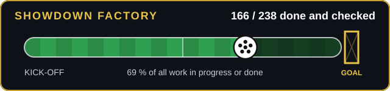

# 🏭 Showdown Factory board

**238 of 238 jobs done and checked · 100 %** · updated Sun 4:21 p.m. Eastern



🏁 Every job is finished.

## 🔴 Now

- Nothing running.

## 🟢 Next (start these)

- Nothing ready right now.

## ⚪ Then

- Nothing queued.

## 🧰 Where to type and when it resets

| Tool | Where | Resets (Eastern) | Jobs left |
| --- | --- | --- | --- |
| 🟡 GPT-5.6 Sol chat | ChatGPT, project "Showdown visual", new normal chat: type the job number | unknown | 0 |
| 🟠 GPT-6.1 Sol Work mode | ChatGPT, Work mode (press Use Work). Not used for factory jobs now | Sun 4:18 p.m. Eastern (passed, update LANES.json) | 0 |
| 🔵 Astra | ChatGPT Work mode (Astra): paste the bundle prompt from handoffs/C2W-*.md | Sun 4:18 p.m. Eastern (passed, update LANES.json) | 0 |
| 🟣 Claude threads | Claude project threads and claude.ai/code cloud sessions (no typing by Nik) | Thu 8:00 p.m. Eastern | 0 |
| ⚫ Codex | Codex: final package review (job 108), paste the job file | unknown | 0 |
| 🖼️ Image tickets | ChatGPT Temporary Chat, paste the ticket from tickets/ | unknown | 0 |

_Resets live in [LANES.json](LANES.json) (hand-edited; "unknown" means nobody has told the board yet)._

_Estimate only. Method: the longest chain of jobs still to do (0 left) × the median real time per step (Claude jobs 3 min, set by hand in LANES.json from the hard-jobs thread (8 parts in about 15 min); GPT chat jobs 31 min; real gaps from jobs finished in the last 3 days, so they include waiting). Codex job assumed 45 min. It ignores usage limits and resets, so it can only slip, and it does not include Claude's quality check or Nik's own approval._

## 📊 Screens

```
Integration    ██████████ 38/38
```
✅ Finished screens (19): Home, League, Club, Transfer, Loading, Trophy Room, Career Stats, Rivalry, Legacy, Season Results, Final Winner, Start/Join, Standings, Rule Book, Settings, Setup, Foundation, Art, Top bar

## 🏅 Who did the work

| Worker | Jobs | Passed first time | Fix rounds | First score |
| --- | --- | --- | --- | --- |
| GPT-5.6 Sol (normal chat) | 121 | `████████░░` 83 % | 27 | 4.01 |
| Claude Sonnet 5.5 | 52 | `██████████` 96 % | 2 | 4.22 |
| Claude Opus 5.5 | 34 | `██████████` 100 % | 0 | 4.32 |
| Astra (Work mode) | 9 | `██████████` 100 % | 0 | 4.3 |
| Image tickets (ChatGPT) | 8 | `██████████` 100 % | 0 | - |
| Codex | 7 | `██████████` 100 % | 0 | - |
| GPT-6.1 Sol (Work mode) | 6 | `██████████` 100 % | 0 | 4.3 |

_Fable 5.1 fixed jobs 58, 83 and 114 in one pass after two GPT-5.6 fix rounds each. Read the [full report](reviews/WORKER_SCORECARD.md) ([PDF](reviews/WORKER_SCORECARD.pdf)) for job kinds, cost and who to give which task._

## Quality

Quality bar: average 4.2 or more, nothing under 3. Average so far 4.26 over 76 scored jobs.

<details><summary>Full job table</summary>

| # | Job | Lane | After | Progress | State |
| --- | --- | --- | --- | --- | --- |
| 0 | [Factory smoke test](jobs/JOB-000.md) | project (type number) | - | 100 % | DONE |
| 1 | [Baseline shots of the four built screens](jobs/JOB-001.md) | project (type number) | - | 100 % | DONE |
| 2 | [Truth sheet: Trophy Room](jobs/JOB-002.md) | project (type number) | - | 100 % | DONE |
| 3 | [Truth sheet: Career Statistics](jobs/JOB-003.md) | project (type number) | - | 100 % | DONE |
| 4 | [Truth sheet: Rivalry Statistics](jobs/JOB-004.md) | project (type number) | - | 100 % | DONE |
| 5 | [Truth sheet: Legacy (History)](jobs/JOB-005.md) | project (type number) | - | 100 % | DONE |
| 6 | [Truth sheet: Season Results](jobs/JOB-006.md) | project (type number) | - | 100 % | DONE |
| 7 | [Truth sheet: Final Winner](jobs/JOB-007.md) | project (type number) | - | 100 % | DONE |
| 8 | [Truth sheet: Start / Join](jobs/JOB-008.md) | project (type number) | - | 100 % | DONE |
| 9 | [Truth sheet: Rule Book](jobs/JOB-009.md) | project (type number) | - | 100 % | DONE |
| 10 | [Truth sheet: Settings](jobs/JOB-010.md) | project (type number) | - | 100 % | DONE |
| 11 | [Truth sheet: Loading](jobs/JOB-011.md) | project (type number) | - | 100 % | DONE |
| 12 | [Showdown tokens and type system](jobs/JOB-012.md) | project (type number) | - | 100 % | DONE |
| 13 | [Panel, button and table kit](jobs/JOB-013.md) | project (type number) | 12 | 100 % | DONE |
| 14 | [Character cut-out tool and standard](jobs/JOB-014.md) | project (type number) | 0 | 100 % | DONE |
| 15 | [Cinematic stage engine](jobs/JOB-015.md) | project (type number) | 12, 14 | 100 % | DONE |
| 16 | [Motion kit (pack-rip grade)](jobs/JOB-016.md) | project (type number) | 13 | 100 % | DONE |
| 17 | [Shared QA harness and compare sheets](jobs/JOB-017.md) | project (type number) | - | 100 % | DONE |
| 18 | [Foundation review](jobs/JOB-018.md) | project (type number) | 13, 15, 16, 14, 17 | 100 % | DONE |
| 19 | [Trophy art: Showdown Champion trophy](jobs/JOB-019.md) | fresh chat (image) | 0 | 100 % | DONE |
| 20 | [Trophy art: League Title trophy](jobs/JOB-020.md) | fresh chat (image) | 0 | 100 % | DONE |
| 21 | [Trophy art: Domestic Cup trophy](jobs/JOB-021.md) | fresh chat (image) | 0 | 100 % | DONE |
| 22 | [Trophy art: Champions League (continental) trophy](jobs/JOB-022.md) | fresh chat (image) | 0 | 100 % | DONE |
| 23 | [Plate: Trophy Room](jobs/JOB-023.md) | project (type number) | 0 | 100 % | DONE |
| 24 | [Plate: Career Statistics](jobs/JOB-024.md) | project (type number) | 0 | 100 % | DONE |
| 25 | [Plate: Rivalry Statistics](jobs/JOB-025.md) | project (type number) | 0 | 100 % | DONE |
| 26 | [Plate: Legacy](jobs/JOB-026.md) | project (type number) | 0 | 100 % | DONE |
| 27 | [Plate: Season Results](jobs/JOB-027.md) | project (type number) | 0 | 100 % | DONE |
| 28 | [Plate: Start / Join](jobs/JOB-028.md) | project (type number) | 0 | 100 % | DONE |
| 29 | [Plate: system stadium (no people)](jobs/JOB-029.md) | fresh chat (image) | 0 | 100 % | DONE |
| 30 | [Art review: trophies and plates](jobs/JOB-030.md) | project (type number) | 19, 20, 21, 22, 23, 24, 25, 26, 27, 28, 29 | 100 % | DONE |
| 31 | [Home: face edges and seams](jobs/JOB-031.md) | project (type number) | 14, 1 | 100 % | DONE |
| 32 | [Home: seven destinations and premium tiles](jobs/JOB-032.md) | project (type number) | 31, 18, 20, 122 | 100 % | DONE |
| 33 | [Home: phone with seven destinations](jobs/JOB-033.md) | project (type number) | 32, 111 | 100 % | DONE |
| 34 | [Home: review](jobs/JOB-034.md) | project (type number) | 33 | 100 % | DONE |
| 35 | [Home: fix round](jobs/JOB-035.md) | project (type number) | 34 | 100 % | DONE |
| 36 | [Home: motion pass](jobs/JOB-036.md) | project (type number) | 35, 16 | 100 % | DONE |
| 37 | [League: hands on the wheel](jobs/JOB-037.md) | project (type number) | 14, 1, 18, 123 | 100 % | DONE |
| 38 | [League: swap in the new league marks](jobs/JOB-038.md) | project (type number) | 37 | 100 % | DONE |
| 39 | [League: phone with the hand in frame](jobs/JOB-039.md) | project (type number) | 37, 112 | 100 % | DONE |
| 40 | [League: review](jobs/JOB-040.md) | project (type number) | 39 | 100 % | DONE |
| 41 | [League: fix round](jobs/JOB-041.md) | project (type number) | 40, 124 | 100 % | DONE |
| 42 | [League: spin feel](jobs/JOB-042.md) | project (type number) | 41, 16 | 100 % | DONE |
| 43 | [Club: scene registration, faces, hands and seams](jobs/JOB-043.md) | project (type number) | 14, 1 | 100 % | DONE |
| 44 | [Club: panels and short-laptop fit](jobs/JOB-044.md) | project (type number) | 43, 18 | 100 % | DONE |
| 45 | [Club: phone](jobs/JOB-045.md) | project (type number) | 44, 113 | 100 % | DONE |
| 46 | [Club: review](jobs/JOB-046.md) | project (type number) | 45 | 100 % | DONE |
| 47 | [Club: fix round](jobs/JOB-047.md) | project (type number) | 46, 124 | 100 % | DONE |
| 48 | [Club: the pack rip](jobs/JOB-048.md) | project (type number) | 47, 16 | 100 % | DONE |
| 49 | [Transfer War: polish to the key art](jobs/JOB-049.md) | project (type number) | 1, 18 | 100 % | DONE |
| 50 | [Transfer War: phone polish](jobs/JOB-050.md) | project (type number) | 49, 114 | 100 % | DONE |
| 51 | [Transfer War: review (part 1 of 4)](jobs/JOB-051.md) | project (type number) | 50 | 100 % | DONE |
| 52 | [Transfer War: fix round (part 1 of 3)](jobs/JOB-052.md) | project (type number) | 142, 124 | 100 % | DONE |
| 53 | [Transfer War: motion (part 1 of 3)](jobs/JOB-053.md) | project (type number) | 144, 16 | 100 % | DONE |
| 54 | [Loading: new look and Reus credit](jobs/JOB-054.md) | project (type number) | 11, 18 | 100 % | DONE |
| 55 | [Loading: review](jobs/JOB-055.md) | project (type number) | 54 | 100 % | DONE |
| 56 | [Loading: fix round](jobs/JOB-056.md) | project (type number) | 55 | 100 % | DONE |
| 57 | [Trophy Room: build (desktop)](jobs/JOB-057.md) | project (type number) | 2, 23, 18, 130, 136, 19, 20, 21, 22 | 100 % | DONE |
| 58 | [Trophy Room: phone](jobs/JOB-058.md) | project (type number) | 57, 115 | 100 % | DONE |
| 59 | [Trophy Room: review](jobs/JOB-059.md) | project (type number) | 58 | 100 % | DONE |
| 60 | [Trophy Room: fix round](jobs/JOB-060.md) | project (type number) | 59 | 100 % | DONE |
| 61 | [Trophy Room: motion](jobs/JOB-061.md) | project (type number) | 60, 16 | 100 % | DONE |
| 62 | [Career Statistics: build (desktop)](jobs/JOB-062.md) | project (type number) | 3, 24, 18, 131, 137, 19, 20, 21, 22 | 100 % | DONE |
| 63 | [Career Statistics: phone](jobs/JOB-063.md) | project (type number) | 62, 116 | 100 % | DONE |
| 64 | [Career Statistics: review (part 1 of 4)](jobs/JOB-064.md) | project (type number) | 63 | 100 % | DONE |
| 65 | [Career Statistics: fix round (part 1 of 3)](jobs/JOB-065.md) | project (type number) | 149 | 100 % | DONE |
| 66 | [Career Statistics: motion (part 1 of 3)](jobs/JOB-066.md) | project (type number) | 151, 16 | 100 % | DONE |
| 67 | [Rivalry Statistics: build (desktop)](jobs/JOB-067.md) | project (type number) | 4, 25, 18, 135, 19, 20, 21, 22 | 100 % | DONE |
| 68 | [Rivalry Statistics: phone (part 1 of 3)](jobs/JOB-068.md) | project (type number) | 67, 207 | 100 % | DONE |
| 69 | [Rivalry Statistics: review (part 1 of 4)](jobs/JOB-069.md) | project (type number) | 155 | 100 % | DONE |
| 70 | [Rivalry Statistics: fix round (part 1 of 3)](jobs/JOB-070.md) | project (type number) | 158 | 100 % | DONE |
| 71 | [Rivalry Statistics: motion (part 1 of 3)](jobs/JOB-071.md) | project (type number) | 160, 16 | 100 % | DONE |
| 72 | [Legacy (History): build (desktop)](jobs/JOB-072.md) | project (type number) | 5, 26, 18, 132, 138, 19, 20, 21, 22 | 100 % | DONE |
| 73 | [Legacy (History): phone (part 1 of 3)](jobs/JOB-073.md) | project (type number) | 72, 118 | 100 % | DONE |
| 74 | [Legacy (History): review (part 1 of 4)](jobs/JOB-074.md) | project (type number) | 164 | 100 % | DONE |
| 75 | [Legacy (History): fix round (part 1 of 3)](jobs/JOB-075.md) | project (type number) | 167 | 100 % | DONE |
| 76 | [Legacy (History): motion (part 1 of 3)](jobs/JOB-076.md) | project (type number) | 169, 16 | 100 % | DONE |
| 77 | [Season Results: build (desktop)](jobs/JOB-077.md) | project (type number) | 6, 27, 18, 133, 19, 20, 21, 22 | 100 % | DONE |
| 78 | [Season Results: phone (part 1 of 3)](jobs/JOB-078.md) | project (type number) | 77, 208 | 100 % | DONE |
| 79 | [Season Results: review (part 1 of 4)](jobs/JOB-079.md) | project (type number) | 173 | 100 % | DONE |
| 80 | [Season Results: fix round (part 1 of 3)](jobs/JOB-080.md) | project (type number) | 176 | 100 % | DONE |
| 81 | [Season Results: motion (part 1 of 3)](jobs/JOB-081.md) | project (type number) | 178, 16 | 100 % | DONE |
| 82 | [Final Winner: build (desktop)](jobs/JOB-082.md) | project (type number) | 7, 23, 18, 134, 139, 19, 20, 21, 22 | 100 % | DONE |
| 83 | [Final Winner: phone](jobs/JOB-083.md) | project (type number) | 82, 115 | 100 % | DONE |
| 84 | [Final Winner: review](jobs/JOB-084.md) | project (type number) | 83 | 100 % | DONE |
| 85 | [Final Winner: fix round (part 1 of 3)](jobs/JOB-085.md) | project (type number) | 84, 124 | 100 % | DONE |
| 86 | [Final Winner: motion (part 1 of 3)](jobs/JOB-086.md) | project (type number) | 182, 16 | 100 % | DONE |
| 87 | [Start / Join: build (desktop)](jobs/JOB-087.md) | project (type number) | 8, 28, 18, 19, 20, 21, 22 | 100 % | DONE |
| 88 | [Start / Join: phone (part 1 of 3)](jobs/JOB-088.md) | project (type number) | 87, 209 | 100 % | DONE |
| 89 | [Start / Join: review (part 1 of 4)](jobs/JOB-089.md) | project (type number) | 186 | 100 % | DONE |
| 90 | [Start / Join: fix round (part 1 of 3)](jobs/JOB-090.md) | project (type number) | 189 | 100 % | DONE |
| 91 | [Start / Join: motion (part 1 of 3)](jobs/JOB-091.md) | project (type number) | 191, 16 | 100 % | DONE |
| 92 | [Rule Book: build (desktop and phone)](jobs/JOB-092.md) | project (type number) | 9, 29, 18, 121 | 100 % | DONE |
| 93 | [Rule Book: review](jobs/JOB-093.md) | project (type number) | 92 | 100 % | DONE |
| 94 | [Rule Book: fix round and motion](jobs/JOB-094.md) | project (type number) | 93, 16, 124 | 100 % | DONE |
| 95 | [Settings: build (desktop and phone)](jobs/JOB-095.md) | project (type number) | 10, 29, 18, 121 | 100 % | DONE |
| 96 | [Settings: review](jobs/JOB-096.md) | project (type number) | 95 | 100 % | DONE |
| 97 | [Settings: fix round and motion (part 1 of 4)](jobs/JOB-097.md) | project (type number) | 96, 16, 124 | 100 % | DONE |
| 98 | [Team G G-3: the pure career model](jobs/JOB-098.md) | team-g | - | 100 % | DONE |
| 99 | [Team G G-7: own-account career index](jobs/JOB-099.md) | team-g | 98 | 100 % | DONE |
| 100 | [Team G G-8: completed-Showdown reader](jobs/JOB-100.md) | team-g | 99 | 100 % | DONE |
| 101 | [Team G G-9 and G-10: Trophy Room standings and records, transfer history](jobs/JOB-101.md) | team-g | 100 | 100 % | DONE |
| 102 | [Team G G-5, G-6 and G-11: active adapter, nav lock fields, model-true fixtures](jobs/JOB-102.md) | team-g | 98 | 100 % | DONE |
| 103 | [Showcase: every screen in one place (part 1 of 5)](jobs/JOB-103.md) | project (type number) | 36, 42, 48, 146, 56, 61, 153, 162, 171, 180, 184, 193, 94, 196, 199 | 100 % | DONE |
| 104 | [Showcase: screens read Team G's model-true fixtures (part 1 of 8)](jobs/JOB-104.md) | project (type number) | 213, 102 | 100 % | DONE |
| 105 | [Full phone pass (part 1 of 7)](jobs/JOB-105.md) | project (type number) | 220 | 100 % | DONE |
| 106 | [Full phone pass: fixes (part 1 of 3)](jobs/JOB-106.md) | project (type number) | 226 | 100 % | DONE |
| 107 | [Motion and sound consistency pass (part 1 of 6)](jobs/JOB-107.md) | project (type number) | 228 | 100 % | DONE |
| 108 | [Final package review (Codex)](jobs/JOB-108.md) | codex | 233 | 100 % | DONE |
| 109 | [Final fixes (part 1 of 3)](jobs/JOB-109.md) | project (type number) | 108 | 100 % | DONE |
| 110 | [Package for Nik and handoff to GPT-5.6 Sol (part 1 of 5)](jobs/JOB-110.md) | project (type number) | 235 | 100 % | DONE |
| 111 | [Phone art: Home](jobs/JOB-111.md) | project (type number) | 14, 1 | 100 % | DONE |
| 112 | [Phone art: League](jobs/JOB-112.md) | project (type number) | 14, 1 | 100 % | DONE |
| 113 | [Phone art: Club Assignment](jobs/JOB-113.md) | project (type number) | 14, 1 | 100 % | DONE |
| 114 | [Phone art: Transfer War](jobs/JOB-114.md) | project (type number) | 14, 1 | 100 % | DONE |
| 115 | [Phone art: Trophy Room](jobs/JOB-115.md) | project (type number) | 14, 23 | 100 % | DONE |
| 116 | [Phone art: Career Statistics](jobs/JOB-116.md) | project (type number) | 14, 24 | 100 % | DONE |
| 117 | [Phone art: Rivalry Statistics (part 1 of 2)](jobs/JOB-117.md) | project (type number) | 14, 25 | 100 % | DONE |
| 118 | [Phone art: Legacy (History)](jobs/JOB-118.md) | fresh chat (image) | 14, 26 | 100 % | DONE |
| 119 | [Phone art: Season Results (part 1 of 2)](jobs/JOB-119.md) | project (type number) | 14, 27 | 100 % | DONE |
| 120 | [Phone art: Start / Join (part 1 of 2)](jobs/JOB-120.md) | project (type number) | 14, 28 | 100 % | DONE |
| 121 | [Phone art: system stadium portrait](jobs/JOB-121.md) | fresh chat (image) | 29 | 100 % | DONE |
| 122 | [Art: Home tile illustrations](jobs/JOB-122.md) | fresh chat (image) | 0 | 100 % | DONE |
| 123 | [Art: League wheel rim](jobs/JOB-123.md) | fresh chat (image) | 0, 1 | 100 % | DONE |
| 124 | [Art: brush title wordmarks](jobs/JOB-124.md) | fresh chat (image) | 0 | 100 % | DONE |
| 125 | [Top bar and phone bottom bar (part 1 of 3)](jobs/JOB-125.md) | project (type number) | 18, 124 | 100 % | DONE |
| 126 | [Truth sheet: Standings](jobs/JOB-126.md) | project (type number) | - | 100 % | DONE |
| 127 | [Standings: build (desktop and phone) (part 1 of 6)](jobs/JOB-127.md) | project (type number) | 126, 25, 207, 18, 19, 20, 21, 22 | 100 % | DONE |
| 128 | [Standings: review (part 1 of 4)](jobs/JOB-128.md) | project (type number) | 204 | 100 % | DONE |
| 129 | [Standings: fix round and motion (part 1 of 4)](jobs/JOB-129.md) | project (type number) | 242, 16, 124 | 100 % | DONE |
| 130 | [Truth sheet fix: Trophy Room](jobs/JOB-130.md) | project (type number) | 2 | 100 % | DONE |
| 131 | [Truth sheet fix: Career Statistics](jobs/JOB-131.md) | project (type number) | 3 | 100 % | DONE |
| 132 | [Truth sheet fix: Legacy (History)](jobs/JOB-132.md) | project (type number) | 5 | 100 % | DONE |
| 133 | [Truth sheet fix: Season Results](jobs/JOB-133.md) | project (type number) | 6 | 100 % | DONE |
| 134 | [Truth sheet fix: Final Winner](jobs/JOB-134.md) | project (type number) | 7 | 100 % | DONE |
| 135 | [Truth sheet fix: Rivalry Statistics](jobs/JOB-135.md) | project (type number) | 4 | 100 % | DONE |
| 136 | [Fixture realism: Trophy Room](jobs/JOB-136.md) | project (type number) | 130 | 100 % | DONE |
| 137 | [Fixture realism: Career Statistics](jobs/JOB-137.md) | project (type number) | 131 | 100 % | DONE |
| 138 | [Fixture realism: Legacy (History)](jobs/JOB-138.md) | project (type number) | 132 | 100 % | DONE |
| 139 | [Fixture realism: Final Winner](jobs/JOB-139.md) | project (type number) | 134 | 100 % | DONE |
| 140 | [Transfer War: review (part 2 of 4)](jobs/JOB-140.md) | project (type number) | 51 | 100 % | DONE |
| 141 | [Transfer War: review (part 3 of 4)](jobs/JOB-141.md) | project (type number) | 140 | 100 % | DONE |
| 142 | [Transfer War: review (part 4 of 4)](jobs/JOB-142.md) | project (type number) | 141 | 100 % | DONE |
| 143 | [Transfer War: fix round (part 2 of 3)](jobs/JOB-143.md) | project (type number) | 52 | 100 % | DONE |
| 144 | [Transfer War: fix round (part 3 of 3)](jobs/JOB-144.md) | project (type number) | 143 | 100 % | DONE |
| 145 | [Transfer War: motion (part 2 of 3)](jobs/JOB-145.md) | project (type number) | 53 | 100 % | DONE |
| 146 | [Transfer War: motion (part 3 of 3)](jobs/JOB-146.md) | project (type number) | 145 | 100 % | DONE |
| 147 | [Career Statistics: review (part 2 of 4)](jobs/JOB-147.md) | project (type number) | 64 | 100 % | DONE |
| 148 | [Career Statistics: review (part 3 of 4)](jobs/JOB-148.md) | project (type number) | 147 | 100 % | DONE |
| 149 | [Career Statistics: review (part 4 of 4)](jobs/JOB-149.md) | project (type number) | 148 | 100 % | DONE |
| 150 | [Career Statistics: fix round (part 2 of 3)](jobs/JOB-150.md) | project (type number) | 65 | 100 % | DONE |
| 151 | [Career Statistics: fix round (part 3 of 3)](jobs/JOB-151.md) | project (type number) | 150 | 100 % | DONE |
| 152 | [Career Statistics: motion (part 2 of 3)](jobs/JOB-152.md) | project (type number) | 66 | 100 % | DONE |
| 153 | [Career Statistics: motion (part 3 of 3)](jobs/JOB-153.md) | project (type number) | 152 | 100 % | DONE |
| 154 | [Rivalry Statistics: phone (part 2 of 3)](jobs/JOB-154.md) | project (type number) | 68 | 100 % | DONE |
| 155 | [Rivalry Statistics: phone (part 3 of 3)](jobs/JOB-155.md) | project (type number) | 154 | 100 % | DONE |
| 156 | [Rivalry Statistics: review (part 2 of 4)](jobs/JOB-156.md) | project (type number) | 69 | 100 % | DONE |
| 157 | [Rivalry Statistics: review (part 3 of 4)](jobs/JOB-157.md) | project (type number) | 156 | 100 % | DONE |
| 158 | [Rivalry Statistics: review (part 4 of 4)](jobs/JOB-158.md) | project (type number) | 157 | 100 % | DONE |
| 159 | [Rivalry Statistics: fix round (part 2 of 3)](jobs/JOB-159.md) | project (type number) | 70 | 100 % | DONE |
| 160 | [Rivalry Statistics: fix round (part 3 of 3)](jobs/JOB-160.md) | project (type number) | 159 | 100 % | DONE |
| 161 | [Rivalry Statistics: motion (part 2 of 3)](jobs/JOB-161.md) | project (type number) | 71 | 100 % | DONE |
| 162 | [Rivalry Statistics: motion (part 3 of 3)](jobs/JOB-162.md) | project (type number) | 161 | 100 % | DONE |
| 163 | [Legacy (History): phone (part 2 of 3)](jobs/JOB-163.md) | project (type number) | 73 | 100 % | DONE |
| 164 | [Legacy (History): phone (part 3 of 3)](jobs/JOB-164.md) | project (type number) | 163 | 100 % | DONE |
| 165 | [Legacy (History): review (part 2 of 4)](jobs/JOB-165.md) | project (type number) | 74 | 100 % | DONE |
| 166 | [Legacy (History): review (part 3 of 4)](jobs/JOB-166.md) | project (type number) | 165 | 100 % | DONE |
| 167 | [Legacy (History): review (part 4 of 4)](jobs/JOB-167.md) | project (type number) | 166 | 100 % | DONE |
| 168 | [Legacy (History): fix round (part 2 of 3)](jobs/JOB-168.md) | project (type number) | 75 | 100 % | DONE |
| 169 | [Legacy (History): fix round (part 3 of 3)](jobs/JOB-169.md) | project (type number) | 168 | 100 % | DONE |
| 170 | [Legacy (History): motion (part 2 of 3)](jobs/JOB-170.md) | project (type number) | 76 | 100 % | DONE |
| 171 | [Legacy (History): motion (part 3 of 3)](jobs/JOB-171.md) | project (type number) | 170 | 100 % | DONE |
| 172 | [Season Results: phone (part 2 of 3)](jobs/JOB-172.md) | project (type number) | 78 | 100 % | DONE |
| 173 | [Season Results: phone (part 3 of 3)](jobs/JOB-173.md) | project (type number) | 172 | 100 % | DONE |
| 174 | [Season Results: review (part 2 of 4)](jobs/JOB-174.md) | project (type number) | 79 | 100 % | DONE |
| 175 | [Season Results: review (part 3 of 4)](jobs/JOB-175.md) | project (type number) | 174 | 100 % | DONE |
| 176 | [Season Results: review (part 4 of 4)](jobs/JOB-176.md) | project (type number) | 175 | 100 % | DONE |
| 177 | [Season Results: fix round (part 2 of 3)](jobs/JOB-177.md) | project (type number) | 80 | 100 % | DONE |
| 178 | [Season Results: fix round (part 3 of 3)](jobs/JOB-178.md) | project (type number) | 177 | 100 % | DONE |
| 179 | [Season Results: motion (part 2 of 3)](jobs/JOB-179.md) | project (type number) | 81 | 100 % | DONE |
| 180 | [Season Results: motion (part 3 of 3)](jobs/JOB-180.md) | project (type number) | 179 | 100 % | DONE |
| 181 | [Final Winner: fix round (part 2 of 3)](jobs/JOB-181.md) | project (type number) | 85 | 100 % | DONE |
| 182 | [Final Winner: fix round (part 3 of 3)](jobs/JOB-182.md) | project (type number) | 181 | 100 % | DONE |
| 183 | [Final Winner: motion (part 2 of 3)](jobs/JOB-183.md) | project (type number) | 86 | 100 % | DONE |
| 184 | [Final Winner: motion (part 3 of 3)](jobs/JOB-184.md) | project (type number) | 183 | 100 % | DONE |
| 185 | [Start / Join: phone (part 2 of 3)](jobs/JOB-185.md) | project (type number) | 88 | 100 % | DONE |
| 186 | [Start / Join: phone (part 3 of 3)](jobs/JOB-186.md) | project (type number) | 185 | 100 % | DONE |
| 187 | [Start / Join: review (part 2 of 4)](jobs/JOB-187.md) | project (type number) | 89 | 100 % | DONE |
| 188 | [Start / Join: review (part 3 of 4)](jobs/JOB-188.md) | project (type number) | 187 | 100 % | DONE |
| 189 | [Start / Join: review (part 4 of 4)](jobs/JOB-189.md) | project (type number) | 188 | 100 % | DONE |
| 190 | [Start / Join: fix round (part 2 of 3)](jobs/JOB-190.md) | project (type number) | 90 | 100 % | DONE |
| 191 | [Start / Join: fix round (part 3 of 3)](jobs/JOB-191.md) | project (type number) | 190 | 100 % | DONE |
| 192 | [Start / Join: motion (part 2 of 3)](jobs/JOB-192.md) | project (type number) | 91 | 100 % | DONE |
| 193 | [Start / Join: motion (part 3 of 3)](jobs/JOB-193.md) | project (type number) | 192 | 100 % | DONE |
| 194 | [Settings: fix round and motion (part 2 of 4)](jobs/JOB-194.md) | project (type number) | 97 | 100 % | DONE |
| 195 | [Settings: fix round and motion (part 3 of 4)](jobs/JOB-195.md) | project (type number) | 194 | 100 % | DONE |
| 196 | [Settings: fix round and motion (part 4 of 4)](jobs/JOB-196.md) | project (type number) | 195 | 100 % | DONE |
| 197 | [Standings: fix round and motion (part 2 of 4)](jobs/JOB-197.md) | project (type number) | 129 | 100 % | DONE |
| 198 | [Standings: fix round and motion (part 3 of 4)](jobs/JOB-198.md) | project (type number) | 197 | 100 % | DONE |
| 199 | [Standings: fix round and motion (part 4 of 4)](jobs/JOB-199.md) | project (type number) | 198 | 100 % | DONE |
| 200 | [Standings: build (desktop and phone) (part 2 of 6)](jobs/JOB-200.md) | project (type number) | 127 | 100 % | DONE |
| 201 | [Standings: build (desktop and phone) (part 3 of 6)](jobs/JOB-201.md) | project (type number) | 200 | 100 % | DONE |
| 202 | [Standings: build (desktop and phone) (part 4 of 6)](jobs/JOB-202.md) | project (type number) | 201 | 100 % | DONE |
| 203 | [Standings: build (desktop and phone) (part 5 of 6)](jobs/JOB-203.md) | project (type number) | 202 | 100 % | DONE |
| 204 | [Standings: build (desktop and phone) (part 6 of 6)](jobs/JOB-204.md) | project (type number) | 203 | 100 % | DONE |
| 205 | [Top bar and phone bottom bar (part 2 of 3)](jobs/JOB-205.md) | project (type number) | 125 | 100 % | DONE |
| 206 | [Top bar and phone bottom bar (part 3 of 3)](jobs/JOB-206.md) | project (type number) | 205 | 100 % | DONE |
| 207 | [Phone art: Rivalry Statistics (part 2 of 2)](jobs/JOB-207.md) | project (type number) | 117 | 100 % | DONE |
| 208 | [Phone art: Season Results (part 2 of 2)](jobs/JOB-208.md) | project (type number) | 119 | 100 % | DONE |
| 209 | [Phone art: Start / Join (part 2 of 2)](jobs/JOB-209.md) | project (type number) | 120 | 100 % | DONE |
| 210 | [Showcase: every screen in one place (part 2 of 5)](jobs/JOB-210.md) | project (type number) | 103 | 100 % | DONE |
| 211 | [Showcase: every screen in one place (part 3 of 5)](jobs/JOB-211.md) | project (type number) | 210 | 100 % | DONE |
| 212 | [Showcase: every screen in one place (part 4 of 5)](jobs/JOB-212.md) | project (type number) | 211 | 100 % | DONE |
| 213 | [Showcase: every screen in one place (part 5 of 5)](jobs/JOB-213.md) | project (type number) | 212 | 100 % | DONE |
| 214 | [Showcase: screens read Team G's model-true fixtures (part 2 of 8)](jobs/JOB-214.md) | project (type number) | 104 | 100 % | DONE |
| 215 | [Showcase: screens read Team G's model-true fixtures (part 3 of 8)](jobs/JOB-215.md) | project (type number) | 214 | 100 % | DONE |
| 216 | [Showcase: screens read Team G's model-true fixtures (part 4 of 8)](jobs/JOB-216.md) | project (type number) | 215 | 100 % | DONE |
| 217 | [Showcase: screens read Team G's model-true fixtures (part 5 of 8)](jobs/JOB-217.md) | project (type number) | 216 | 100 % | DONE |
| 218 | [Showcase: screens read Team G's model-true fixtures (part 6 of 8)](jobs/JOB-218.md) | project (type number) | 217 | 100 % | DONE |
| 219 | [Showcase: screens read Team G's model-true fixtures (part 7 of 8)](jobs/JOB-219.md) | project (type number) | 218 | 100 % | DONE |
| 220 | [Showcase: screens read Team G's model-true fixtures (part 8 of 8)](jobs/JOB-220.md) | project (type number) | 219 | 100 % | DONE |
| 221 | [Full phone pass (part 2 of 7)](jobs/JOB-221.md) | project (type number) | 105 | 100 % | DONE |
| 222 | [Full phone pass (part 3 of 7)](jobs/JOB-222.md) | project (type number) | 221 | 100 % | DONE |
| 223 | [Full phone pass (part 4 of 7)](jobs/JOB-223.md) | project (type number) | 222 | 100 % | DONE |
| 224 | [Full phone pass (part 5 of 7)](jobs/JOB-224.md) | project (type number) | 223 | 100 % | DONE |
| 225 | [Full phone pass (part 6 of 7)](jobs/JOB-225.md) | project (type number) | 224 | 100 % | DONE |
| 226 | [Full phone pass (part 7 of 7)](jobs/JOB-226.md) | project (type number) | 225 | 100 % | DONE |
| 227 | [Full phone pass: fixes (part 2 of 3)](jobs/JOB-227.md) | project (type number) | 106 | 100 % | DONE |
| 228 | [Full phone pass: fixes (part 3 of 3)](jobs/JOB-228.md) | project (type number) | 227 | 100 % | DONE |
| 229 | [Motion and sound consistency pass (part 2 of 6)](jobs/JOB-229.md) | project (type number) | 107 | 100 % | DONE |
| 230 | [Motion and sound consistency pass (part 3 of 6)](jobs/JOB-230.md) | project (type number) | 229 | 100 % | DONE |
| 231 | [Motion and sound consistency pass (part 4 of 6)](jobs/JOB-231.md) | project (type number) | 230 | 100 % | DONE |
| 232 | [Motion and sound consistency pass (part 5 of 6)](jobs/JOB-232.md) | project (type number) | 231 | 100 % | DONE |
| 233 | [Motion and sound consistency pass (part 6 of 6)](jobs/JOB-233.md) | project (type number) | 232 | 100 % | DONE |
| 234 | [Final fixes (part 2 of 3)](jobs/JOB-234.md) | project (type number) | 109 | 100 % | DONE |
| 235 | [Final fixes (part 3 of 3)](jobs/JOB-235.md) | project (type number) | 234 | 100 % | DONE |
| 236 | [Package for Nik and handoff to GPT-5.6 Sol (part 2 of 5)](jobs/JOB-236.md) | project (type number) | 110 | 100 % | DONE |
| 237 | [Package for Nik and handoff to GPT-5.6 Sol (part 3 of 5)](jobs/JOB-237.md) | project (type number) | 236 | 100 % | DONE |
| 238 | [Package for Nik and handoff to GPT-5.6 Sol (part 4 of 5)](jobs/JOB-238.md) | project (type number) | 237 | 100 % | DONE |
| 239 | [Package for Nik and handoff to GPT-5.6 Sol (part 5 of 5)](jobs/JOB-239.md) | project (type number) | 238 | 100 % | DONE |
| 240 | [Standings: review (part 2 of 4)](jobs/JOB-240.md) | project (type number) | 128 | 100 % | DONE |
| 241 | [Standings: review (part 3 of 4)](jobs/JOB-241.md) | project (type number) | 240 | 100 % | DONE |
| 242 | [Standings: review (part 4 of 4)](jobs/JOB-242.md) | project (type number) | 241 | 100 % | DONE |

</details>

Generated by `tools/board.py` from `BOARD.json`, `status/`, `tickets/` and `LANES.json`. Workers never edit this file.
