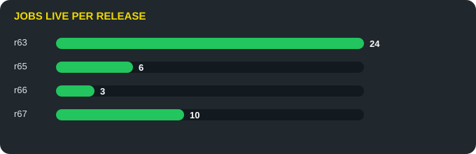
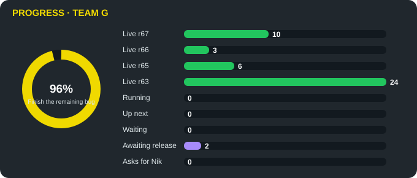

# Bug hunt board · Haiku G

**How to type.** Type just the number. GPT jobs in a new ChatGPT chat, Codex jobs in a new Codex task. One-time setup: [INSTRUCTIONS.md](queue/INSTRUCTIONS.md) and [CODEX_SETUP.md](queue/CODEX_SETUP.md). Tomorrow's order: [TOMORROW.md](queue/TOMORROW.md).





Updated Sat 10 Oct, 10:09 AM Boston time. Bug hunting only, no new features until further notice. The Team G and Team V Custom views and the board artifact show this same board. History of every job and bug report: [Board history](BOARD_ARCHIVE.md) · hand-offs between teams: [relay](RELAY.md).

🌐 **Live: 1.9.1-r67** (main `f42dac2`, Fri 9 Oct 9:34 PM)

🩺 **All clear: every check has a machine.** · POS20 #304 6/16

## Jobs

### 👉 Next for you, in this order

**#1 · 1579** `G` Season Results: a slow load must not pull you back after you moved on (Sol S5)  
`░░░░░░░░░░` **0.0000 %**  
🔵 Team blue · **GPT-6 Sol** · High effort · ChatGPT project "Career Mode Showdown", normal chat

Paste this:

```text
1579
```

**#2 · 1580** `G` Showdown Gate: run the L5 lane only when its inputs changed  
`░░░░░░░░░░` **0.0000 %**  
⚪ Team white · **Codex default coding model** · High effort · Codex cloud, this repo

Paste this:

```text
1580
```

**#3 · 1583** `G` Measure the home screens at ten window sizes (report only)  
`░░░░░░░░░░` **0.0000 %**  
⚪ Team white · **Codex default coding model** · Medium effort · Codex cloud, this repo

Paste this:

```text
1583
```

**#4 · 1584** `G` Measure the transfer screens at ten window sizes (report only)  
`░░░░░░░░░░` **0.0000 %**  
⚪ Team white · **Codex default coding model** · Medium effort · Codex cloud, this repo

Paste this:

```text
1584
```

**#5 · 1585** `G` Measure the season-final screens at ten window sizes (report only)  
`░░░░░░░░░░` **0.0000 %**  
⚪ Team white · **Codex default coding model** · Medium effort · Codex cloud, this repo

Paste this:

```text
1585
```

**#6 · 1586** `G` Measure the club screens at ten window sizes (report only)  
`░░░░░░░░░░` **0.0000 %**  
⚪ Team white · **Codex default coding model** · Medium effort · Codex cloud, this repo

Paste this:

```text
1586
```

**#7 · 1587** `G` Season Results: a passing Transfer Challenge read hiccup must not fail the publish (Sol S2)  
`░░░░░░░░░░` **0.0000 %**  
🔵 Team blue · **GPT-6 Sol** · High effort · ChatGPT project "Career Mode Showdown", normal chat

Paste this:

```text
1587
```

### ⏸ Waiting on something else

**#1 · 1581** `G` Showdown Gate: split the slowest lane and cache downloads  
`░░░░░░░░░░` **0.0000 %**  
⚪ Team white · **Codex default coding model** · High effort · later: after 1580 merges

**#2 · 1582** `G` Showdown Gate: screen shots of changed screens as a run artifact  
`░░░░░░░░░░` **0.0000 %**  
⚪ Team white · **Codex default coding model** · Medium effort · later: after 1581 merges

**Done, waiting for the next release:** 1059, 1060

**Done and live:** r67: 1044, 1045, 1048, 1049, 1050, 1051, 1052, 1053, 1055, 1058 · r66: 1041, 1042, 1043 · r65: 1011, 1028, 1037, 1038, 1039, 1040 · r63: 1001, 1003, 1004, 1005, 1009, 1010, 1014, 1015, 1020, 1021, 1022, 1023, 1024, 1025, 1026, 1027, Z1, Z2, Z3, Z4, Z5, Z6, Z7, Z8

**Done, no game code** (factory or handoff documents): 1046, 1047, 1054, 1056, 1057

## Goals, in this order

**1. Finish the remaining bugs** `now`  
`█████████░` **89.4118 %**  
Numbered jobs: 50 done, 7 other open · Olympiad recheck: 23 of 23 settled, 0 still to fix · Sol's old leads: 2 open (2 real, 0 unsure)

**2. Visual fixes** `after stage 1`  
`█████░░░░░` **52.3810 %**  
Team V hand-offs: 11 of 21 done

**3. Match current desktop screens to the mockup** `after stage 2`  
`█░░░░░░░░░` **6.2500 %**  
Mockup Lab: 1 of 16 screens studied, 7 differences to fix

**4. Visual mockups for phone** `after stage 3`  
`░░░░░░░░░░` **0.0000 %**  
Not started

**5. Improved desktop versions** `after stage 4`  
`░░░░░░░░░░` **0.0000 %**  
Not started

## Claude lane (nothing to type)

The mega factory or the lead marks a job NEEDS CLAUDE with the reason; the lead moves it to this lane with a purple, brown or black team colour and runs it. Nothing for Nik to type.

Claude takes a job when:

- Rules, sign-in or Firebase work that the ChatGPT safety filter blocks (Codex can still take Rules code when it needs no live run)
- Work that needs the emulator, a browser run, the two-phone journey or a live check of the deployed game
- Cross-screen or multi-file logic bigger than one GPT turn (more than about 5 reads, 3 writes or 200 lines, or more than one decision)
- A job GPT failed twice (wrong fix, stalled chat or red Gate) after it was split once
- Release, merge, deploy and Gate-seal work (lead only)

| Job | Team | Model | State | Why Claude |
| --- | --- | --- | --- | --- |
| **G-F7** Ten-season smoothness run on live 2.0 (emulator, 10 seasons with a mid-game expiry) | 🟤 | Claude Sonnet | queued after the Olympiad bug jobs (stage 1) | needs the emulator: a 10-season run |
| **G-F11** Old-design CSS collisions: scope old rulebook/settings/analytics/app CSS off Team V markup (about 70 shared class names) | 🟤 | Claude Sonnet | ready (Sonnet audit, then Opus fix) | cross-screen CSS collisions across old and new screens |
| **G-F18** Old-design screen audit: Legacy, Career Statistics and Trophy Room still open in the old shell; drive every live screen  | 🟣 | Claude Opus | queued for stage 2 (visual fixes); the history screens now load online (r65), the old-design shell is what remains | cross-screen audit with emulator screenshots |
| **G-F5** QA packet adoptions: truth line, wrong-target guard on main PRs, PR title rule | 🟤 | Claude Sonnet | queued after the bug jobs | Gate and main-PR guard work |
| **G-F17** Showdown Gate: replace POS20 with a faster check system built on Claude and GitHub, keeping every check (plan: /mnt/proj | 🟣 | Claude Opus | shadow: KEEP_SHADOW after the 9 Oct independent audit (71/100); fixes 1043, 1044 and 1045 merged; the owner card waits for a fresh exit report | Gate design (lead only) |

## Mega factory

One numbered queue: type a bare number in any GPT chat. Live from GitHub (queue/QUEUE_STATE.json).

Type now, in any GPT chat:

```text
1 2 3 4 5 6 7 8 9 10 11 12
```

Open code PRs: 0/8.

0 taken of 518.

| Stage | Items | Merged | Picked up |
| --- | --- | --- | --- |
| audits | 112 | 0/112 | 0/112 |
| screen fixes | 266 | 0/266 | 0/266 |
| mockup match | 14 | 0/14 | 0/14 |
| phone studies | 70 | 0/70 | 0/70 |
| desktop studies | 56 | 0/56 | 0/56 |

**Last taken numbers**

| # | Job | State | Title |
| --- | --- | --- | --- |
| — | — | nothing taken yet | — |

## Mega tracker (live, free)

Live page: [mega/index.html](https://github.com/nikahanghojjati-oss/fifa17-career-showdown2/blob/factory/gameplay-v1/project-documents/gameplay-factory/mega/index.html) · summary: [mega/MEGA_TRACKER.md](https://github.com/nikahanghojjati-oss/fifa17-career-showdown2/blob/factory/gameplay-v1/project-documents/gameplay-factory/mega/MEGA_TRACKER.md) · rebuilt by the poller each round, updated 2026-10-10T14:05:57Z.

| Stage | Done (merged or live) | In progress | Waiting |
| --- | --- | --- | --- |
| Gameplay audits | 0 of 112 | 0 | 112 |
| Screen fixes | 0 of 266 | 0 | 266 |
| Match desktop to mockups | 0 of 14 | 0 | 14 |
| Phone mockup studies | 0 of 70 | 0 | 70 |
| Improved desktop studies | 0 of 56 | 0 | 56 |

**Open train PRs**

- none open right now

**Latest finished numbers (up to 20)**

- none finished yet

## Other asks

- Nothing else needs you right now.

## Other Team G work

**Up next**

| Lane | Item | What | State |
| --- | --- | --- | --- |
| 🟪 Sonnet | **G-F11** | Old-design CSS collisions: scope old rulebook/settings/analytics/app CSS off Team V markup (about 70 shared class names) | ready |
| 🟪 Sonnet | **G-F5** | QA packet adoptions: truth line, wrong-target guard on main PRs, PR title rule | queued after the bug jobs |
| 🟧 Opus | **G-F17** | Showdown Gate: replace POS20 with a faster check system built on Claude and GitHub, keeping every check (plan: /mnt/project-files/check-system/SHOWDOWN_GATE_PLAN.md) | shadow: KEEP_SHADOW after the 9 Oct independent audit · after exit bar: 10 real PRs agree (2 full seals), 2 canaries fail, 1 simulated outage recovers; POS20 stays the merge authority until then |
| 🟧 Opus | **G-F18** | Old-design screen audit: Legacy, Career Statistics and Trophy Room still open in the old shell; drive every live screen in a browser against Team V's design and route all of them to the new design | queued for stage 2 · after stage 2 |
| 🟪 Sonnet | **G-F7** | Ten-season smoothness run on live 2.0 (emulator, 10 seasons with a mid-game expiry) | queued after the Olympiad bug jobs |


## Other Team V work

**Up next**

| Lane | Item | What | State |
| --- | --- | --- | --- |
| 🟧 Opus | **V-F2** | Design changes from Nik and Daniel's 2.0 play-through (only real design changes; bugs stay with G) | queued · after G-F1 |

